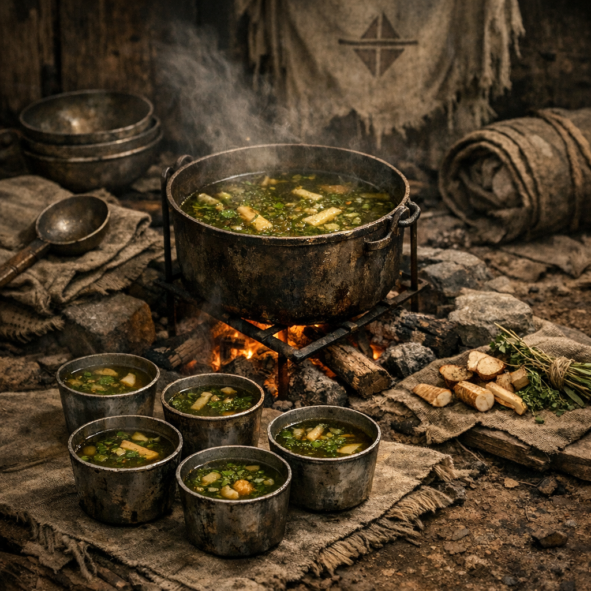

# Pilgerrast-Datensuppe

Ein Ordensgericht: schlicht, bitter, nahrhaft genug für den Weg und sauber genug in der Logik, dass es fast schon wie eine kleine Liturgie gekocht wird.

## Zutaten

- zwei Hände [Brennnesseln](../Pflanzen/Brennnessel.md), aus sicheren Randbereichen oder an Pilgerpfaden gesammelt
- eine Hand voll [Rohrkolben](../Pflanzen/Rohrkolben.md)-Rhizome oder Triebe, aus lesbaren Uferstellen gezogen
- ein kleiner Griff [Wilder Hopfen](../Pflanzen/Wilder-Hopfen.md), für Bittere und Haltbarkeit
- ein kleiner Griff [Beifuss](../Pflanzen/Beifuss.md), als Lagerkraut
- eine halbe Dose klare Brühe, Gemüsesuppe oder dünner Dosenfraß aus Tauschware an der [Pilgerrast](../../Orte/Handelsposten/Pilgerrast.md) oder anderen Posten
- ein bis zwei Becher Wasser
- eine kleine Prise Salz, wenn vorhanden

## Zubereitung

Die Rohrkolbenstücke zuerst in Wasser weich kochen. Danach die Brennnesseln hineingeben und nur so lange ziehen lassen, bis sie zusammenfallen. Dann Brühe oder dünnen Dosenfraß einrühren.

Hopfen und Beifuss nur leicht zerreiben und sparsam hinzufügen. Die Suppe soll bitter und klar wirken, nicht wild. Ordensleute kochen sie meist leise und ohne Hektik, oft am Rand eines Feuers statt in voller Glut.

Wenn die Brühe leicht grün-gold wird, die Wurzelstücke weich sind und die Bittere sauber im Hals steht, gilt die Suppe als bereit. Sie wird heiß in kleinen Metallbechern gereicht, nie überladen, nie verschwendet.
