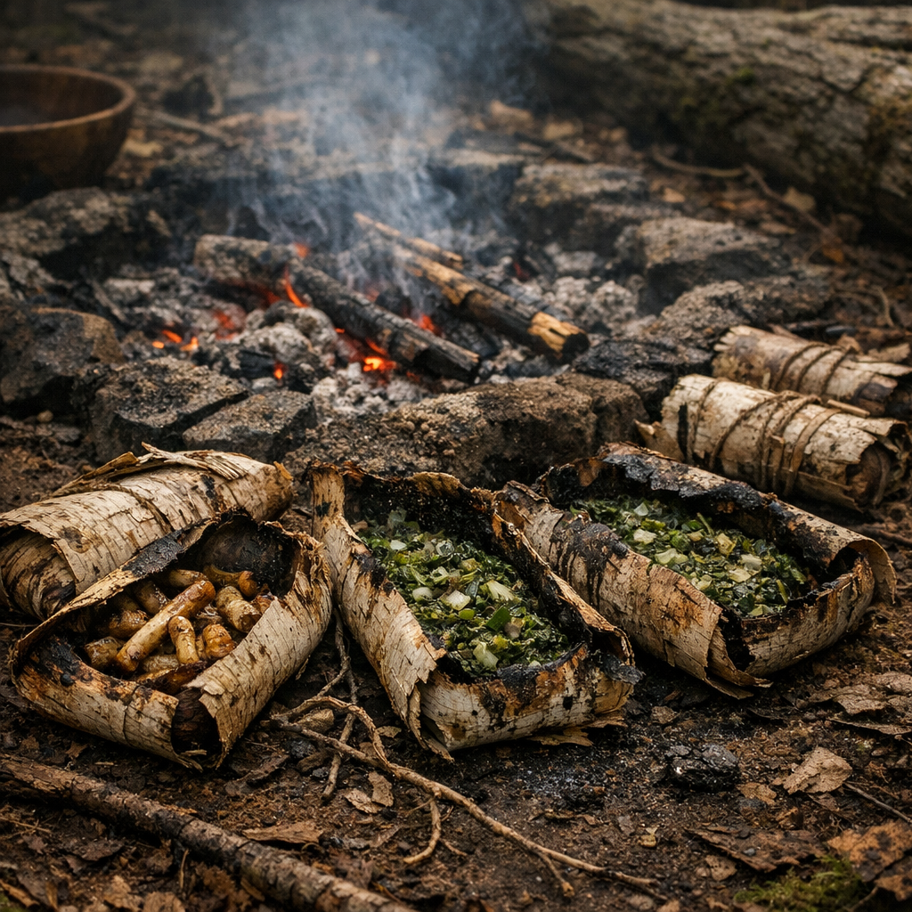

# Retro-Rindenwickel

Ein Retro-Gericht: wenig Technik, wenig Verschwendung, viel Glut und die Hoffnung, dass ein sauberer Waldrest mehr Ehrlichkeit in einer Mahlzeit trägt als jede Dose aus alter Zeit.

## Zutaten

- zwei Hände junge [Brennnesseln](../Pflanzen/Brennnessel.md), aus lesbaren, wenig belasteten Randzonen
- eine gute Hand voll [Rohrkolben](../Pflanzen/Rohrkolben.md)-Rhizome, gründlich gewaschen
- ein kleiner Griff [Beifuss](../Pflanzen/Beifuss.md), als bitteres Würzkraut
- ein paar [Brombeeren](../Pflanzen/Brombeere.md), wenn Saison ist und etwas Säure gebraucht wird
- mehrere Stücke trockene [Birke](../Pflanzen/Birke.md) in Form von Rinde, als Wickel und Brennmaterial
- ein halber Becher Wasser
- ein Löffel Fett oder gar keins, wenn nur Glutkochen möglich ist

## Zubereitung

Die Rohrkolben-Rhizome weich kochen oder in wenig Wasser vorgaren und danach grob zerdrücken. Brennnesseln und Beifuss fein hacken und untermischen. Falls Brombeeren vorhanden sind, nur wenige zerdrücken und für etwas Säure unterheben.

Die Birkenrinde kurz über Dampf oder Feuer halten, bis sie biegsam wird. Dann die Masse in kleine Portionen darauf setzen, zu festen Wickeln einschlagen und mit Pflanzenfaser, Draht oder Holzsplitter verschließen.

Die Wickel in heiße Asche oder an den Rand einer Glutgrube legen und langsam garen, bis die Rinde außen trocken und dunkel wird. Innen soll die Füllung fest und warm, aber nicht verbrannt sein. Gegessen wird direkt aus der geöffneten Rinde, oft schweigend und ohne viel Drumherum.
