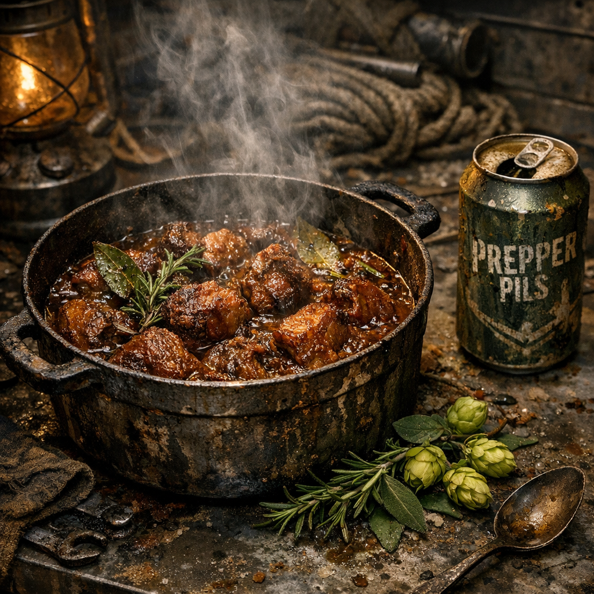

# Rotzschwein in Prepper Pils

Ein Gericht für Leute, die wissen, dass gutes Fleisch selten und gutes Bier ausgestorben ist, aber beides zusammen trotzdem nach Feierabend schmecken kann.

## Zutaten

- zwei Hände Rotzschweinfleisch von jungen Tieren aus weniger kranken Böden, selbst gejagt oder als Zweifelware am Posten gekauft
- eine Dose oder Flasche [Prepper Pils](../Gegenstaende/Prepper-Pils.md), aus Bunkern, Postenbars oder Vorratskisten
- eine Hand voll [Wilder Hopfen](../Pflanzen/Wilder-Hopfen.md), frisch oder getrocknet, an Zäunen, Ruinen und feuchten Lagerrändern gesammelt
- eine Hand voll [Brennnesseln](../Pflanzen/Brennnessel.md), grob zerdrückt
- eine halbe Hand voll Dosenzwiebeln, Dosenbohnen oder irgendein salziger Dosenrest
- ein Löffel Fett

## Zubereitung

Das Rotzschweinfleisch in grobe Würfel schneiden und in heißem Fett anbraten, bis die Außenseite dunkel wird. Danach den Dosenrest und die Brennnesseln dazugeben und kurz mitrösten.

Mit Prepper Pils ablöschen. Den Hopfen leicht zwischen den Fingern zerreiben und mit in den Topf werfen. Jetzt nicht mehr hart kochen, sondern nur noch leise simmern lassen, bis das Fleisch nachgibt und die Brühe bitter, dunkel und dick wird.

Wenn das Bier fast ganz eingekocht ist und der Topf nur noch schwer und kräftig riecht, ist das Gericht fertig. Viele essen es mit trockenem Brot, Rohrkolbenfladen oder direkt aus der Dose, wenn kein Teller mehr da ist.
