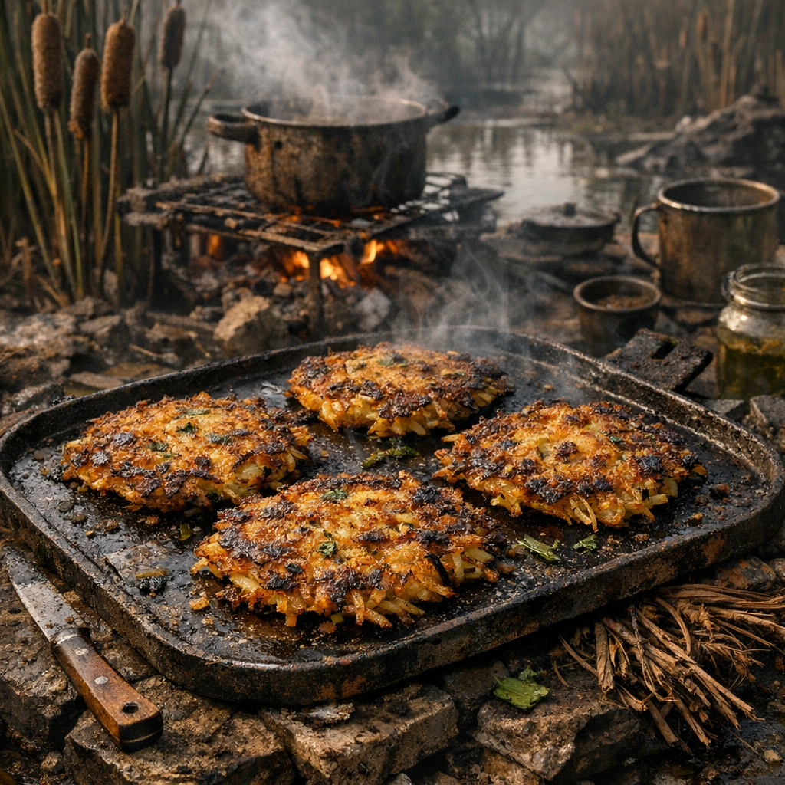

# Sumpf-Rösti

Der Name klingt nach alter Welt, aber in Wahrheit ist es nur die elegante Bezeichnung für alles, was sich aus Sumpfstärke und Pfannenboden zu einem Fladen pressen lässt.

## Zutaten

- zwei Hände geschälte [Rohrkolben](../Pflanzen/Rohrkolben.md)-Rhizome, aus flachen Uferzonen, Waschgruben oder von Sammlern am Posten
- eine Hand voll klein geschnittene junge [Brennnesseln](../Pflanzen/Brennnessel.md), möglichst aus wenig belasteten Randböden
- eine halbe Dose Dosenkartoffeln, Erbsenpüree oder stärkehaltiger Dosenbrei, aus Altlagern oder Küchenresten
- eine halbe Hand voll zerriebene trockene Krümel: altes Brot, Crackerreste oder geröstete Rohrkolbenfaser zum Binden
- ein Löffel Fett, Talg oder altes Bratöl
- eine Prise Salz oder getrocknete Kräuter, wenn vorhanden

## Zubereitung

Die Rohrkolben-Rhizome gründlich von Schlamm befreien, klein hacken und in wenig Wasser weich kochen. Danach mit Messergriff, Becherboden oder flachem Stein grob zerdrücken. Die Brennnesseln kurz überbrühen oder direkt mit in den heißen Brei drücken, bis sie zusammenfallen.

Dann die halbe Dose Brei und die trockenen Krümel untermischen, bis eine formbare Masse entsteht. Daraus flache Fladen drücken, ungefähr handtellergroß und nicht dicker als ein Daumen.

In einer flachen Pfanne, auf einem Blech oder direkt auf einer gefetteten Schrottplatte von beiden Seiten braten, bis sich eine braune Kruste bildet. Wenn sie sich mit dem Messer ablösen lassen und nicht mehr nass wirken, sind sie gut.
