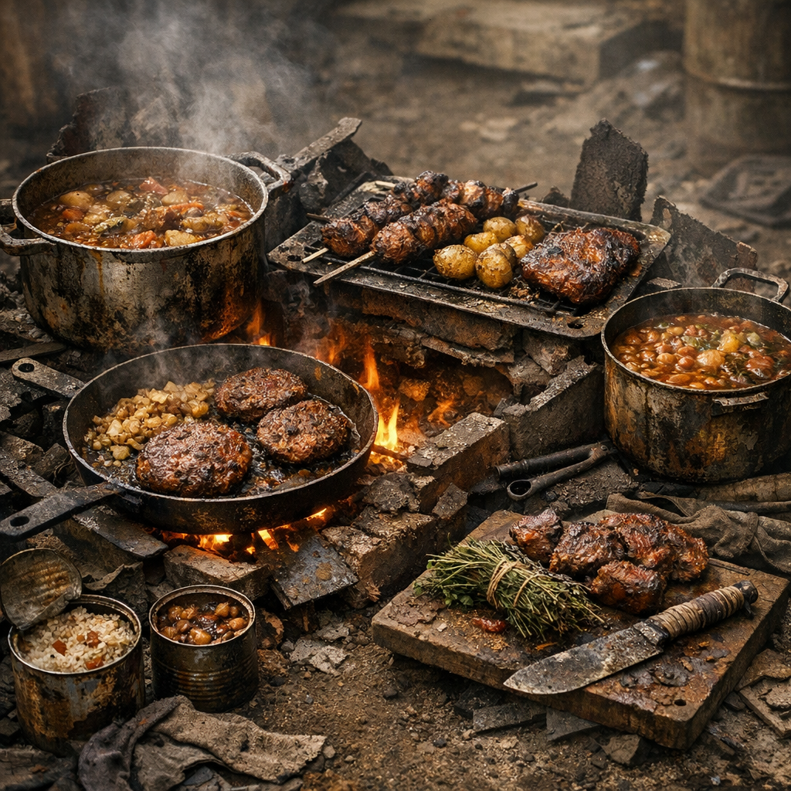

# Rezepte

Rezepte in der [Wasteland](../../Kanon/glossar.md#wasteland) sind keine Kochkunst im alten Sinn. Sie sind Überlebenskunst: Dosenfraß, Jagdbeute, Sumpfstärke, bittere Kräuter und alles, was sich mit Feuer, Blech, Draht und Geduld essbar machen lässt.

## Einträge

- [Dosenacker-Eintopf](Dosenacker-Eintopf.md) – Dicke Lagertopfsuppe aus Dosenresten, Brennnessel und Rotzschwein.
- [Sumpf-Rösti](Sumpf-Roesti.md) – Flache Bratlinge aus Rohrkolben und Dosenstärke.
- [Rotzschwein in Prepper Pils](Rotzschwein-in-Prepper-Pils.md) – Zäher Schmortopf mit dem letzten Bier der Welt.
- [Nesselblech mit Schaben-Crunch](Nesselblech-mit-Schaben-Crunch.md) – Grüner Lagerfladen mit geröstetem Eiweiß-Topper.
- [Brombeer-Hopfen-Sud](Brombeer-Hopfen-Sud.md) – Bitter-süßer Lagertrunk aus Beeren, Hopfen und Notzucker.
- [Aschehafen-Pfanne](Aschehafen-Pfanne.md) – Bratpfanne aus Dosenfleisch, Rohrkolben und dem, was am Posten übrig bleibt.
- [Hexenkessel 2066](Hexenkessel-2066.md) – Hillbilly-Eintopf aus Rotzschwein, Beifuss, Brombeeren und bitterem Lagerzeug.
- [Messingmarkt-Hash](Messingmarkt-Hash.md) – Steampunk-Werkhofpfanne aus Dosenfleisch, Rohrkolben und rauchigem Grünkram.
- [Pilgerrast-Datensuppe](Pilgerrast-Datensuppe.md) – Asketische Ordenssuppe aus Nessel, Rohrkolben und bitterer Kräuterordnung.
- [Glaspforten-Blechpastete](Glaspforten-Blechpastete.md) – Zero-nahe Notfeinkost aus Konserve, Beeren und sauberer Inszenierung.
- [Retro-Rindenwickel](Retro-Rindenwickel.md) – Rückwärtsgekochte Waldration in Birkenrinde und Glut.
