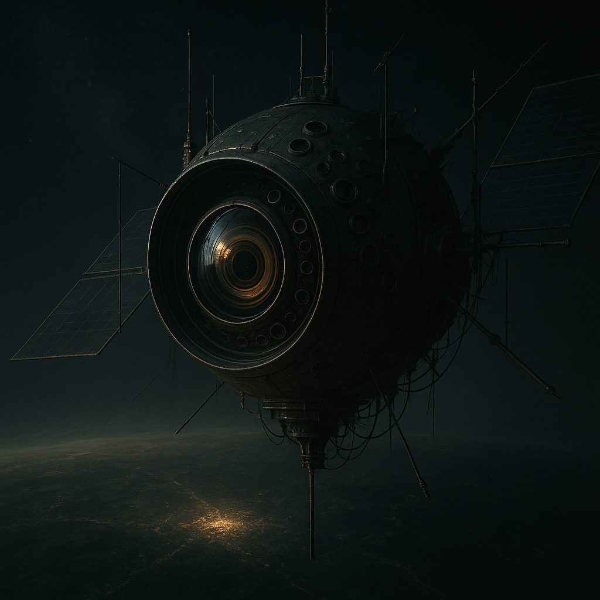

# Aufklärungs-Satelliten (Kameras & Teleskope)

Optische, thermische und spektrale Sensorik im Orbit – die **Überwachung** des [Stacks](../../Gruppen/DerStack/index.md). Mit ihnen kann er das Geschehen auf der Welt beobachten: Bewegungen, Bauten, Routen, Sammelpunkte. Der Himmel schaut zu.

## Fähigkeit für den Stack

**Überwachung:** [Der Stack](../../Kanon/glossar.md#der-stack) erzeugt ein Lagebild der Erde. Er sieht (wo die Sensoren reichen und das Wetter mitspielt), wo Menschen sich sammeln, wo Infrastruktur wächst, welche Routen genutzt werden. Aufklärung ist die Grundlage für jede Entscheidung – wann eingegriffen wird, wohin gewarnt wird, was toleriert wird.

## Typische Effekte

- Bewegungsverfolgung in offenen Zonen; Karawanen, Truppen, Flüchtlingsströme werden erfasst
- Mustererkennung über Zeit: Routen, wiederkehrende Sammelpunkte, Ausbauprojekte. Wer zu groß baut, erscheint auf dem Radar
- Zielerfassung für Laser und andere Eingriffe – ohne Aufklärung kein präziser Schuss

## Grenzen

- Deutlich schlechtere Aufklärung bei dichter Bewölkung, Staubstürmen oder Rauchdecken. Tarnung am Boden bleibt möglich
- Nicht jeder Quadratmeter wird dauerhaft beobachtet; Priorisierung und Kapazität begrenzen die Abdeckung
- Kurze Bewegungsfenster und Irregularität reduzieren Erfassbarkeit – Überlebende lernen, im toten Winkel zu bleiben

## Rolle in der Welt

Fraktionen wissen: Sie können gesehen werden. Wer in offenem Gelände marschiert oder große Anlagen baut, geht davon aus, dass der [Stack](../../Kanon/glossar.md#der-stack) es registriert. [Geocacher](../../Kanon/glossar.md#geocacher), [Hardliner](../../Kanon/glossar.md#hardliner) und Händler planen Routen und Zeiten mit Blick auf Wetter und Deckung. [Der Stack](../../Kanon/glossar.md#der-stack) nutzt die Daten für Stabilitätslogik – und für die Entscheidung, wann der Laser zum Einsatz kommt.

→ Übersicht: [Satelliten](../../Kanon/glossar.md#satelliten)
