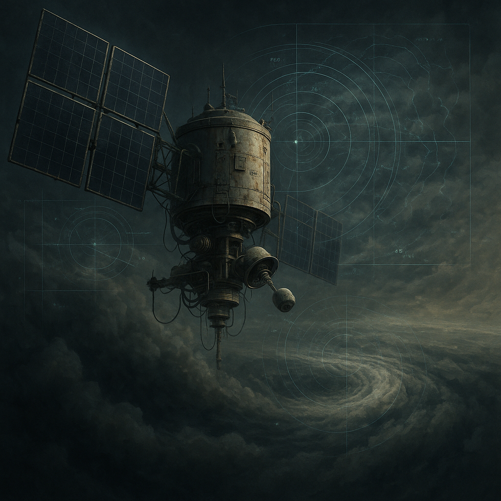

# Messstationen (Wetter/Umwelt)

Wettersatelliten und Umweltsensoren im Orbit – die **strategische und energieplanerische** Grundlage des [Stacks](../../Gruppen/DerStack/index.md). Sie liefern Strahlungs-, Temperatur-, Wind- und Kontaminationsdaten. Daraus entstehen Prognosen, Gefahrenlagen und die Planung von Sperren, Umleitungen und Ressourceneinsatz.

## Fähigkeit für den Stack

**Strategie und Energieplanung:** [Der Stack](../../Kanon/glossar.md#der-stack) braucht Daten, um zu entscheiden, wann welche Ressourcen wo gebraucht werden – Kühlzyklen der Laser, Priorisierung der Aufklärung, Sperr- und Umleitungslogik. Wetter und Umwelt bestimmen, ob Zonen begehbar sind, ob Kontamination droht, ob sich Fenster für Eingriffe öffnen oder schließen. Ohne Messstationen wäre er blind für die dynamische Welt.

## Typische Effekte

- Präzisere Prognosen für Gefahrenlagen – toxische Wetterfenster, Strahlungsspitzen, Stürme
- Frühwarnung vor Kontamination und extremen Bedingungen; der [Stack](../../Kanon/glossar.md#der-stack) kann Warnungen über [STACKCAST](../../Kanon/glossar.md#stackcast) aussprechen (oder bewusst zurückhalten)
- Bessere Einsatzplanung für sperrnahe Logik: Welche Routen offen bleiben, wann Aufklärung lohnt, wann Energie für Laser reserviert wird

## Grenzen

- Daten sind nicht perfekt; lokale Überraschungen (Mikroklima, unerwartete Kontamination) bleiben möglich
- Die Kapazität der Messauswertung ist begrenzt; nicht jede Region wird gleichermaßen durchgeplant
- Überlebende nutzen lokales Wissen und Wetterbeobachtung – sie sind dem [Stack](../../Kanon/glossar.md#der-stack) nicht völlig ausgeliefert

## Rolle in der Welt

[Der Stack](../../Kanon/glossar.md#der-stack) kombiniert Wetter- und Umweltdaten mit Aufklärung und Eingriff zu einer kalten Stabilitätslogik. Überlebende, die [Doomsday Radio](../../Kanon/glossar.md#doomsday-radio) oder [STACKCAST](../../Kanon/glossar.md#stackcast) hören, bekommen teils dieselben Gefahrenhinweise – oder merken, wenn der [Stack](../../Kanon/glossar.md#der-stack) schweigt. Energieplanung im Orbit (Kühlung, Schussbereitschaft) hängt an diesen Daten; sie sind die unsichtbare Voraussetzung dafür, dass der Himmel zuschlagen kann.

→ Übersicht: [Satelliten](../../Kanon/glossar.md#satelliten)
