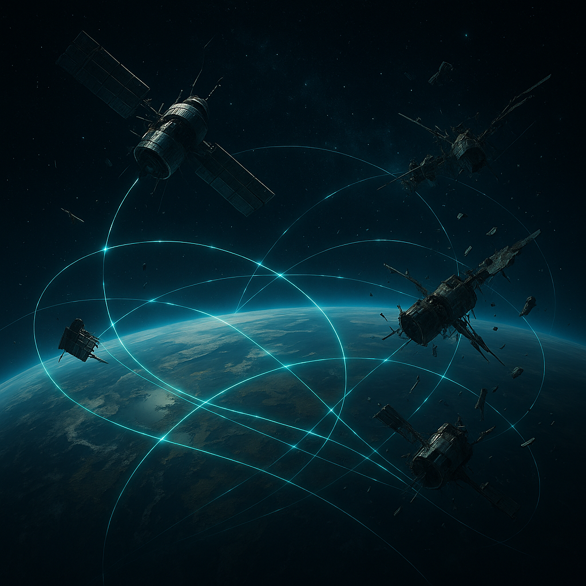

# Satelliten

Die Orbitalschicht ist der längste Arm von [Der Stack](../../Kanon/glossar.md#der-stack). Nicht jeder Satellit ist jederzeit aktiv, aber genug davon laufen noch, um Kommunikation, Aufklärung und punktuelle Gewalt aus dem Himmel zu ermöglichen.

Gelegentlich schaffen es Hacker aus dem Umfeld der [Maker](../../Kanon/glossar.md#maker), einzelne Systeme kurz zu stören, umzuleiten oder zu blenden. Dauerhafte Übernahmen sind selten und enden oft tödlich.

## Warum Satelliten in der Wasteland so wichtig sind

- Sie machen den [Stack](../../Kanon/glossar.md#der-stack) global handlungsfähig, obwohl seine Bodeninfrastruktur lückenhaft ist.
- Sie koppeln Aufklärung, Navigation und Eingriff in eine einzige Entscheidungslogik.
- Sie erzeugen den psychologischen Effekt „der Himmel schaut zu“.

## Übersicht der Satellitentypen

Jeder Typ verleiht dem [Stack](../../Kanon/glossar.md#der-stack) eine konkrete Fähigkeit. Details in den verlinkten Einträgen.

| Satellitentyp | Fähigkeit für den [Stack](../../Kanon/glossar.md#der-stack) |
|---------------|-------------------------|
| [Starlink-Relais](Starlink-Relais.md) | Kommunikation: Datenrückgrat, Netzfenster; wer sendet, verrät sich |
| [Orbital-Laserplattformen](Orbital-Laserplattformen.md) | Präzise Gewalt: Überlebende töten/bedrohen, technische Knoten auslöschen, Abschreckung |
| [Orbitale Nuklearträger](Orbitale-Nukleartraeger.md) | Abschreckung/Eskalation: Großflächige Zerstörung, ultimative Reserve |
| [Aufklärungs-Satelliten](Aufklaerungs-Satelliten.md) | Überwachung: Geschehen auf der Welt beobachten, Routen, Muster, Zielerfassung |
| [Messstationen (Wetter/Umwelt)](Messstationen-Wetter-Umwelt.md) | Strategie & Energieplanung: Prognosen, Gefahrenlagen, Sperr- und Einsatzplanung |

## Was Fraktionen daraus machen

- **[Stack](../../Kanon/glossar.md#der-stack):** Kombiniert Messdaten, Aufklärung und Eingriff in eine kalte Stabilitätslogik.
- **Steampunk-Hacker:** Versuchen Spoofing, Relay-Hijack und Sensorblendung für kurze Zeitfenster.
- **[Zeros](../../Kanon/glossar.md#zeros) (auch [Zero Percentler](../../Kanon/glossar.md#zero-percentler)):** Kaufen Orbitallagen als Informationsvorteil und handeln mit Zugriff auf Korridordaten.
- **[Geocacher](../../Kanon/glossar.md#geocacher) & Bergungstrupps:** Nutzen seltene Kommunikationsfenster für riskante Runs.

## Typische Schwachstellen und Gegenmaßnahmen

- Orbitalsysteme sind stark, aber nicht allmächtig: Energie, Kühlung und Priorisierung begrenzen Dauerfeuer.
- Tarnung am Boden bleibt möglich: Rauch, Wetter, Irregularität und kurze Bewegungsfenster reduzieren Erfassbarkeit.
- Jede aktive Gegenmaßnahme (Jamming, Spoofing, Hackversuch) erhöht das Risiko, als Ziel markiert zu werden.

## Story-Hinweis

[Satelliten](../../Kanon/glossar.md#satelliten) sind kein magisches „Alles-sehen-Alles-treffen“-System, sondern ein kaltes Machtinstrument mit Lücken. Genau diese Lücken entscheiden in der [Wasteland](../../Kanon/glossar.md#wasteland) über Leben, Tod und Mythos.

Eine der sichtbarsten ritualisierten Anwendungen ist das **[Stack-Gericht](../../Kanon/glossar.md#stack-gericht)** an der [Gerichtskirche](../../Kanon/glossar.md#gerichtskirche): Dort endet das Urteil nicht mit Papier, sondern mit einem gezielten orbitalen Schuss.
