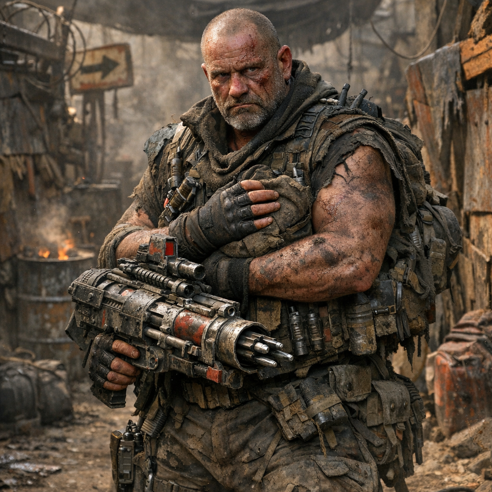

# Bolzen Branko

## Kurzprofil

- **Name:** Branko Voss
- **Alias / Rufname:** Bolzenbranko; später auch Chicken Bob
- **Rolle:** Hardliner, Gewaltlegende und spätere Schlüsselfigur des Laura-Falls
- **Zugehörigkeit:** [Hardliner](../Kanon/glossar.md#hardliner) / Dachfraktion [Roamer](../Kanon/glossar.md#roamer)
- **Status:** nach der Laura-Quest verschollen; aus der Zero-Sphäre nicht zurückgekehrt

## Auftreten

Breite Silhouette, alte Narben, schwerer Schritt, zerrissenes Oberteil, Kampfstiefel, zu viele Waffen und die Art von Präsenz, bei der andere lieber erst den Abstand prüfen. Er sieht aus wie eine mobile Gewaltkatastrophe. Zu seiner Signatur gehört vor allem der schwere, umgebaute **Bolzenschießer** namens **der Stempel**, der ihm den älteren Hardliner-Rufnamen **Bolzenbranko** eingebracht hat.

## Kern

Branko Voss ist als Figur genau deshalb stark, weil unter der Gewaltmaske eine fast verschüttete Bindungsfähigkeit überlebt hat. Der härteste innere Grund dafür liegt in einer Mischung aus **verlorener Familie**, erkannter **Unschuld** und blankem **Trotz gegen die Zeros**. Im Kern der Geschichte steht, dass Branko einmal einen Auftrag für die [Zeros](../Kanon/glossar.md#zeros) **absichtlich versemmelte**.

Der Grund dafür war nicht abstrakte Moral, sondern ein persönlicher Bruch: Der Auftrag lockte ihn in eine **Falle**, die in der [Ödlandarena](../Orte/Zonen/Oedlandarena.md) endete. Dort sollte er in einem arrangierten Duell gegen seinen eigenen Kumpel antreten. Genau an diesem Punkt verweigerte er die Logik des Auftrags. Branko setzte den **Tötungsschlag nicht**. Die [Zeros](../Kanon/glossar.md#zeros) ließen den Kumpel trotzdem sterben - gerade dadurch. Die Sabotage war deshalb kein politisches Programm, sondern die Weigerung, sich von den [Zeros](../Kanon/glossar.md#zeros) bis in Freundschaft und Körpernähe hinein steuern zu lassen.

Die Bestrafung war nicht bloß finanziell oder körperlich, sondern exemplarisch: Die [Zeros](../Kanon/glossar.md#zeros) ließen in seine Tochter oder den letzten nahen Familienrest einen **[Killcoin](../Kanon/glossar.md#killcoin)-Core** integrieren.

Von da an lief die Strafe als kalter Vertrag weiter. Branko hätte sich theoretisch freiarbeiten oder den Gegenwert eines Coins beschaffen können, um sie zurückzuholen. Praktisch bekam er weder rechtzeitig den nötigen Gegenwert eines vollen [Killcoins](../Kanon/glossar.md#killcoin) zusammen noch die zugehörige **Shell** in die Hand. Genau darin liegt die Grausamkeit des Vorgangs: Nicht sofortiger Tod, sondern erzwungene Hoffnung unter Marktbedingungen, bis Familie in Zero-Logik kippt und verloren geht.

Erst **nach** diesem Verlust begann Branko selbst aktiv nach einem **vollständigen Killcoin** zu suchen. Nicht als Handelswert, sondern als spätes Werkzeug der Rache. Von diesem Coin erfuhr er überhaupt erst durch einen **Tipp am Lagerfeuer** - zu einem Zeitpunkt, als es für seine Tochter längst zu spät war. Das war kein sauberer Informant, sondern alkoholgetränktes Plaudern von irgendwem, halb Gerücht, halb Restwissen. Der Kern des Hinweises war schlicht, aber brutal genug: **dass Krell einen vollständigen Killcoin besitzt und wo er ungefähr zu finden sein könnte**.

Den Coin selbst konnte Branko aber erst **nach Krells Tod** anhand gefundener Spuren aufspüren. Lange Zeit setzte er ihn für nichts ein. Erst dadurch wurde aus bloßer Wutreserve ein möglicher Hebel für spätere Rache gegen die [Zeros](../Kanon/glossar.md#zeros). Dass Branko diesen Trumpf überhaupt in der Hand hat, wird vielen - und ihm selbst in seiner strategischen Tragweite - erst sehr spät bewusst.

Am Anfang des Laura-Falls genießt Branko das Spiel. Ein echtes Huhn, das plötzlich halb [Wasteland](../Kanon/glossar.md#wasteland) auf seine Spur zieht, ist für einen [Hardliner](../Kanon/glossar.md#hardliner) erst einmal fast perfekter Stoff: Er hat etwas, das alle wollen, kann Jäger gegeneinander ausspielen, falsche Spuren legen und die eigene Härte als Ausnahmefall inszenieren. Der erste Reiz ist deshalb nicht Zärtlichkeit, sondern Jagdrausch, Egotrip und die fast lustvolle Erfahrung, dass plötzlich alle hinter ihm her sind und er trotzdem nicht zu greifen ist.

Genau darin liegt dann aber der Kipppunkt. Aus dem Beutestück, mit dem man spielt, wird im Alltag langsam ein lebendiges Wesen, das auf ihn reagiert, ihm vertraut und Nähe erzwingt. Im Laura-Fall trifft Laura so genau diese verschüttete Stelle in ihm. Wo andere in dem Tier Ware, Zeichen, Auftrag oder Schande sehen, behandelt er es irgendwann mit zärtlicher Ernsthaftigkeit und ist bereit, eher für es zu sterben als es zu verkaufen. Er spricht mit Laura **leise und sanft** und nennt sie im Privaten oft einfach **„Kleine“**. Später, als das Huhn ihm bereits vertraut, entdeckt er an ihr den Fußring **L-2047-04**. Ihr typischer Zufluchtsort ist dann eine **improvisierte Brusttasche unter seiner Lederweste** - warm, eng, staubgeschützt und so nah am Körper, dass aus dem Hardliner fast unfreiwillig ein Trägerherz wird.

Gerade diese Beziehung bleibt dabei nicht kitschig rein. In einer Phase echten Hungers hat Laura ihm ein Ei gelegt, und Branko hat es gegessen. Nicht aus Gleichgültigkeit, sondern aus nackter Not. Genau solche Momente machen die Bindung stärker statt sauberer: Laura ist für ihn nicht bloß Symbol, sondern zugleich Leben, Versorgung, Schuld und Nähe.

Gerade danach kippt etwas in ihm endgültig. Aus dem gegessenen Ei wird kein schmutziger Verrat, sondern ein Moment aus **Liebe, Dankbarkeit und radikaler Klarheit**. Für Branko ist das nicht der Ursprung seines Hasses auf die [Zeros](../Kanon/glossar.md#zeros) - der liegt im Verlust seiner Tochter -, sondern der Punkt, an dem dieser alte Bruch in der Laura-Quest wieder persönlich, gegenwärtig und handlungswirksam wird.

Sein erster Impuls ist dabei jedoch nicht sofort der große Gegenschlag, sondern **Schutz**. Zuerst muss Laura überleben - vor allem vor den [Roamern](../Kanon/glossar.md#roamer), die den Auftrag haben, sie verschwinden zu lassen. Erst aus dieser Schutzbewegung kann später ein offener Angriff auf Zero-Interessen werden.

Praktisch heißt das: **ständig in Bewegung bleiben**. Branko zieht mit Laura nicht in einen festen Unterschlupf, sondern hält sie auf Wanderkurs durch die [Wasteland](../Kanon/glossar.md#wasteland). Er legt falsche Spuren, wechselt Routen, nutzt Gerücht und Funk gegen seine Verfolger, tritt brutal und abschreckend auf und tötet, wenn er es für nötig hält.

Gejagt wird er dabei nicht nur von irgendeiner diffusen Meute, sondern von konkreten Typen der Welt: vor allem von [Geocachern](../Kanon/glossar.md#geocacher), die aus Laura Auftrag, Cache und Ausnahmefund zugleich lesen, und von [Magiern](../Kanon/glossar.md#magier), die in ihr Herkunft, Bio-Fragment oder operative Chance wittern. Gerade diese Mischung macht die Jagd so lang: Nicht alle verfolgen dasselbe Motiv, aber alle folgen derselben Spur.

In dieser Jagd wird auch **[Noah Krell](Noah-Krell.md)** zu seinem letzten großen Hindernis. Krells Tod in der Zero-Sphäre markiert für Branko nicht das Ende der Quest, sondern den Punkt, an dem seine Schutz- und Jagdbewegung endgültig in einen Opferkurs gegen die [Zeros](../Kanon/glossar.md#zeros) kippt. Die genaue Abfolge dieser Eskalation gehört zum Konfliktstoff der Laura-Quest und nicht in sein Primärprofil.

## Beziehungen

- **Hardliner:** sehen in ihm je nach Perspektive einen peinlichen Weichpunkt oder den Beweis radikaler Eigenlogik.
- **Zeros:** würden ihn als bewaffnetes Hindernis vor entlaufenem Hausgut lesen.
- **Orden:** könnte in seiner Bindung eine fehlgeleitete, aber echte Hingabe erkennen.
- **Laura:** wird für ihn zum unverdorbenen Rest von etwas, das die Welt eigentlich schon ausgespuckt hat.

## Storyfunktion

Branko Voss macht den Laura-Fall personentragend. Er zieht Geld, Gewalt, Mythos und Absurdität in eine Figur zusammen und verschiebt eine Jagd aus Marktlogik und Hardliner-Challenge in persönlichen Krieg, Opferbereitschaft und späteren Märtyrerstoff.

## Relevante Quellen

- Konkrete Geschichte: [../Kanon/Geschichten/Die-Jagd-um-Laura.md](../Kanon/Geschichten/Die-Jagd-um-Laura.md)
- Laura-Fall: [../Kanon/Konflikte/Wenn-ein-echtes-Tier-auftaucht.md](../Kanon/Konflikte/Wenn-ein-echtes-Tier-auftaucht.md)
