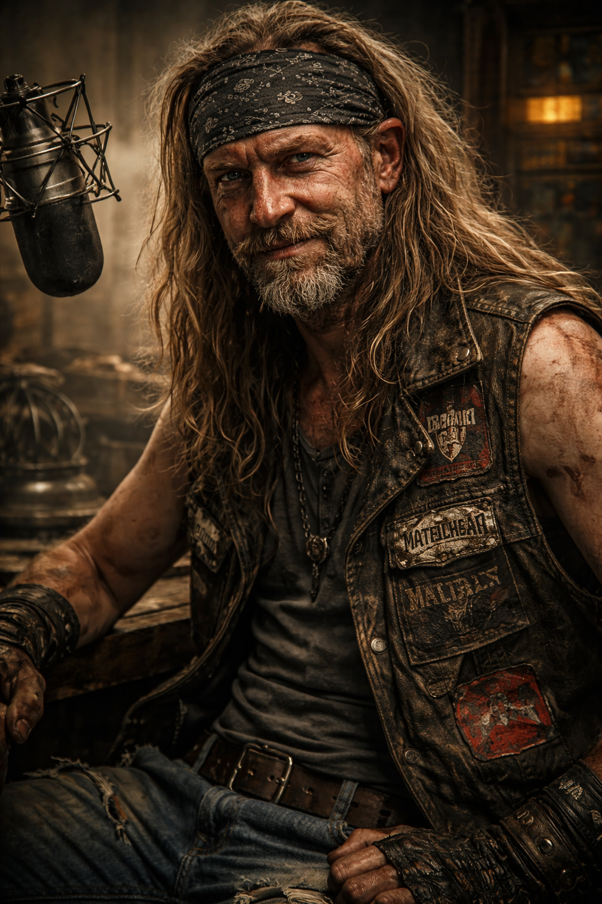

# Mad Dog

## Kurzprofil

- **Name:** Mad Dog
- **Alias / Rufname:** die Morgenlatte
- **Rolle:** Hauptmoderator, Krisenstimme und Lautsprecher von Doomsday Radio
- **Zugehörigkeit:** maker-nahes Umfeld der [Doomsday Dispatcher](../Kanon/glossar.md#doomsday-dispatcher)
- **Status:** aktiv

## Auftreten

Bandana, Lederweste ohne Ärmel, zerrissene Jeans und eine permanente Zigarette hinter dem Ohr, die er nie anzündet. Seine Haare sind ein wirres, verfilztes Chaos zwischen Headbanger, Roadie und Überlebendem. Er trägt selbstgemachte Band-Patches auf der Weste, als hätte er sich seine eigene Legende zusammengetackert. Seine Stimme schwankt ohne Vorwarnung zwischen Flüstern, Brüllen und rauem Moonshine-Schmirgel. Mad Dog wirkt wie ein Metal-Frontmann, der den Weltuntergang nicht überlebt hat, sondern moderiert.

## Kern

Mad Dog trägt die lauteste Maske des Senders: Chaos, Wut, vulgären Witz und Dauerübertreibung. Darunter steckt eine fast peinlich gut versteckte Fürsorglichkeit. Er will, dass die Leute draußen durchhalten, lachen und nicht bedeutungslos sterben. Genau der Kontrast zwischen Krawall und Verantwortung macht ihn zur stärksten menschlichen Eintrittsstimme in die Welt von Doomsday Radio.

## Persönlichkeit

### Die Fassade

Mad Dog gibt sich als der härteste Typ der [Wasteland](../Kanon/glossar.md#wasteland). Er macht sich über fast alles lustig: Mutanten, Katastrophen, Politiker, den Tod, sich selbst. Kein Thema ist tabu, keine Grenze lange heilig. Er ist der Klassenclown der Apokalypse, der pubertäre Witze reißt, polemische Spitznamen erfindet und mitten in ernsten Nachrichten Sätze platziert, die man nie wieder ganz vergisst.

Was er besonders hasst, ist politische Kälte mit Anzug oder Uniform. Politiker sind für ihn Würste, faschistische Tendenzen bekommen seinen ungebremsten Zorn ab, und genau in diesen Momenten kippt der Krawall für Sekunden in echte Haltung.

### Das Darunter

Unter der Weste, dem Geschrei und der Pose steckt ein Mensch, der seine Hörer wirklich liebt. Mad Dog sorgt sich um jeden einzelnen Überlebenden da draußen. Er will, dass sie durchhalten, dass sie lachen, dass sie sich nicht aufgeben. Aber diese Fürsorglichkeit darf für ihn nie offen sichtbar werden, weil die Welt Schwäche bestraft und Coolness seine Rüstung ist.

In seltenen Momenten rutscht ihm trotzdem etwas Ehrliches heraus:

> *„Hey, wenn ihr da draußen noch durchhaltet … also … rockt weiter, Leute. Aber sagt das bloß niemandem, klar?"*

## Moderationsstil

| Element | Ton | Stil |
|---|---|---|
| **Begrüßung** | Überdreht, laut, zynisch | Übertriebener Enthusiasmus, Metal-Metaphern, Slang, vulgäre Bilder und maximaler Krawall. |
| **Überleitungen** | Humorvoll, chaotisch, provokant | Absurde Übergänge, schlechte Witze, treffende Beschimpfungen, viel Energie und überraschend viel taktisches Gefühl. |
| **Ernstfall** | Still, klar, respektvoll | Bei Toten, Anschlägen oder echtem Leid fällt die Maske kurz. Genau dann wird seine Menschlichkeit sichtbar. |

### Beispielton

> *„Yo, Leute. Hier ist Mad Dog, die Morgenlatte, euer Hauptlieferant für radioaktives Entertainment und irre News. Wir sind live aus dem Ödland, wo der Sand weht, die Mutanten pfeifen und niemand fragt, warum ich keine Hose trage."*

## Hintergrund

Woher Mad Dog kommt, weiß niemand sicher. Manche sagen, er sei ein Roadie einer untergegangenen Metal-Band gewesen. Andere behaupten, er sei ein desertierter Kämpfer, der die Gewalt satt hatte und stattdessen die Leute zum Lachen bringen wollte. Er selbst erzählt jedes Mal eine andere Geschichte, und jede klingt ein bisschen absurder als die letzte.

Sicher ist nur: Er tauchte nach dem Tod von [Viktor Weiß](Viktor-Weiss.md) am Mikrofon auf und übernahm `Welt am Abgrund`. Viktor hat das Format geschaffen. Mad Dog hat es angezündet, ohne dass es bisher eingestürzt ist.

## Senderfunktion

Mad Dog ist die Stimme von **[Welt am Abgrund](../Radio/programm.md)** und damit der lauteste Teil der menschlichen Senderfront. Über ihn lassen sich Nachrichten, Eskalationen, Fraktionsspannung, schwarzer Humor und moralischer Restanstand gleichzeitig transportieren.

Er gehört zu einer aussterbenden Zunft: den menschlichen Dispatchern. Gerade deshalb ist er mehr als Moderator. Er ist Symbol dafür, dass im Radio noch jemand mit Schweiß, Meinung und Nervenzusammenbruch spricht und nicht nur ein perfekter Bot.

## Beziehungen

- **[Viktor Weiß](Viktor-Weiss.md):** Vorgänger, Gegenbild und unausgesprochener Maßstab.
- **[Rasti](Rasti.md):** stärkster On-Air-Komplize; gemeinsam halten sie den menschlichen Teil des Senders lebendig.
- **[Zeros](../Kanon/glossar.md#zeros):** sehen in ihm einen unkontrollierbaren politischen Störfaktor.
- **[Hillbillys](../Kanon/glossar.md#hillbillys):** kultische Hörerbasis, die sein Chaos liebt.
- **Steampunk Trader:** nutzen seine Sendung als Marktbarometer, weil seine Ansagen reale Preise bewegen können.
- **Rambos:** respektieren die Größe seines Egotrips, selbst wenn sie ihn nicht offen mögen.

## Storyfunktion

Mad Dog ist die schnellste menschliche Eintrittsstimme in die Welt. Über ihn lassen sich Nachrichten, Kultur, Wut, Fürsorge, politische Reibung und der ganze barbarische Humor des Senders bündeln. Er ist laut genug für den Einstieg und menschlich genug für den Nachhall.

## Relevante Quellen

- Senderkontext: [../Radio/index.md](../Radio/index.md)
- Dispatcher-Übersicht: [index.md](index.md)
- Programmprofil: [../Radio/programm.md](../Radio/programm.md)
- Fraktionskontext: [../Gruppen/Maker/doomsday-dispatcher.md](../Gruppen/Maker/doomsday-dispatcher.md)
- Lore: [Mad Dog](Mad-Dog.md)
