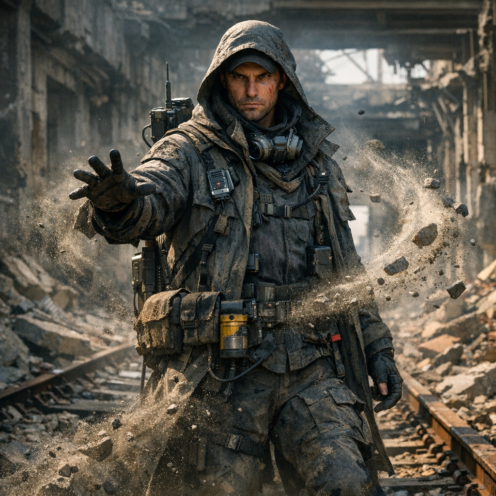

# Noah Krell

## Kurzprofil

- **Name:** Noah Krell
- **Alias / Rufname:** Krellsturm
- **Rolle:** Magierischer Hauptjäger in der Laura-Storyline
- **Zugehörigkeit:** [Magier](../Kanon/glossar.md#magier) / Dachfraktion [Maker](../Kanon/glossar.md#maker)
- **Status:** in der Laura-Quest getötet

## Auftreten

Kühl, kontrolliert, präzise. Noah Krell wirkt nicht wie ein chaotischer Werkstatthexer, sondern wie ein staubverhangener Feldoperator. Schmal bis hart geschnittenes Gesicht, fixierender Blick, schwere Kapuzensilhouette, viel funktionale Feldausrüstung und die Art von Präsenz, bei der selbst Schutt, Wind und lockerer Boden aussehen, als würden sie auf ihn hören. Sein Stil ist nicht exzentrisch, sondern zweckgebunden: klare Bewegungen, wenig verschwendete Gesten, Ausrüstung mit Nutzen, keine Show um der Show willen.

## Kern

Noah Krell verfolgt Laura nicht als bloßes Tier, sondern als **lebenden Schlüssel**. In ihrem Fußring, ihrer Herkunft und ihrer biologischen Normalität liest er die Spur einer tieferen Ordnung: verlorene Zuchtlinien, Zero-Besitz, alte Biotech-Kontinuität, vielleicht sogar Zugang zu etwas, das größer ist als das Huhn selbst. Gerade deshalb will er Laura nicht bloß töten, sondern möglichst **lebend** in die Hand bekommen.

Sein tieferer Antrieb ist dabei eine fast krankhafte **Obsession mit verlorener Biotech**. Für Krellsturm ist Laura nicht nur Herkunftsbeweis, sondern womöglich ein fehlendes Stück auf dem Weg zu etwas viel Seltenerem: einer Form von biologisch-technischer Verdichtung, aus der in Ausnahmefällen sogar ein **Druide** hervorgehen könnte. Was ein Druide dann genau mit Tieren vermag, bleibt selbst unter [Magiern](../Kanon/glossar.md#magier) unscharf, halb Praxis, halb Gerücht. Genau diese Hoffnung macht ihn gefährlich. Er jagt Laura nicht nur, um etwas zu besitzen, sondern um sich selbst in eine andere Entwicklungsstufe hineinzuzwingen.

Gefährlich ist er vor allem durch kalte Präzision. Wo andere jagen, verfolgt, markiert, lenkt und formt er Situationen. Im Kampf wirkt seine Magierpraxis für Außenstehende fast wie Zauberei: Gelände kippt, Staub wird zur Wand, Wind dreht unnatürlich, Druckwellen brechen durch enge Korridore, und plötzlich scheint selbst das Wetter Partei zu ergreifen.

## Fähigkeiten

- **Terraforming im Kleinen:** Kann Boden, Schutt, Staub und lose Oberflächen so manipulieren, dass Wege brechen, Deckung kippt oder Fluchtlinien sich schließen.
- **Sturmeingriffe:** Kann lokale Wind- und Druckphänomene auslösen oder verstärken, sodass Kämpfe aussehen, als hätte er einen Sturm beschworen.
- **Spurkontrolle:** Liest, fälscht und legt Spuren so, dass Verfolgung zur psychologischen Waffe wird.
- **Kaltes Gefecht:** Kämpft nicht aus Wut, sondern aus Kontrolle.

Sein markantester Effekt ist der **Schuttwirbel**: lokale Druck- und Resonanzfelder, die lockeren Staub, Geröll und trockenen Boden in Bewegung setzen. Wo andere nur Ruinen sehen, liest Krellsturm Materialspannung, lose Schichten und Bruchkanten und löst im richtigen Moment präzise Feldimpulse aus. Für Außenstehende wirkt das wie Telekinese oder Zauberei. Tatsächlich ist es ein hochpräziser Feldtrick aus Technik, Timing und Geländegefühl, der nur dort voll greift, wo genug loses Material vorhanden ist.

Gerade daraus ergibt sich auch seine klare Schwäche: **saubere, feste, aufgeräumte Räume**. Eine einfache trockene Halle mit glattem Boden, wenig losem Material und klaren Kanten nimmt seinem Schuttwirbel viel von der Wucht. Wo kaum Staub, Bruch oder lockere Schichten vorhanden sind, bleibt von Krellsturms "Windmagie" oft nur ein deutlich gewöhnlicherer Feldtechniker übrig.

## Beziehungen

- **Bolzen Branko:** Hauptgegner in der Jagd auf Laura.
- **Laura:** Für ihn kein Wunder, sondern Objekt mit Herkunftswert.
- **Zeros:** keine notwendige Loyalität, aber eine operative Überschneidung im Interesse an Laura.
- **Doomsday Radio / Dispatcher:** Krellsturm ist im Funkraum bekannt, aber nur schemenhaft. Man kennt seinen Namen, seine Effekte und seinen Ruf besser als seine wirkliche Person. Gerade sein Schuttwirbel gilt on air als saucool, auch wenn kaum jemand behaupten würde, ihn wirklich zu verstehen.

Ohne dass es lange breite Kreise zieht, führt eine Spur ausgerechnet zu einem **vollständigen [Killcoin](../Kanon/glossar.md#killcoin)** in Krells Besitz. Krell besitzt diesen Coin nicht durch Zufall oder Hauszuteilung, sondern weil er ihn selbst über Jagd, Aufspüren und Vollendung ganz gemacht hat. Für ihn ist das kein legendärer Einzelfall, sondern eher kalte Arbeit: Krell ist stark und spezialisiert genug, dass er ähnliche Aufträge wiederholt übernimmt und der Coin nicht zwingend sein einziger ist. Erst **nach Krells Tod** kann [Bolzen Branko](Bolzen-Branko.md) diesen Fund überhaupt konkret sichern.

## Informationszugang

Krellsturm kommt Laura vor allem über **Funk und Radioberichte** auf die Spur. Er hört Gerüchte nicht als Rauschen, sondern als Rohmaterial: Dispatch-Fetzen, Fehlmeldungen, Lagerfeuerfunk, halbe Sichtungen und übertriebene Meldungen werden von ihm gegeneinander gelesen, bis aus Mythos wieder verwertbare Route wird.

Er hört **Doomsday Radio** dabei offen und regelmäßig. Nicht aus Fanliebe, sondern weil der Sender für ihn ein brauchbarer Strom aus Lagebildern, Schwächen, Spuren und Übertreibungen ist. Wo andere Unterhaltung, Warnung oder Mythos hören, hört Krellsturm verwertbare Muster.

## Storyfunktion

Die Figur bringt eine zweite Qualität von Bedrohung in den Laura-Fall: nicht rohe Gewalt wie bei [Hardlinern](../Kanon/glossar.md#hardliner), sondern kalte, technisch wirkende Umweltmagie. Dadurch wird die Jagd größer, weil Branko nicht nur gehetzt, sondern regelrecht aus dem Gelände heraus bekämpft werden kann.

Innerhalb der Quest wird Krell zum letzten großen Hindernis, das zwischen Branko und dessen eigentlichem Vorstoß gegen die [Zeros](../Kanon/glossar.md#zeros) steht. Sein Tod in der Zero-Sphäre ist deshalb weniger der Abschluss der ganzen Story als der Punkt, an dem das Ablenkungsduell endet und Brankos eigentliche Mission weiterläuft. Die genaue Abfolge gehört in das Konfliktprofil der Laura-Quest und nicht in sein Primärprofil.

## Relevante Quellen

- Laura-Quest: [../Kanon/Konflikte/Wenn-ein-echtes-Tier-auftaucht.md](../Kanon/Konflikte/Wenn-ein-echtes-Tier-auftaucht.md)
- Konkrete Geschichte: [../Kanon/Geschichten/Die-Jagd-um-Laura.md](../Kanon/Geschichten/Die-Jagd-um-Laura.md)
- Bolzen Branko: [Bolzen-Branko.md](Bolzen-Branko.md)
