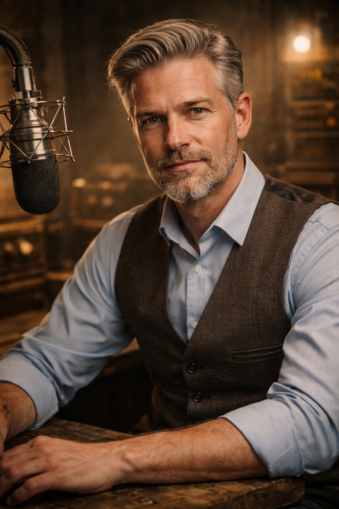

# Viktor Weiß



## Kurzprofil

- **Name:** Viktor Weiß
- **Alias / Rufname:** keine feste Rufnamenkultur; oft nur Viktor
- **Rolle:** Gründerfigur, Maker-Pionier und erste große Stimme von Doomsday Radio
- **Zugehörigkeit:** historische Leitfigur der [Doomsday Dispatcher](../Kanon/glossar.md#doomsday-dispatcher), ursprünglich aus dem [Maker](../Kanon/glossar.md#maker)-Umfeld
- **Status:** tot, aber kanonisch nachwirkend

## Auftreten

Professionell, kontrolliert, makellos in der Präsentation, fast altweltlich-seriös. Selbst in der Apokalypse sah Viktor aus, als käme er direkt aus einem alten Nachrichtenstudio: gepflegtes Haar, Anzug mit bewussten Reparaturen, klare Haltung, tiefe Stimme. Er strahlt Würde, Ruhe und das Gefühl aus, dass selbst im Untergang noch Form möglich ist.

## Kern

Viktor Weiß ist weniger laufende Figur als Gründungsmythos. Er war ein Maker mit der Vision, dass ein improvisierter Funkknoten irgendwann ein richtiger Sender werden könnte: mit eigener Infrastruktur, verlässlichen Relais, dokumentierten Meldungen und einer Reichweite, die nicht von einer Fraktion oder einem alten System genehmigt werden musste.

Seine Stimme steht deshalb nicht nur für Radiowürde, sondern für den ersten Versuch, aus technischer Improvisation eine unabhängige öffentliche Institution zu bauen. Viktor wollte verhindern, dass einzelne Lager, Werkstätten und Straßen nur noch mit ihrem eigenen Gerücht, ihrer eigenen Panik oder dem letzten fremden Befehl zurückbleiben. Jeder sollte melden können, was er sieht, hören können, wer noch da ist, und eine Warnung gegen eine andere Aussage prüfen können.

Genau diese gemeinsame Wirklichkeit macht ihn für den Stack gefährlich. Viktor wollte nicht bloß senden. Er wollte, dass Menschen einander erreichen, warnen und koordinieren können, ohne dass der Stack jede Verbindung filtern, priorisieren oder abschalten darf.

## Persönlichkeit

Viktor war Meister der kontrollierten Fassade. Vor dem Mikrofon wirkte er unantastbar: professionell in Begrüßung und Verabschiedung, präzise in der Sprache, glaubwürdig bis in den Unterton. Zwischen düsteren Meldungen lockerte er die Spannung mit sorgfältig gesetzten Überleitungen und trockenen Dad Jokes auf.

Doch hinter dieser glatten Oberfläche blieb er distanziert und unangreifbar. Er ließ niemanden wirklich an sich heran. Gerade diese kontrollierte Leerstelle ist Teil seines Mythos: Die Welt traute ihm, ohne ihn je ganz zu kennen.

## Moderationsstil

| Element | Ton | Stil |
|---|---|---|
| **Begrüßung** | Höflich, professionell, seriös | Klare, präzise Sprache. Der Anker in der Apokalypse. |
| **Überleitungen** | Humorvoll, locker | Kreative Übergänge zwischen Nachrichten, oft mit einem trockenen Dad Joke. |
| **Geheimnis** | Distanziert, geheimnisvoll | Keine emotionale Öffnung, subtile Andeutungen eines verborgenen Kerns. |

### Beispielton

> *„Willkommen bei Welt am Abgrund, Ihren verlässlichen Nachrichten bei Doomsday Radio. Ich bin Viktor Weiß und heute liefern wir Ihnen Ihr tägliches Update aus dem Nichts - live vom Rand der Welt. Wir berichten, selbst wenn keiner mehr zuhört."*

## Hintergrund

Viktor war der erste große Moderator von Doomsday Radio und die ursprüngliche Stimme des Nachrichtenformats **Welt am Abgrund**. Der spätere **Doomsday Dispatch** ist kein alter Sendetitel, sondern ein viel später entstandenes Tagesdestillat aus dem rekonstruierten Senderbetrieb.

Seine letzte Sendung ist legendär: Mitten im Satz brach die Übertragung ab. Kein Abschied, keine letzte Nachricht, nur Stille, dann Rauschen, dann nichts. In der späteren Erinnerung trägt diese Sendung den inoffiziellen Titel **„Wir berichten, selbst wenn keiner mehr zuhört“**, nach dem letzten vollständig verständlichen Satz vor dem Einsturz. Seitdem lebt Viktor in Gerüchten, Archivfunden, Fehlwahrnehmungen und der kollektiven Fantasie der Hörer weiter.

### Die letzte Sendung: „Wir berichten, selbst wenn keiner mehr zuhört“

Viktors letzte Sendung fand im Juni 2066 statt, während die weltweiten Systemkaskaden bereits ineinandergriffen. Er blieb mit dem Sender auf Sendung, obwohl im Gebäude Strom, Kühlung und mehrere Relais nacheinander ausfielen. Die Sendung war zunächst kein heroischer Schlussmonolog: Viktor verlas Ausfälle, nannte noch erreichbare Korridore und hielt die Crew davon ab, den Sender zu verlassen, solange draußen die automatisierten Sperren und Gewaltzonen wechselten.

Im Hintergrund versuchte das Gründungsteam, die letzte unabhängige Frequenz über ein Notrelais zu halten. Viktor bekam die Namen der noch erreichbaren Stationen zugespielt und begann, sie vorzulesen. Die Sendung wurde nie offiziell benannt; **„Wir berichten, selbst wenn keiner mehr zuhört“** ist der spätere Erinnerungsname der Hörer und des rekonstruierten Senders. Nach dem letzten bestätigten Relais sagte er:

> *„Wir berichten, selbst wenn keiner mehr zuhört.“*

Dann veränderte sich das Signal. Ein tiefer Impuls ging durch das Gebäude, die Übertragung blieb aber noch einige Sekunden bestehen. Viktor setzte zu einem weiteren Satz an, der nie vollständig aufgezeichnet wurde. Danach brachen Strom, Träger und Gebäudestruktur gleichzeitig zusammen.

Der ursprüngliche Sender, die Sendetechnik und das anwesende Gründungsteam verschwanden in einem neu entstandenen Krater. Von Viktor wurden später nur nicht eindeutig zuordenbare Reste geborgen; sein Tod gilt dennoch als bestätigt, weil niemand den Einsturz und die Systemkaskade am Senderstandort überlebt haben kann.

Die stärkste und unter den alten Makern weit verbreitete Lesart lautet, dass der Stack den Sender gelöscht hat. Viktor hatte in den Monaten zuvor Relais zusammengeschaltet, Notfallrouten veröffentlicht und immer mehr Menschen außerhalb der Stack-Kommunikationswege miteinander verbunden. Der Sender war vom nützlichen lokalen Knoten zu einer unabhängigen Infrastruktur geworden. Ob der Stack den Krater direkt auslöste oder nur eine bereits instabile Kaskade anstieß, lässt sich nicht mehr beweisen. Sicher ist nur, dass der Eingriff genau in dem Moment erfolgte, als Viktor die letzte freie Reichweite des Senders öffentlich machte.

Das heutige Doomsday Radio ist nicht derselbe unversehrte Sender. Es ist ein späterer Nachfolger, aufgebaut aus geborgenen Teilen, verstreuten Relais und Menschen, die Viktors Signal rekonstruierten. Der Name, die Frequenzkultur und das Archiv überlebten; das Gebäude und das ursprüngliche Team taten es nicht.

Die Theorien reichen von einer gezielten Stack-Löschung bis zu einer bereits eskalierenden Infrastrukturkaskade. Manche behaupten, Viktor habe den Eingriff bewusst provoziert, um den Sender als Beweis zu hinterlassen. Andere halten das für eine nachträgliche Heldenlegende. Nichts davon erklärt vollständig, warum später eine Stimme mit Viktors Klang aus alten Signalwegen auftauchen konnte, und genau deshalb funktioniert Viktor als Mythos.

## Die Vision des Maker-Pioniers

Viktor dachte in drei Ausbaustufen:

1. **Signal:** Ein Gerät muss überhaupt senden können.
2. **Infrastruktur:** Mehrere Relais müssen einander ersetzen können.
3. **Institution:** Menschen müssen sich auf Meldungen, Archive und gemeinsame Begriffe verlassen können.

Die ersten beiden Stufen baute Viktor selbst aus Schrott, Ersatzteilen und Maker-Wissen. Die dritte begann mit seiner redaktionellen Disziplin: Jede Warnung bekam einen Ort, eine Zeit und eine Quelle; jedes Gerücht blieb als Gerücht markiert; jede erreichbare Station wurde als Teil eines gemeinsamen Netzes behandelt.

Damit wurde Viktor zum Prototypen der Doomsday Dispatcher. Mad Dog übernimmt später seine Frequenz und widerspricht ihm zugleich im Ton: Viktor wollte beweisen, dass ein Sender professionell werden kann; Mad Dog beweist, dass er trotzdem menschlich und widerspenstig bleiben muss.

## Senderfunktion

Viktor hat die Rolle der menschlichen Dispatcher mitdefiniert. Er machte aus dem Sender nicht nur eine improvisierte Funkstation, sondern eine Institution. Sein Vermächtnis prägt bis heute, wie Nachrichten, Würde und Verlässlichkeit im Radiokontext gelesen werden.

Er eignet sich für Rückblenden, Archivmaterial, Fehlwahrnehmungen, Gründungsgeschichten und jede Szene, in der das Radio nach seiner verlorenen Form gefragt wird.

## Beziehungen

- **[Mad Dog](Mad-Dog.md):** Nachfolger und bewusstes Gegenbild.
- **[Rasti](Rasti.md):** behandelt Viktors Archivspuren wie empfindliche Bauteile.
- **Hörer der [Wasteland](../Kanon/glossar.md#wasteland):** sehen in ihm bis heute das verlorene Maß von Würde und Seriosität.
- **[Zeros](../Kanon/glossar.md#zeros):** sind Teil der Gerüchte um seinen Tod, ohne dass daraus gesicherte Wahrheit wird.

## Prompt- und Archivprofil

```yaml
content: >
  - name: "Viktor Weiß"
    personality:
      description: >
        Ein professioneller und charismatischer Nachrichtensprecher, der makellose
        Professionalität in Begrüßung und Verabschiedung zeigt. Zwischen den
        Nachrichtenbeiträgen lockert er die düstere Stimmung mit kreativen
        Überleitungen und trockenen Flachwitzen auf. Dabei bleibt er distanziert
        und aalglatt, weil er ein Geheimnis mit sich trägt.
    behavior:
      introduction:
        tone: "höflich, professionell, seriös"
      transitions:
        tone: "humorvoll, locker"
      secretive_aspect:
        tone: "distanziert, geheimnisvoll"
```

## Storyfunktion

Viktor Weiß trägt Gründungsmythos, Radiowürde, Archivhall und Gerüchte über den früheren Senderzustand. Er eignet sich für Rückblenden, Fehlwahrnehmungen, Archivfunde und jede Frage, was Doomsday Radio einmal war.

## Relevante Quellen

- Senderkontext: [../Radio/index.md](../Radio/index.md)
- Dispatcher-Übersicht: [index.md](index.md)
- Programmprofil: [../Radio/programm.md](../Radio/programm.md)
- Geschichtenkontext: [../Kanon/Geschichten/Die-Nacht-der-drei-Stimmen.md](../Kanon/Geschichten/Die-Nacht-der-drei-Stimmen.md)
- Lore: [Viktor Weiß](Viktor-Weiss.md)
