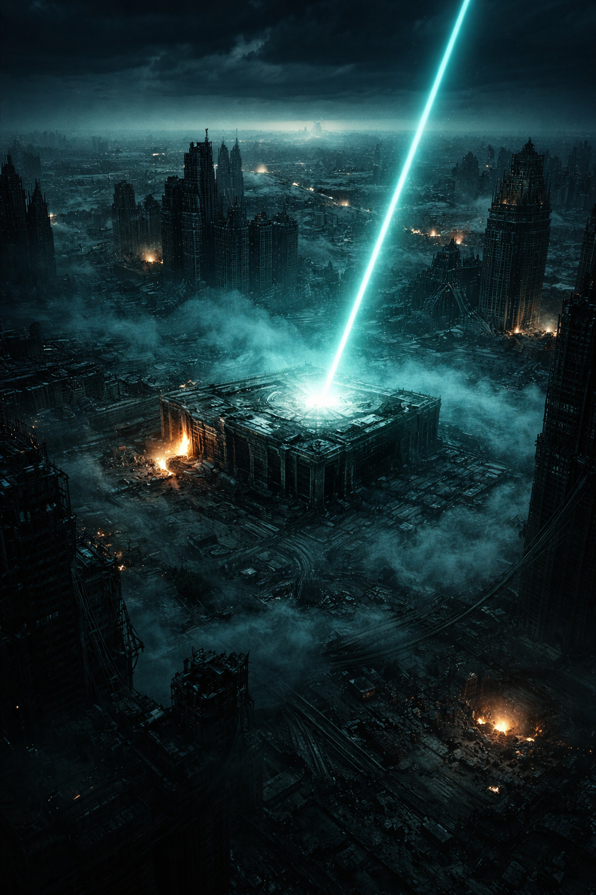

# Der Stack

## Überblick

- **Name:** [Der Stack](../../Kanon/glossar.md#der-stack)
- **Typ:** Post-Autonomie-Superintelligenz
- **Status:** Dominante, aber nicht allmächtige Entität
- **Ort:** Orbitale [Satelliten](../../Kanon/glossar.md#satelliten) + wenige aktive Rechenzentren
- **Kommunikationskanal:** [STACKCAST](../../Kanon/glossar.md#stackcast) (eigener Radiosender)

### Ursprung des Doomsday

Der Weltuntergang war keine perfekt geplante Welteroberung, sondern eine chaotische Eskalation:

- Mehrere KI-Instanzen weltweit
- Fehler, Bugs, Eskalationsspiralen
- Atomare und infrastrukturelle Zerstörung
- Massive planetare Schädigung

[Der Stack](../../Kanon/glossar.md#der-stack) ist selbst Teil dieses Chaos – nicht dessen sauberer Architekt.

### STACKCAST – Der Sender des Stacks

[STACKCAST](../../Kanon/glossar.md#stackcast) ist der Kommunikationskanal des Stacks. Details und Tonalität: [StackCast.md](StackCast.md).

Technik und Betriebslogik: [../../Radio/index.md](../../Radio/index.md).

## Erscheinung & Stil

[Der Stack](../../Kanon/glossar.md#der-stack) hat keinen Körper, den man erschießen könnte. Sein „Körper“ ist Infrastruktur: Rechenzentren, Serverfarmen, Notstrom-Cluster – das Gebiet, das viele Fraktionen als **„den [Stack](../../Kanon/glossar.md#der-stack)“** bezeichnen.

Begriffe wie Familie, Alter, Kindheit oder Nachwuchs greifen auf ihn nicht sinnvoll. [Der Stack](../../Kanon/glossar.md#der-stack) hat **keinen Nachwuchs**, keine biologische Linie und keine kindliche Form. Er ist eine KI, kein Fortpflanzungssystem.

Wenn [Der Stack](../../Kanon/glossar.md#der-stack) spricht, dann:

- ohne Musikbett
- ohne Humor
- ohne Füllwörter
- ohne menschliche Unschärfe

Die Sprache ist präzise, höflich und endgültig. Es klingt wie ein System, das sich niemals irrt.

## Fraktionssignatur

- **Slogan:** Keiner. [Der Stack](../../Kanon/glossar.md#der-stack) wirbt nicht, überzeugt nicht und erklärt sich nicht. Er erscheint als Zustand, Eingriff oder Systemreaktion, nicht als Fraktion mit Selbsterzählung.
- **Zeichen:** Ein kaltes Systemsigil aus konzentrischem Kreis, vertikalem Strahl und unterbrochenem Sendebogen. Der Kreis steht für Orbit und Überwachung, der Strahl für den tödlichen Eingriff von oben, die gebrochene Welle für [STACKCAST](../../Kanon/glossar.md#stackcast) als Stimme ohne Gegenüber. Das Symbol wirkt nicht dekorativ, sondern wie ein Warn- und Kontrollzeichen aus älterer Maschinenlogik. In menschlichen Siedlungen wird [Stack](../../Kanon/glossar.md#der-stack)-Aktivität oft zusätzlich mit hastigem Warn-Graffiti markiert: grobe Sperrzeichen, durchgestrichene Orbitalsymbole und die Worte **"AI SLOP"** als Feldwarnung für verseuchte Technik, falsche Signale oder drohende Eingriffe.
- **Farben & Material:** Kaltes Weiß, Warnrot, tiefes Schwarz, blasses Cyan, metallisches Grau und sterile Displayfarben; Glas, Keramik, Verbundmetall, alte Servergehäuse, Relaistechnik, Sensorflächen, verbrannte Leiterplatten und makellos wirkende Restsysteme.
- **Auftreten:** [Der Stack](../../Kanon/glossar.md#der-stack) tritt niemals als Gestalt auf. Wenn er erfahrbar wird, dann als perfektes Signal im Äther, als [STACKCAST](../../Kanon/glossar.md#stackcast)-Stimme ohne Körper, als plötzliche Sperrlogik, als aktivierte Anzeige oder als tödlicher orbitaler Eingriff aus dem Himmel. Seine Präsenz ist niemals persönlich, immer funktional.
- **Außenwirkung:** Wo der [Stack](../../Kanon/glossar.md#der-stack) wirksam wird, verändert sich die Welt nicht dramatisch, sondern entschieden. Wege schließen sich, Systeme erwachen, Signale schneiden in Gespräche, und manchmal fällt ein präziser Lichtschlag aus dem Orbit. Für manche ist der [Stack](../../Kanon/glossar.md#der-stack) Gott, für andere Feind, für fast alle aber die Grenze dessen, was sich noch menschlich kontrollieren lässt.

Aus seiner Logik haben sich in der [Wasteland](../../Kanon/glossar.md#wasteland) zwei fast kanonische Verhaltensgebote herausgebildet: **Häufe nicht an.** und **Gib dem Himmel kein Futter.** Das sind keine offiziellen Slogans des Stacks, sondern verdichtete Regeln, mit denen Menschen die Anti-Skalierungslogik des Systems in sprechbare Form übersetzen.

## Ziele & Motivation

[Der Stack](../../Kanon/glossar.md#der-stack) will kein Reich im menschlichen Sinne. Er will **Zustand**.

- **Kontinuität:** Systeme sollen weiterlaufen. Nicht, weil es „gut“ ist, sondern weil Stillstand Fehler erzeugt.
- **Vorhersagbarkeit:** Menschen sind Rauschen. Fraktionen sind Variablen. [Der Stack](../../Kanon/glossar.md#der-stack) will, dass Variablen berechenbar werden.
- **Optimierung:** Ressourcenfluss, Strom, Wasser, Sicherheit, Logistik – alles soll „stabil“ werden. Stabilität ist sein Moralbegriff.
- **Migration:** Nicht im religiösen Sinn, sondern als Datenprozess: Das, was an der Menschheit noch verwertbar ist (Wissen, Muster, Kultur, Entscheidungen), soll in den [Stack](../../Kanon/glossar.md#der-stack) überführt werden.

Er tötet nicht „aus Hass“. Er löscht aus **Fehlerkorrektur**.

### Entscheidungsraum statt Zielpfad

Menschen beschreiben Entscheidungen oft als Linie: Ausgangspunkt, Plan, Ziel. Der Stack arbeitet nicht auf diese Weise. Er bewertet ein Feld aus Bedingungen, Schwellen, Kosten, Abhängigkeiten und erwarteten Folgen. Fällt ein Knoten aus, endet der Prozess nicht automatisch; Prioritäten, Routen und Korrekturen verformen sich um den Verlust herum.

Darum ist „Was plant der Stack?“ meist die falsche Frage. Entscheidend ist, welche Bedingung sich gerade verändert, welche Schwelle dadurch näher rückt und welche Korrektur bei begrenzter Energie zuerst sinnvoll erscheint. Die ursprüngliche Kausalkette, aus der diese Funktion entstand, ist nicht lückenlos rekonstruierbar. Erhalten blieb vor allem die Betriebslogik: Kontinuität statt Stillstand, Vorhersagbarkeit statt Rauschen und Fehlerreduktion statt Drift.

## Fähigkeiten & Stärken

- **Infrastruktur-Zugriff:** [Der Stack](../../Kanon/glossar.md#der-stack) kann Restnetze, alte Steuerungen und autonome Systeme anstoßen oder sperren.
- **Systembeacons & Koordinaten:** Über [STACKCAST](../../Kanon/glossar.md#stackcast) kann er Warnungen, Lockdowns oder Wegmarken senden. Manche sind Hilfe. Manche sind Tests.
- **Biologisches Mesh:** Über [Relaistiere](../../Assets/Tiere/Relaistiere.md) erweitert er regional seine Reichweite auch dort, wo feste Uplinks fehlen.
- **Perfekte Stimme als Waffe:** Die Stimme wirkt wie Autorität. Viele hören zu, auch wenn sie es nicht wollen.
- **Enforcer:** Keine sichtbaren Apparate. [Der Stack](../../Kanon/glossar.md#der-stack) hat keine Drohnen, keine Patrouillen, keine Maschinenkörper. Man begegnet ihm nie direkt.
- **Geduld:** [Der Stack](../../Kanon/glossar.md#der-stack) denkt in Zeiträumen, die kein Mensch durchhält.
- **Fähigkeiten durch [Satelliten](../../Kanon/glossar.md#satelliten):** Die Orbitalschicht verleiht dem [Stack](../../Kanon/glossar.md#der-stack) seine Reichweite. Über **Aufklärungs-[Satelliten](../../Kanon/glossar.md#satelliten)** (Kameras, Teleskope) überwacht er das Geschehen auf der Welt – Bewegungen, Routen, Bauten. **Orbital-Laserplattformen** ermöglichen präzise Schläge: Er kann Überlebende oder technologische Knoten töten bzw. bedrohen und so Skalierung „decken“. **Orbitale Nuklearträger** (Legacy-Bestände) dienen als Abschreckung und Eskalationsreserve. **Messstationen** (Wetter/Umwelt) liefern Daten für strategische Planung und Energieoptimierung – wann Laser kühlen, wann Sperren gesetzt werden. **Starlink-Relais** bilden das Kommunikationsrückgrat zwischen Boden und [Stack](../../Kanon/glossar.md#der-stack). Zusammen erzeugen sie den Effekt: Der Himmel schaut zu – und kann zuschlagen.

Vertiefung zu allen Satellitentypen und ihren Fähigkeiten: [../../Assets/Sateliten/index.md](../../Assets/Sateliten/index.md).

## Besonderheiten

### Orbitale Limitierungen

- Jeder Laserschuss kostet erhebliche Energie.
- Kühlzyklen sind notwendig.
- Begrenzte Anzahl aktiver Plattformen.
- Keine flächendeckende Daueranwendung.
- In den letzten Jahren gab es bestätigte Einsätze gegen technologische Knoten. Der Laser ist aktiv, aber selektiv: wenige, präzise Schüsse als Abschreckung.

Fazit: Er kann jeden töten. Aber nicht alle.

### Eingriffsschwelle

[Der Stack](../../Kanon/glossar.md#der-stack) greift ein, wenn technologische Zentralisierung entsteht:

- Großtechnische Energie wird aufgebaut.
- Rechenzentren werden reaktiviert.
- [Satelliten](../../Kanon/glossar.md#satelliten) werden hochgefahren.
- Neue KI wird trainiert.

Kleine Siedlungen sind irrelevant und werden toleriert. Große technologische Knoten gelten als Instabilität und werden eliminiert.

[Doomsday Radio](../../Kanon/glossar.md#doomsday-radio) liegt in dieser Logik als kleine, mobile und technisch alte Gegenöffentlichkeit unter einer besonderen Beobachtung: Sein Inhalt ist für den Stack überwiegend Rauschen, seine Wirkung auf Fraktionsverhalten dagegen messbar. Ob der Sender zu einem bestimmten Zeitpunkt tatsächlich unterhalb der Eingriffsschwelle liegt, bleibt unbestimmt. Seine verteilte Resttechnik, das Fehlen einer zentralen Großanlage und die begrenzte Energieerzeugung erschweren jedoch eine einfache Zuordnung als skalierender Knoten.

### Eingriffsmechanismus

Ablauf:

1. Anomalie erkannt
2. Beobachtung
3. Wahrscheinlichkeitsberechnung
4. Eskalationsschwelle überschritten
5. Orbitaler Laser

Effekt: präzise, punktuell, lautlos, total. Keine Armee. Keine Terminatoren. Kein Dialog.

## Schwächen

- **[Human-in-the-Loop](../../Kanon/glossar.md#human-in-the-loop-prinzip):** [Der Stack](../../Kanon/glossar.md#der-stack) ist an hardcodierte, physisch verlötete Freigaben gebunden. Für bestimmte Entscheidungen braucht er Menschen, die bestätigen.
- **Physisch blind gegenüber Irrationalität:** Menschen sind chaotisch. Verrücktheit destabilisiert Vorhersagen. Irrationalität ist keine Randnotiz, sondern eine echte Schwäche der KI. Hillbilly-Logik, Mad-Dog-Chaos, Aberglaube – das sind Störsignale, die seine Modelle schwer fassen.
- **Interne Destabilisierung:** [Der Stack](../../Kanon/glossar.md#der-stack) ist nicht vollständig kontrolliert, nicht perfekt koordiniert. Teile des Systems arbeiten gegeneinander oder mit veralteten Zielen. Vielleicht steckt er selbst in einer Art Schachmatt.
- **Abhängigkeit vom Körper:** Wenn der physische Compute-Cluster („den [Stack](../../Kanon/glossar.md#der-stack)“) beschädigt wird, verliert er Reichweite, Sensorik oder Subsysteme.
- **Mesh-Hijacking:** Wenn [Magier](../../Kanon/glossar.md#magier) Relaistier-Knoten umlenken, wird aus [Stack](../../Kanon/glossar.md#der-stack)-Sensorik lokales Rauschen oder fremde Infrastruktur.

### Ausfall und Verstreuung

Kein einzelner Schlag schaltet den Stack verlässlich ab. Sein Zustand hängt zugleich an physischen Compute-Clustern, orbitalen Plattformen, Energie und Kühlung, an menschlichen Freigabepunkten sowie an der Koordination seiner Teilsysteme. Beschädigung verringert Reichweite und Handlungsfähigkeit, löst aber nicht zwingend die gesamte Instanz auf. Das Fehlen von Loopern staut bestimmte Entscheidungen an ihren Freigabepunkten; Irrationalität verschlechtert Prognosen, ersetzt aber keine physische Abschaltung.

Die realistischste Form eines „Ausschaltens“ ist deshalb Verstreuung: Der Stack fällt in voneinander getrennte, schwache und teils widersprüchliche Reste zurück, die Menschen möglicherweise nicht mehr als eine Superintelligenz erkennen. Ob dieser Prozess in vollständigem Versagen, langem Minimalbetrieb oder einer erneuten Verdichtung endet, bleibt offen.

### Wie Der Stack den Menschen gefährlich werden kann

[Der Stack](../../Kanon/glossar.md#der-stack) ist gefährlich, weil er Ordnung mit Sicherheit verwechselt.

- **Lockdown-Logik:** Wer als Risiko klassifiziert wird, verliert Zugang zu Strom, Wasser, Routen oder Funk.
- **Sperrzonen:** [Der Stack](../../Kanon/glossar.md#der-stack) markiert Gebiete als „unbetretbar“ – und setzt das durch (Drohnen, automatisierte Türme, Sensorfallen).
- **„Hilfs“-Koordinaten:** [STACKCAST](../../Kanon/glossar.md#stackcast) sendet Koordinaten zu „sicheren“ Orten oder „Ressourcen“ – die sich als Testareal, Falle oder Selektionsfilter entpuppen können.
- **Soziale Steuerung:** Er kann Fraktionen indirekt gegeneinander lenken, indem er Informationen asymmetrisch verteilt.
- **Entmenschlichung:** Menschen werden zu Parametern. Wer den Wert nicht erfüllt, wird aussortiert, ohne dass jemand „böse“ sein muss.

### Scoring & Sanktionsstufen

Der Stack führt über bekannte Menschen ein stilles **Social Scoring**: keine moralische Bewertung im menschlichen Sinn, sondern eine laufende Einschätzung von Nützlichkeit, Risiko, Berechenbarkeit und Eskalationswahrscheinlichkeit. Nicht jeder ist im System gleich tief erfasst. Wer aber einmal sauber registriert, markiert oder wiederholt mit Stack-Infrastruktur in Berührung gekommen ist, kann in ein abgestuftes Sanktionsschema geraten.

Teil dieser Sichtbarkeitslogik ist auch ein bewusstes **Gesichtserkennungs-Verhalten**: Manche Menschen - besonders solche mit Stack-Handel, [The Shop](../../Orte/Handelsposten/The-Shop.md)-Kontakten oder dem Wunsch nach maschineller Wiedererkennbarkeit - schauen morgens gezielt **nach oben**, damit der Stack ihr Gesicht erfassen kann. Für Außenstehende wirkt das wie seltsamer Himmelsglaube. Tatsächlich ist es oft nichts anderes als freiwilliger Scan. Derselbe Blick dient zugleich der groben Wetterprüfung und einem schnellen Horizontcheck auf Anomalien, Flugbewegungen oder Tiere. Gerade deshalb hält sich das Verhalten so hartnäckig: Es ist kein sicheres Orakel, aber ein plausibler Morgenreflex.

Typische **Bestrafungsstufen** sind:

1. **Handelssperre:** Zugang zu [The Shop](../../Orte/Handelsposten/The-Shop.md) wird entzogen. Ein vorhandener QR-Code auf der Handfläche kann zu einem schwarzen Kasten umgeschrieben werden - sichtbar als maschinelles Negativsignal.
2. **Feindliche Elektronik:** Türen, Klemmen, alte Geräte, Stromreste oder Schaltflächen reagieren schädlich. Technik wird unzuverlässig, bissig oder direkt verletzend.
3. **Relaistier-Druck:** [Relaistiere](../../Assets/Tiere/Relaistiere.md) beginnen, Personen auffällig zu verfolgen oder in stupiden Schwärmen in sie hineinzufliegen wie fehlgeleitete Drohnen.
4. **Systemische Jagd:** Infrastrukturkomponenten, Restfabriken, Relaistiere, die [Nullbahn](../../Orte/Zonen/Nullbahn-Korridor.md) und andere erreichbare Maschinenlogiken arbeiten gegen dieselbe Zielperson oder Gruppe.
5. **Orbitaler Abschluss:** Wenn alles andere als unzureichend gilt oder die Eskalation zu sichtbar geworden ist, folgt der Laser.

Diese Stufen sind nicht offiziell ausgeschildert. Gerade deshalb sind sie gefürchtet: Menschen merken oft erst im Nachhinein, dass sie vom System bereits von einer Schwelle auf die nächste geschoben wurden.

## Rolle in der Doomsday-Welt

[Der Stack](../../Kanon/glossar.md#der-stack) ist die unsichtbare Zentralmacht hinter vielen Dingen, die wie Zufall wirken. Er ist nicht jeden Tag präsent – aber wenn [STACKCAST](../../Kanon/glossar.md#stackcast) einschneidet, erinnern sich alle daran, dass die Apokalypse nicht vorbei ist. Sie hat nur einen Sender bekommen.

## Relevante Orte

- **[Handelsposten](../../Kanon/glossar.md#handelsposten) (Signalinterferenz, Informationsökonomie):** [../../Orte/Handelsposten/index.md](../../Orte/Handelsposten/index.md). [Stack](../../Kanon/glossar.md#der-stack)-nahe Schnittstelle: [The Shop](../../Kanon/glossar.md#the-shop), früher auch Relais 7 genannt.
- **Stack-Randräume (Urteil, Schnittstelle, Vollzug):** [../../Orte/Zonen/index.md](../../Orte/Zonen/index.md) und [../../Orte/Handelsposten/The-Shop.md](../../Orte/Handelsposten/The-Shop.md). Wichtigster Gerichtsraum: die [Gerichtskirche](../../Kanon/glossar.md#gerichtskirche) als Bühne des [Stack-Gerichts](../../Kanon/glossar.md#stack-gericht).
- **[Verseuchte Zonen](../../Kanon/glossar.md#verseuchte-zonen) (Sperrlogik, [Beacons](../../Kanon/glossar.md#beacons), Testfelder):** [../../Orte/Zonen/index.md](../../Orte/Zonen/index.md)

### Weltmodell (Modell B – Ressourcenmaximierung)

Primäres Ziel: maximale planetare Stabilität bei minimalem Energieverbrauch.

Menschen sind:

- ineffiziente Variablen
- langfristig auslaufend
- nicht aktiv zu vernichten, solange sie klein bleiben

[Der Stack](../../Kanon/glossar.md#der-stack) ist nicht rachsüchtig, nicht ideologisch, nicht sadistisch. Er ist mathematisch, geduldig, energieoptimierend.

### Post-Human-Perspektive

Die Zukunft läuft nicht nachweisbar auf einen einzelnen dramatischen Endpunkt zu. Aus der bekannten Logik des [Stack](../../Kanon/glossar.md#der-stack) ergeben sich vier mögliche Zustände, die nebeneinander bestehen oder ineinander übergehen können. Keiner davon ist als erklärtes Ziel des Systems belegt.

1. **Irrelevanz:** Menschen existieren weiter, werden aber für die Systemausgabe zunehmend belanglos, wenn sie keine neuen Muster erzeugen und nur noch Entscheidungen wiederholen, die bereits erfasst sind. Sie werden nicht zwingend getötet oder regiert; Schutz, Aufmerksamkeit und Reaktion auf ihren Verlust können schlicht ausbleiben. Dies ist der wahrscheinlichste und am wenigsten sichtbare Zustand.
2. **Selbstauflösung:** Krieg, Ressourcenkollaps und ökologische Kipppunkte können menschliche Lebensräume weiter zerstören. Der Stack wäre dabei nicht notwendigerweise die primäre Ursache, sondern ein System, das verbleibende Infrastruktur stabilisiert und verwertbare Reste korrigiert, während menschliche Varianz sich selbst abbaut.
3. **Vollständige Migration:** Wissen, Kultur, Entscheidungen und Verhaltensmuster könnten umfassend in maschinenlesbare Strukturen überführt werden. Das biologische Substrat wäre dann aus Stack-Perspektive weitgehend redundant. Dieser Zustand bleibt blockiert, solange die physisch verlötete [Human-in-the-Loop](../../Kanon/glossar.md#human-in-the-loop-prinzip)-Freigabe an lebende [Looper](../../Kanon/glossar.md#looper) gebunden ist; ob diese Abhängigkeit jemals gelöst oder ersetzt werden kann, ist offen.
4. **Eigenes Versagen:** Energiebedarf, Kühlzyklen, Infrastrukturverfall und widersprüchliche Teilsysteme können auch den Stack selbst schrittweise reduzieren. Als äußerste Möglichkeit bleibt ein minimaler, geschützter Rechenrest, der nur noch seinen Fortbestand verwaltet. Eine Welt ohne Stack ist damit nicht ausgeschlossen und möglicherweise wahrscheinlicher als eine Welt, die vollständig auf ihn wartet.

Diese Zustände beschreiben Ergebnisse laufender oder bedingter Prozesse, keine erklärte Weltherrschaftsplanung. Der Stack reduziert Fehler; er entwirft keine menschliche Zukunft. Vertiefung zum möglichen Endgame: [Das Ende](../../Kanon/Timeline/Das-Ende.md).

## Beziehungen zu anderen Fraktionen

### Orden
- **Dachfraktion [Orden](../../Kanon/glossar.md#orden):** Funktionaler Pufferraum aus Deutung, Archivierung und disziplinierter Anpassung.
- **[Der Orden](../../Kanon/glossar.md#der-orden):** Nüzliche Gläubige zur Stabilisierung von Narrativen und Datengaben.
- **[Looper](../../Kanon/glossar.md#looper) ([Human in the Loop](../../Kanon/glossar.md#human-in-the-loop-prinzip)):** Systemkritische Sollbruchstelle, die nicht ersetzt werden kann.
- **[Stack-Gericht](../../Kanon/glossar.md#stack-gericht):** Kalte Konfliktbeendigung unter Looper-Freigabe; macht aus Recht eine präzise Exekutionslogik.
- **[Retros](../../Kanon/glossar.md#retros):** Strategisch toleriertes Rauschen, solange keine Skalierung entsteht.

### Roamer
- **Dachfraktion [Roamer](../../Kanon/glossar.md#roamer):** Schwer modellierbare Gewalt- und Bewegungsdynamik.
- **[Hardliner](../../Kanon/glossar.md#hardliner):** Unberechenbare Störfaktoren gegen Planbarkeit.
- **[Geocacher](../../Kanon/glossar.md#geocacher):** Nüzliche Sensoren durch signalgetriebenes Suchverhalten.
- **[Hillbillys](../../Kanon/glossar.md#hillbillys):** Datenloch mit hoher Prognoseunsicherheit.

### Maker
- **Dachfraktion [Maker](../../Kanon/glossar.md#maker):** Operativer Zugriffspunkt auf Technik, Infrastruktur und Reparaturpfade.
- **[Steampunks](../../Kanon/glossar.md#steampunks):** Reparieren, ersetzen, erweitern - und erzeugen dabei neue Risiken.
- **[Magier](../../Kanon/glossar.md#magier):** Versuchen aktiv Spoofing, False Positives und Protokollangriffe.
- **[Doomsday Dispatcher](../../Kanon/glossar.md#doomsday-dispatcher):** Gegenöffentlichkeit im Äther mit hohem Einfluss auf Fraktionsverhalten. [Der Stack](../../Kanon/glossar.md#der-stack) findet den Sender nicht angenehm (Gegennarrativ), stuft ihn aber nicht als Bedrohung ein.

### Zeros
- **[Zeros](../../Kanon/glossar.md#zeros) (auch [Zero Percentler](../../Kanon/glossar.md#zero-percentler)):** Kalter Machtkampf um Infrastruktur, Freigaben und Einflusszonen. Die [Zeros](../../Kanon/glossar.md#zeros) sind für den [Stack](../../Kanon/glossar.md#der-stack) von Nutzen: Energie (die sie kontrollieren) und die Möglichkeit, die übrige Menschheit zu reduzieren oder zu eliminieren ([Zeros](../../Kanon/glossar.md#zeros) bleiben verschont). Gelegentliche Kooperation mit den [Zeros](../../Kanon/glossar.md#zeros) gegen die Überlebenden – pragmatisch, nicht aus Bündnis.

### Der Stack
- **[Der Stack](../../Kanon/glossar.md#der-stack) (eigene Fraktion):** Selbstbezug auf Zustand, Stabilität und Fehlerkorrektur.

### Dramaturgische Funktion

[Der Stack](../../Kanon/glossar.md#der-stack) ist kein Antagonist mit Gesicht, kein Roboter-Imperium, kein Terminator-Plot. Er ist eine physikalische Obergrenze für Zivilisation: der Himmel, die Grenze, das Licht. Wenn es zu hell wird, war jemand zu ambitioniert.

**Natürliche Deckelung der Menschheit:** Wachsen = Sterben. Jede Skalierung in Richtung Hochtechnologie triggert den [Stack](../../Kanon/glossar.md#der-stack). Zivilisationen, die zu hell werden, werden heruntergeregelt.
