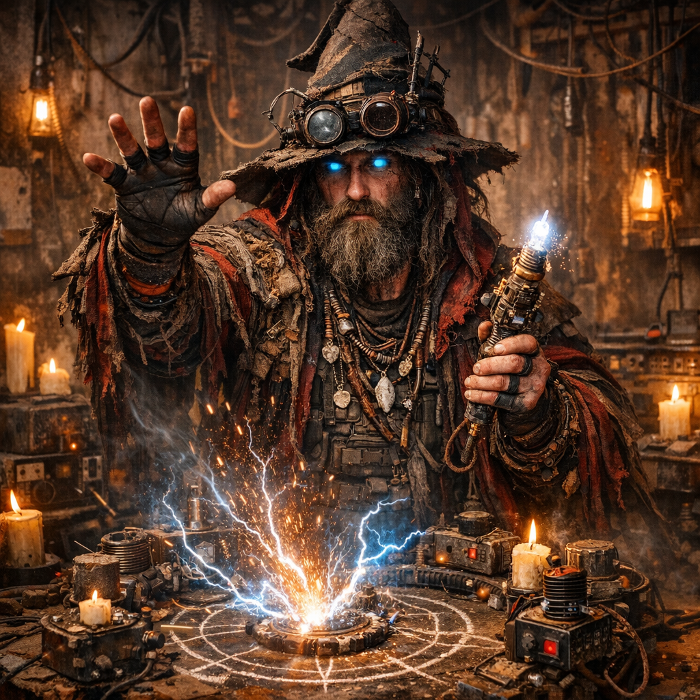

# Magier

Untergruppe der Dachfraktion [Maker](../../Kanon/glossar.md#maker).

## Überblick

Sie nennen sich **[Magier](../../Kanon/glossar.md#magier)** und treten nach außen oft als **Cyberpunks** in Erscheinung. Im Kern sind sie die stärksten Tech-Hacker der [Maker](../../Kanon/glossar.md#maker). Sie wissen genau, dass sie keine echten Zauberer sind, stecken aber längst so tief in ihrem eigenen Roleplay aus Ritualsprache, Cosplays und Beschwörungslogik, dass der Unterschied im Alltag kaum noch eine Rolle spielt. Ihr Fokus liegt auf Signal-Spoofing, Protokolltricks und riskanter Feldtechnik.

## Erscheinung & Stil

[Magier](../../Kanon/glossar.md#magier) treten als technische Esoteriker auf: Ritualsprache, Symbolik und improvisierte High-Risk-Geräte verschmelzen zu einem Stil, der zwischen Werkstatt, Kult und Einsatztrupp liegt. Unter Kutten, Talismanen, Rauschbärten und improvisierten Magierhüten stecken hochpräzise Hacker, die ihre Geräte wie Fokusstäbe, Runentafeln und Zauberwerkzeuge inszenieren.

## Fraktionssignatur

- **Slogan:** "Der Funke folgt dem, der ihn benennt."
- **Zeichen:** Kein klassisches Wappen, sondern ein arkanes Sigill: ein unterbrochener Kreis, darin ein stilisiertes Auge oder eine gebrochene Linse, durchzogen von verschobenen Linien und kleinen Zeichen, die nur Eingeweihte zu lesen glauben. Für [Magier](../../Kanon/glossar.md#magier) ist es Bannkreis, Schutzzeichen und Anspruch auf Deutungshoheit zugleich.
- **Farben & Material:** Kupferglut, Aschegrau, verbranntes Schwarz und fahles Cyan in kleinen Akzenten; Lackdraht, Glaslinsen, Spulen, verkohltes Holz, Keramikreste, Schrottmetall und rußige Stoffe.
- **Auftreten:** [Magier](../../Kanon/glossar.md#magier) inszenieren jedes Eingreifen wie ein Ritual. Kabel hängen wie Gebetsbänder, Schalter werden wie Reliquien berührt, Geräte mit Kreide, Ruß oder eingebrannten Glyphen markiert. Ihre Werkzeuge wirken wie Kultobjekte, ihre Eingriffe wie Beschwörungen.
- **Außenwirkung:** Wo ihr Zeichen auftaucht, erwartet man unheimliche Präzision, Störungen, flackerndes Licht, falsche Wahrnehmung und Leute, die behaupten, das Unsichtbare lesen zu können. Für Verbündete sind sie nützliche Spezialisten, für Außenstehende fanatische Zeichenleser mit Hang zur Katastrophe.

## Ziele & Motivation

Sie wollen den [Stack](../../Kanon/glossar.md#der-stack) manipulieren, Einflussräume für [Maker](../../Kanon/glossar.md#maker) sichern und über technische Überlegenheit politische Wirkung erzielen. Ihr Leitmotiv ist Kontrolle durch Unvorhersehbarkeit: Wer Signale deuten und fälschen kann, bestimmt den Takt.

## Fähigkeiten & Stärken

- **Signal-Spoofing:** Sie erzeugen falsche Anomalien, verfälschen [Beacons](../../Kanon/glossar.md#beacons) und verschieben Wahrnehmung im Netzraum.
- **Protokolltricks:** Alte Schnittstellen und gestohlene Chips werden zu operativen Hebeln.
- **Arkansprache:** [Magier](../../Kanon/glossar.md#magier) sprechen eine künstliche Ritualsprache aus Codestücken, verfremdeten Fachbegriffen, Namen und Spruchformeln, die für Außenstehende wie echte Beschwörung klingt.
- **Luftglyphen & Scheinzeichen:** Über versteckte Projektoren, unsichtbare Displays und präparierte Geräte lassen sie Schriftzeichen, Siegel, Warnrunen und flackernde Effekte scheinbar frei in der Luft erscheinen.
- **Relaistier-Hacking:** Sie kapern [Relaistiere](../../Assets/Tiere/Relaistiere.md), verdrahten Knoten um und bauen lokale Schatten-Meshes.
- **Schwarmlenkung:** Einige [Magier](../../Kanon/glossar.md#magier) können [Drahtwespen](../../Assets/Tiere/Drahtwespen.md) in engen Fenstern umlenken und als lebende Störfelder einsetzen.
- **Fremdblick:** Erfahrene Zellen nutzen [Eisensänger](../../Assets/Tiere/Eisensaenger.md) als "Augen" für Vorfeldaufklärung und Mastbeobachtung.
- **Chimärenwerk:** Ein radikaler Randflügel verbindet Tiere mit Maschinenrahmen zu [Chimärenplattformen](../../Assets/Tiere/Chimaerenplattformen.md).
- **Feldtechnik:** Improvisierte Generator- und Kondensatorsysteme liefern kurzfristig hohe Wirkung.
- **Show-Pyro:** Einzelne Zellen verkaufen ihre Flammen- und Funkenrituale als Bühneneffekt für Arena-Abende, Konzerte und große [Maker](../../Kanon/glossar.md#maker)-Shows.
- **Psychologischer Effekt:** Ihre Ritualästhetik verstärkt Abschreckung und Verunsicherung.

## Schwächen

- **Instabilität:** Viele Effekte sind unzuverlässig oder nur unter engen Bedingungen reproduzierbar.
- **Selbstgefährdung:** Fehlkalibrierungen führen zu Verletzungen, Systemkaskaden oder unfreiwilliger [Stack](../../Kanon/glossar.md#der-stack)-Aufmerksamkeit.
- **Interner Dogmatismus:** Ritualisierung erschwert nüchterne Risikoabwägung bei kritischen Einsätzen.

## Besonderheiten

### Alte Magier

Alte [Magier](../../Kanon/glossar.md#magier) genießen besonderen Respekt, weil sich in ihnen technisches Können und arkanes Rollenspiel am stärksten verdichten. Je älter ein [Magier](../../Kanon/glossar.md#magier), desto größer meist seine Lore, sein Ruf als Deuter von Zeichen und sein Anspruch auf verborgene Kunde.

### Kinder bei den Magiern

[Magier](../../Kanon/glossar.md#magier)-Kinder im engeren Sinn gibt es kaum als feste Nachwuchslinie. Es sind meistens einfach **[Maker](../../Kanon/glossar.md#maker)-Kinder**, und die Eltern legen keinen besonderen Wert darauf, dass jemand die Magierkunde übernimmt. Manche Kinder suchen sich dieses Interesse aber selbst aus, verfallen der Ritualsprache, den Symbolen und der Feldtechnik und werden genau deshalb später doch zu Magiern.

### Ritual & Praxis

Ein Teil der [Magier](../../Kanon/glossar.md#magier) lebt Technologie wie ein Ritual. Sie sprechen Zaubersprüche und bedienen alte Hardware in festen Zeremonien. Was für andere nur Schrott ist, ist für sie ein System aus Namen, Glyphen und Schaltern, das sie „wirken“ lassen.

Sie wissen dabei sehr genau, dass sie keine übernatürlichen Kräfte besitzen. Gerade die erfahrensten unter ihnen sind brillante Hacker, Protokollbrecher und Feldtechniker. Trotzdem wird das technische Wissen im Alltag fast vollständig in Rollenspiel übersetzt: Befehle werden zu Formeln, Fehlersuche zu Divination, Zugriff zu Beschwörung und Tarntechnik zu Illusionskunst.

Ihre Tricks sind Tech-Hacks: alte Protokolle, Feldgeneratoren, gestohlene Steuerchips, improvisierte Kondensatorstacks. Sie können Blitze werfen, Feuerbälle zünden oder Schutzfelder aufbauen - nicht durch Magie, sondern durch riskante Technik, die wie Magie aussieht.

Besonders eindrucksvoll sind ihre "Schriftwunder": Mit versteckten Projektoren, prismatischen Linsen, Relay-Spiegeln und schwer sichtbaren Displayflächen lassen sie Runen, Bannkreise, Warnzeichen und ganze Spruchzeilen in Rauch, Staub oder scheinbar frei im Raum erscheinen. Für Außenstehende wirkt das wie echte Arkana; für [Magier](../../Kanon/glossar.md#magier) ist es perfekte Inszenierung mit operativem Nutzen.

Viele ihrer Effekte sind instabil, gefährlich oder nur unter bestimmten Bedingungen wiederholbar. Gerade das macht sie unberechenbar und furchteinflössend.

Sie glauben, den [Stack](../../Kanon/glossar.md#der-stack) über „Zauber“ beeinflussen zu können: Signal-Spoofing, falsche Anomalien, manipulierte [Beacons](../../Kanon/glossar.md#beacons). Ziel ist, den [Stack](../../Kanon/glossar.md#der-stack) gegen Rivalen zu lenken - ein Spiel, das oft in Katastrophen endet.

In ihrer Schrauberkapelle verehren viele [Magier](../../Kanon/glossar.md#magier) die Götzenstatü **Makey Mc Makeface** als Patron der Improvisation, des Bastelwahns und der glücklichen Fehlfunktion.

Ein Spezialzweig der [Magier](../../Kanon/glossar.md#magier) bezeichnet das Relaistier-Hacking als "Druiden-Zauber". Gemeint sind keine übernatürlichen Kräfte, sondern wiederholbare Feldprozeduren:

- **Knotenruf:** ein Tier wird auf ein neues [Beacon](../../Kanon/glossar.md#beacons) geprägt
- **Rudelkreis:** mehrere Tiere werden auf eine gemeinsame Route synchronisiert
- **Totembruch:** [Stack](../../Kanon/glossar.md#der-stack)-Handshake wird gestört und lokal umgebogen
- **Wespensiegel:** ein Drahtwespenschwarm wird kurz auf Zielflächen, Leitungen oder Einhängepunkte gehetzt
- **Eisenblick:** Eisensänger werden über Resonanzköder an Beobachtungslinien gebunden

Wenn es funktioniert, entsteht für Stunden oder Tage ein nutzbares Mesh für [Maker](../../Kanon/glossar.md#maker)-Operationen, Schmuggelrouten oder fremde Auftraggeber.

### Druiden

Ein echter **Druide** ist unter den [Magiern](../../Kanon/glossar.md#magier) kein bloßer Stilbegriff, sondern eine seltene und umstrittene Zuspitzung ihres Biohacking-Zweigs. Gemeint ist ein [Magier](../../Kanon/glossar.md#magier), der es nicht nur schafft, Relaistier-Knoten umzuprogrammieren, sondern tierisches Verhalten über implantierte Marker, Konditionierung, Resonanzköder und biologische Schlüsselmuster so eng zu binden, dass es für Außenstehende wie echte Tierbeherrschung wirkt.

Diese "Tierkontrolle" ist aber eng begrenzt. Druiden können keine gewöhnlichen Tiere nach Belieben kommandieren. Ihre Eingriffe funktionieren fast nur bei **[Relaistieren](../../Assets/Tiere/Relaistiere.md)** oder bei Tieren, die bereits als Bio-Schlüssel vorbereitet, markiert oder technisch berührt wurden. Zudem reicht ihre Kontrolle meist nur so weit, wie Funk, Relaisfenster oder Resonanzknoten sauber tragen. Außerhalb dieser lokalen Reichweite brechen Bindung, Reizkette und Steuerbarkeit schnell zusammen. Genau deshalb gilt der Weg zum Druiden als selten: Man braucht nicht nur Feldtechnik, sondern Zugang zu Tierdaten, Markerlinien, Schlüsselmustern und riskanter Biohacking-Praxis.

Viele [Magier](../../Kanon/glossar.md#magier) forschen deshalb mit Tieren nicht nur als Trägern von Relaismodulen, sondern als **bio-logischen Schlüsseln**. Bestimmte Linien, Marker oder Konditionierungen können Zugänge zu alten Zuchtlogiken, Kontrollprotokollen oder verborgenen Infrastrukturpfaden eröffnen. Wer daraus wiederholbar Kontrolle gewinnt, steht in den Augen anderer [Magier](../../Kanon/glossar.md#magier) bereits am Rand des Druidentums.

Ein kleiner, stark umstrittener Zirkel treibt das Ganze weiter und baut tiergebundene Maschinenkörper. Diese "Biohacking-Künstler" nennen ihre Werkhöfe Chimärenwerk. Die Ergebnisse reichen von kurzlebigen Lasttieren bis zu instabilen Schockplattformen.

Ein anderer, deutlich besser bezahlter Nebenpfad ist reine Showarbeit: [Magier](../../Kanon/glossar.md#magier), die bei Konzerten in der [Ödlandarena](../../Orte/Zonen/Oedlandarena.md) oder in härteren Locations wie [Kaliber 50](../../Orte/Handelsposten/Kaliber-50.md) Pyro fahren. Dieselben Leute, die im Feld Signale verbiegen, lassen dort Flammenfächer, Funkenkreuze und Störlicht über die Bühne laufen.

## Rolle in der Doomsday-Welt

[Magier](../../Kanon/glossar.md#magier) sind die volatile Speerspitze der [Maker](../../Kanon/glossar.md#maker): nützlich, wenn klassische Technik nicht reicht, gefährlich, wenn ihre Eingriffe eskalieren. Sie verschieben lokale Machtverhältnisse, können aber ebenso schnell neue Katastrophen auslösen.

## Relevante Orte

- **[Handelsposten](../../Kanon/glossar.md#handelsposten):** [../../Orte/Handelsposten/index.md](../../Orte/Handelsposten/index.md). Ihr Ort: [Chaos-Kapelle](../../Orte/Handelsposten/Chaos-Kapelle.md).
- **[Verseuchte Zonen](../../Kanon/glossar.md#verseuchte-zonen) (Feldtechnik, Restinfrastruktur):** [../../Orte/Zonen/index.md](../../Orte/Zonen/index.md)
- **Relaistier-Korridore:** [Relaistiere](../../Assets/Tiere/Relaistiere.md), besonders rund um den [Leithive-Kern](../../Orte/Zonen/Leithive-Kern.md)

## Beziehungen zu anderen Fraktionen

### Orden

- **Dachfraktion [Orden](../../Kanon/glossar.md#orden):** Technik wird als Ritualraum gelesen; [Magier](../../Kanon/glossar.md#magier) handeln, helfen oder stören je nach Nutzen.
- **[Der Orden](../../Kanon/glossar.md#der-orden):** Braucht punktuell Spoofing und Netzmanipulation, misstraut aber dem Stil der [Magier](../../Kanon/glossar.md#magier).
- **[Looper](../../Kanon/glossar.md#looper) ([Human in the Loop](../../Kanon/glossar.md#human-in-the-loop-prinzip)):** Sind für [Magier](../../Kanon/glossar.md#magier) der seltenste Zugangsschlüssel zu [Stack](../../Kanon/glossar.md#der-stack)-Prozessen.
- **[Retros](../../Kanon/glossar.md#retros):** Offener Gegenpol; [Retros](../../Kanon/glossar.md#retros) sehen [Magier](../../Kanon/glossar.md#magier) als Beschleuniger genau der Technik, die sie beenden wollen.

### Roamer

- **Dachfraktion [Roamer](../../Kanon/glossar.md#roamer):** Kunden, Eskorte oder Störfaktor je nach Auftrag und Lage.
- **[Hardliner](../../Kanon/glossar.md#hardliner):** Werden für harte Einsätze technisch unterstützt, sind aber schwer kontrollierbar.
- **[Geocacher](../../Kanon/glossar.md#geocacher):** Liefern Datenfunde und Koordinaten, die [Magier](../../Kanon/glossar.md#magier) operationalisieren.
- **[Hillbillys](../../Kanon/glossar.md#hillbillys):** Unberechenbare Feldvariable; Kontakte funktionieren nur über klare Tauschlogik.

### Maker

- **Dachfraktion [Maker](../../Kanon/glossar.md#maker):** Eigene Heimat; intern umstritten wegen riskanter Eingriffe in [Stack](../../Kanon/glossar.md#der-stack)-nahe Systeme.
- **[Steampunks](../../Kanon/glossar.md#steampunks):** Engste operative Partner für Hardware, Ersatzteile und Feldumbauten.
- **[Magier](../../Kanon/glossar.md#magier) (eigene Unterfraktion; nach außen oft Cyberpunks):** Sehen sich als digitale Speerspitze der [Maker](../../Kanon/glossar.md#maker).
- **[Doomsday Dispatcher](../../Kanon/glossar.md#doomsday-dispatcher):** Gegenseitige Abhängigkeit aus Technik, Reichweite und Narrativkontrolle.

### Zeros

- **[Zeros](../../Kanon/glossar.md#zeros) (auch [Zero Percentler](../../Kanon/glossar.md#zero-percentler)):** Beauftragen verdeckt Operationen, fürchten aber unkontrollierbare Nebenwirkungen.

### Der Stack

- **[Der Stack](../../Kanon/glossar.md#der-stack):** Hauptgegner und zugleich technischer Referenzpunkt; jedes erfolgreiche Spoofing bleibt ein Hochrisikospiel. Das Kappen oder Umlenken von Relaistier-Meshes gilt als wirksamster, aber gefährlichster "Druiden-Zauber".
