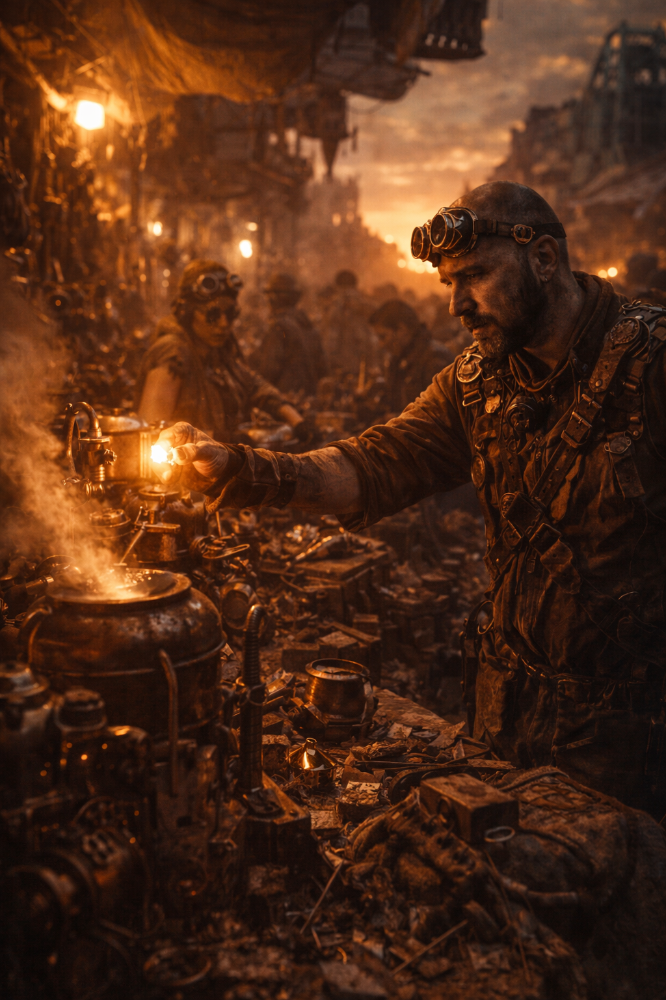

# Steampunks

Untergruppe der Dachfraktion [Maker](../../Kanon/glossar.md#maker).

## Überblick

Die Steampunk Trader sind die Händler und Sammler der Doomsday-Welt. Sie kontrollieren den Großteil des Warenverkehrs und horten alles, was sich zu [Killcoins](../../Kanon/glossar.md#killcoin) machen lässt. Wer etwas braucht – Ersatzteile, Werkzeug, Deko, Baumaterial – kommt an ihnen nicht vorbei. Sie sind die wohlhabendste Fraktion und gehören zur oberen Schicht der Post-Apokalypse-Gesellschaft.

## Erscheinung & Stil

Optisch erinnern sie an eine Mischung aus viktorianischen Kaufleuten und Wüstennomaden – wie die **Sandpeople aus Star Wars**, nur mit Schweißerbrillen, Zahnrädern und Lederschürzen. Ihre Kleidung ist funktional und gleichzeitig extravagant: selbstgebaute Gadgets, dampfbetriebene Werkzeuge und Accessoires aus Schrott, die sie mit Stolz zur Schau tragen. Jeder Steampunk Trader sieht anders aus, aber alle tragen das typische Messing-und-Leder-Ästhetic.

## Fraktionssignatur

- **Slogan:** "Wert macht man."
- **Zeichen:** Banner und Logo beruhen auf demselben Symbol: ein offenes Zahnrad, das an einer Stelle sichtbar weitergebaut wurde. Die Lücke ist kein Defekt, sondern der Anfang des nächsten Teils. Je nach Anwendung wird das Zeichen als Schablone auf Kisten gesprüht, in Blech geritzt, in Leder gebrannt oder als geflicktes Banner aus schwerem Werkstattstoff geführt.
- **Farben & Material:** Messinggelb, Staubbraun, Rußschwarz und oxidiertes Grün; Segeltuch, Leder, genietete Bleche, Glaslinsen und Kupferdetails.
- **Auftreten:** [Steampunks](../../Kanon/glossar.md#steampunks) verstecken ihr Können nicht. Werkzeuge, Messinstrumente, Linsen, Ventile und kleine mechanische Kuriositäten sind offen sichtbar getragen oder an Karawanen befestigt. Ihre Stände und Wagen wirken wie fahrende Werkstätten: chaotisch auf den ersten Blick, präzise sortiert auf den zweiten.
- **Außenwirkung:** Wo ihr Zeichen hängt, erwartet man Reparatur, Umbau, seltene Teile und Leute, die aus scheinbar wertlosem Schrott wieder Funktion herausholen. Gerade dieser Tüftlerstolz macht sie unentbehrlich - und gibt ihrer Handelsmacht Gewicht.

## Ziele & Motivation

Steampunk Trader wollen Warenfluss, Verfügbarkeit und Einfluss kontrollieren. Ihr Kernantrieb ist Profit durch Knappheit: Wer seltene Teile, Bergungsgut und funktionierende Technik bündelt, diktiert Preise und Bedingungen. Gleichzeitig sehen sie sich als Erhalter praktischen Wissens, das die [Wasteland](../../Kanon/glossar.md#wasteland) ohne sie verlieren würde.

## Kinder bei den Steampunks

Steampunk-Kinder lernen früh **Handwerk**. Werkzeug halten, Teile sortieren, flicken, feilschen, aufpolieren, wieder brauchbar machen - das beginnt oft lange, bevor von echter Verantwortung die Rede ist. Nachwuchs wächst zwischen Werkbank, Lager und [Handelsposten](../../Kanon/glossar.md#handelsposten) auf und wird früh an Material, Wert und praktische Nützlichkeit gewöhnt.

## Fähigkeiten & Stärken

- **Handwerk & Upcycling:** Sie können aus nahezu jedem Schrott etwas Brauchbares bauen. Kaputte Elektronik wird zu funktionierenden Geräten, Altmetall zu Werkzeugen oder Waffen. Ihr handwerkliches Geschick ist in der gesamten [Wasteland](../../Kanon/glossar.md#wasteland) unübertroffen.
- **Handel & Wertschätzung:** Sie wissen genau, was etwas wert ist. Kein Deal geht an ihnen vorbei, ohne dass sie den wahren Wert einer Ware kennen. Sie sind die Marktmacher der Doomsday-Ökonomie.
- **Horten & Sammeln:** Wie besessene Nerds horten sie alles – von alten Computerplatinen über seltene Schrauben bis hin zu Pre-Doomsday-Artefakten. Ihre Lager sind legendär und streng bewacht.
- **Basteln & Erfinden:** Ihre dampfbetriebenen Kreationen reichen von simplen Fallen über mechanische Prothesen bis hin zu ganzen Fahrzeugen, zusammengeschustert aus dem Müll der alten Welt.
- **Bio-Upcycling:** Sie verarbeiten [Pflanzen](../../Assets/Pflanzen/index.md) zu Filterpads, Faserseilen, Dichtmassen und billigen Verbundstoffen für Feldbetrieb.

## Schwächen

- **Körperlich schwach:** Sie sind keine Kämpfer. Ihre Stärke liegt im Kopf und in den Händen, nicht in den Fäusten. In einem direkten Kampf ziehen sie fast immer den Kürzeren.
- **Unsozial & misstrauisch:** Jahre des Hortens und Handelns haben sie paranoid gemacht. Sie vertrauen niemandem und arbeiten selten mit anderen Fraktionen zusammen – außer es gibt einen klaren Profit.
- **Gierig:** Ihre größte Schwäche ist die Gier. Ein Steampunk Trader gibt nichts freiwillig her. Jedes Geschäft wird bis zum letzten [Killcoin](../../Kanon/glossar.md#killcoin) verhandelt, und sie sind berüchtigt dafür, andere über den Tisch zu ziehen.

## Besonderheiten

- [Handelsposten](../../Kanon/glossar.md#handelsposten) sind für [Steampunks](../../Kanon/glossar.md#steampunks) zugleich Markt, Werkstatt, Lager und Festung.
- Der innere Kreis großer Posten kontrolliert nicht nur Ware, sondern auch Routenwissen und Zugang zu seltenen Technologien.
- In mehreren Werkhöfen laufen inzwischen "grüne Linien": standardisierte Chargen aus [Moosen und Flechten](../../Assets/Pflanzen/Moose-und-Flechten.md), [Wildhopfen](../../Assets/Pflanzen/Wilder-Hopfen.md) und [Ackerschachtelhalm](../../Assets/Pflanzen/Ackerschachtelhalm.md).

## Rolle in der Doomsday-Welt

Die Steampunk Trader gehören zwar nicht zu den 1 %, die alle [Killcoins](../../Kanon/glossar.md#killcoin) besitzen, aber sie sind verdammt nah dran. Sie bilden die wirtschaftliche Oberschicht und betreiben die [Handelsposten](../../Kanon/glossar.md#handelsposten), an denen der gesamte Warenaustausch der [Wasteland](../../Kanon/glossar.md#wasteland) stattfindet. Ohne sie würde die fragile Ökonomie zusammenbrechen – was ihnen eine gewisse Unantastbarkeit verleiht, solange man es sich mit ihnen nicht verscherzt.

Ihre [Handelsposten](../../Kanon/glossar.md#handelsposten) sind gleichzeitig Werkstätten, Lagerhallen und Festungen. Hier wird gefeilscht, repariert und erfunden. Wer Zugang zum inneren Kreis eines Handelspostens bekommt, findet dort Schätze aus der alten Welt – funktionierende Technik, seltene Materialien und Wissen, das anderswo längst verloren ist.

## Relevante Orte

- **[Handelsposten](../../Kanon/glossar.md#handelsposten):** [../../Orte/Handelsposten/index.md](../../Orte/Handelsposten/index.md). Ihr zentraler Posten: [Messingmarkt 9](../../Orte/Handelsposten/Messingmarkt-9.md).
- **[Verseuchte Zonen](../../Kanon/glossar.md#verseuchte-zonen) (Bergung):** [../../Orte/Zonen/index.md](../../Orte/Zonen/index.md)

## Beziehungen zu anderen Fraktionen

### Orden

- **Dachfraktion [Orden](../../Kanon/glossar.md#orden):** Funktionale Tauschbeziehung zwischen Reliktwissen und Infrastrukturbedarf.
- **[Der Orden](../../Kanon/glossar.md#der-orden):** Kaufen Komponenten und Energiepfade, bleiben aber ideologisch schwierig.
- **[Looper](../../Kanon/glossar.md#looper) ([Human in the Loop](../../Kanon/glossar.md#human-in-the-loop-prinzip)):** Werden indirekt über Versorgung, Wartung und sichere Transitlogik adressiert.
- **[Retros](../../Kanon/glossar.md#retros):** Offener Gegenpol; [Retros](../../Kanon/glossar.md#retros) sabotieren, was [Steampunks](../../Kanon/glossar.md#steampunks) aufbauen.

### Roamer

- **Dachfraktion [Roamer](../../Kanon/glossar.md#roamer):** Wichtiges Kunden- und Schutzmilieu für Karawanen, Aufträge und Begleitdienste.
- **[Hardliner](../../Kanon/glossar.md#hardliner):** Topkunden und Sicherheitsrisiko zugleich.
- **[Geocacher](../../Kanon/glossar.md#geocacher):** Liefern Funde und Koordinaten, bleiben aber schwer kalkulierbar.
- **[Hillbillys](../../Kanon/glossar.md#hillbillys):** Rohstofflieferanten mit hoher Eskalationswahrscheinlichkeit.

### Maker

- **Dachfraktion [Maker](../../Kanon/glossar.md#maker):** Eigene Basis; Streitpunkt bleibt Profitlogik vs. strategischer Kurs.
- **[Steampunks](../../Kanon/glossar.md#steampunks) (eigene Unterfraktion):** Sehen sich als wirtschaftliches Rückgrat der [Maker](../../Kanon/glossar.md#maker).
- **[Magier](../../Kanon/glossar.md#magier):** Enge Kooperation bei Signal-, Feld- und Sicherheitsproblemen.
- **[Doomsday Dispatcher](../../Kanon/glossar.md#doomsday-dispatcher):** Austausch aus Reichweite gegen Techniksupport.

### Zeros

- **[Zeros](../../Kanon/glossar.md#zeros) (auch [Zero Percentler](../../Kanon/glossar.md#zero-percentler)):** Finanzieren große Warenströme und versuchen, Lieferketten politisch zu binden.

### Der Stack

- **[Der Stack](../../Kanon/glossar.md#der-stack):** Gefährlicher Gegenpart; jeder technische Skalierungsschub kann orbital beantwortet werden.
