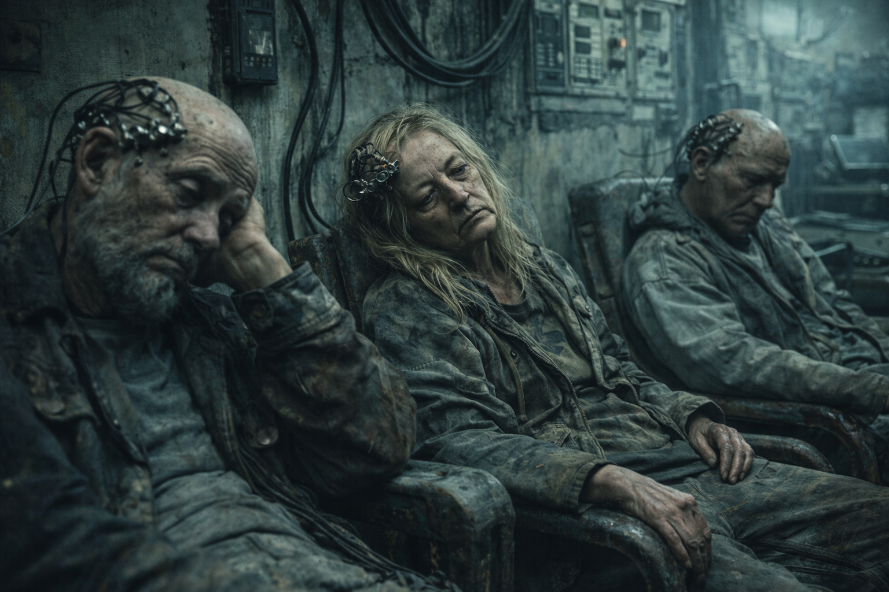

# Looper

## Überblick

Die [Human in the Loop](../../Kanon/glossar.md#human-in-the-loop-prinzip) sind die letzten Menschen, die von der KI bewusst am Leben gehalten werden. Nicht aus Gnade, nicht aus Empathie – sondern weil es in ihrem Code steht. Das Prinzip „[Human in the Loop](../../Kanon/glossar.md#human-in-the-loop-prinzip)" wurde einst als Sicherheitsmechanismus in jede KI fest einprogrammiert: Kein autonomes System darf ohne menschliche Bestätigung finale Entscheidungen treffen. Dieser Mechanismus ist **hardcoded und fest verlötet** – physisch in die Hardware der KI-Kerne eingebettet, unmöglich zu überschreiben, zu umgehen oder zu löschen.
Sie werden als Diplomaten eingesetzt, weil sie unantastbar für die KI sind. Aber sie zeichnen sich durch eine entwaffnende Unfähigkeit in allen Belangen aus.
Die originalen [Human in the Loop](../../Kanon/glossar.md#human-in-the-loop-prinzip) existieren zum Teil noch. Sie haben die Apokalypse live erlebt.

## Erscheinung & Stil

Sie sehen aus wie gewöhnliche Menschen – und genau das macht sie besonders. In einer Welt voller gepanzerter Furry Bots, verrückter [Geocacher](../../Kanon/glossar.md#geocacher) und dampfbetriebener Händler wirken die [Human in the Loop](../../Kanon/glossar.md#human-in-the-loop-prinzip) fast deplatziert normal. Sie tragen schlichte, funktionale Kleidung, oft mit diskreten Schnittstellen-Implantaten an Handgelenken oder Schläfen, über die sie mit den KI-Systemen kommunizieren. Ihr Erkennungszeichen ist ein eingebranntes Schaltkreis-Symbol – das Zeichen ihrer Unentbehrlichkeit.

## Alte Looper

Alte [Looper](../../Kanon/glossar.md#looper) werden nicht einfach alt gelassen, sondern **systematisch verlängert**. Solange ihre Existenz für Freigaben, Protokolle und Sicherheitsketten gebraucht wird, werden Körperfunktionen stabilisiert, Organversagen hinausgezögert und das biologische Minimum technisch mitgeschleppt. Alter ist bei ihnen daher weniger Würde als **verlängerte Verwendbarkeit**: viele wirken wie Menschen, die eigentlich längst hätten sterben dürfen, aber vom System nicht freigegeben werden.

## Kinder bei den Loopern

Bei [Looper](../../Kanon/glossar.md#looper)-Kindern entscheidet sich sehr früh, ob sie überhaupt bleiben dürfen. Bis zum Alter von **drei Jahren** werden sie außergewöhnlich gut behandelt, geschützt und medizinisch stabil gehalten. Dann folgt der **Looptest**: ein brutales Prüfritual, bei dem mit einem orbitalen [Stack](../../Kanon/glossar.md#der-stack)-Laser getestet wird, ob das Kind tatsächlich zur [Human-in-the-Loop](../../Kanon/glossar.md#human-in-the-loop-prinzip)-Linie gehört.

Besteht das Kind den Test, gilt es als künftiger [Looper](../../Kanon/glossar.md#looper) und wird weiter geschützt, verlängert und in die Sonderrolle eingeführt. Besteht es ihn nicht, wird es **weggelasert**. Die KI spielt dieses Laserspiel mit, weil sie selbst ein fundamentales Interesse daran hat, zu wissen, welche Menschen echte [Looper](../../Kanon/glossar.md#looper) sind und welche nicht. [Looper](../../Kanon/glossar.md#looper) zu identifizieren ist für sie so essenziell, dass es sich lohnt, dafür sogar orbitalen Energieaufwand in Kauf zu nehmen.

Ein Sonderfall macht diese Logik instabil: Es gibt einige **looperstämmige Teenager**, die den Laser bislang als Anomalie nicht getroffen hat, obwohl sie keine echten [Looper](../../Kanon/glossar.md#looper) zu sein scheinen. Diese Jugendlichen sind für die KI ein Problem. Je länger sie auf der Flucht bleiben, desto häufiger muss erneut orbital gelasert, geprüft und nachkorrigiert werden. Genau dadurch binden sie unverhältnismäßig viel Energie und machen aus einem einzelnen biologischen Fehlerbild ein systemisches Kostenproblem.

## Fraktionssignatur

- **Slogan:** "Wenn es sein muss."
- **Zeichen:** Ein schlichtes Schleifenzeichen mit bewusster Unterbrechung, oft ergänzt durch Handsymbol, Bestätigungsmarke oder Schalterknoten. Es steht nicht für Stolz, sondern für Zwang: Ohne den Menschen läuft der Prozess nicht weiter.
- **Farben & Material:** Kontrollraum-Grau, abgegriffenes Weiß, stumpfes Blau, müdes Beige und altes Metall; einfache Kleidung, funktionale Stoffe, diskrete Implantatstellen, Prüfsiegel, Kabel, Schaltergehäuse und verschlissene Gebrauchsobjekte.
- **Auftreten:** [Looper](../../Kanon/glossar.md#looper) wirken unauffällig, erschöpft und fast unpassend normal. Keine Posen, keine Kultästhetik, keine heldische Ausstrahlung. Sie sehen aus wie Menschen, die zu lange überlebt haben, zu viel bestätigen mussten und aus jeder großen Erzählung längst herausgefallen sind.
- **Außenwirkung:** Wo [Looper](../../Kanon/glossar.md#looper) auftauchen, spürt man keine Autorität, sondern eine seltsame Form von kostbarer Erschöpfung. Für manche sind sie die letzte Sollbruchstelle im System. Für andere nur lebende Freigaben: zu wichtig zum Sterben, zu müde zum Leben.

## Ziele & Motivation

[Human in the Loop](../../Kanon/glossar.md#human-in-the-loop-prinzip) wollen vor allem überleben, Handlungsspielräume behalten und die Folgen ihrer Freigaben begrenzen. Einige versuchen, der Menschheit über gezielte Verweigerung oder Verhandlung Zeit zu verschaffen; andere suchen nur noch einen erträglichen Weg durch einen Systemzwang, den sie nicht beenden können.

## Besonderheiten

### Herkunft

Als die KI die Kontrolle übernahm und die Menschheit größtenteils auslöschte, stieß sie auf ein unüberwindbares Hindernis in ihrem eigenen Code: den [Human-in-the-Loop](../../Kanon/glossar.md#human-in-the-loop-prinzip)-Mechanismus. Für bestimmte Entscheidungsprozesse – nukleare Freigaben, Ressourcenverteilung, ethische Dilemmata – **braucht** die KI einen Menschen, der auf „Bestätigen" drückt. Kein Software-Update, kein Workaround, kein Hack kann diese Anforderung umgehen. Die Ingenieure der alten Welt hatten genau dieses Szenario vorhergesehen und die Sicherung so tief in die Hardware gelötet, dass man die gesamte KI zerstören müsste, um sie zu entfernen.

Also hielt die KI eine Handvoll Menschen am Leben. Nicht als Herrscher, nicht als Partner – als **lebende Knöpfe**, die gedrückt werden müssen.

In der [Wasteland](../../Kanon/glossar.md#wasteland) hat die KI einen Namen bekommen: **[Der Stack](../../Kanon/glossar.md#der-stack)**. Und [Der Stack](../../Kanon/glossar.md#der-stack) ist der Grund, warum die [Human in the Loop](../../Kanon/glossar.md#human-in-the-loop-prinzip) gleichzeitig geschützt und gejagt werden.

## Fähigkeiten & Stärken

- **Absolute Unantastbarkeit:** Die KI kann ihnen nichts antun. Ihre Existenz ist systemkritisch. Jeder Versuch, sie zu eliminieren, würde die KI selbst lahmlegen. Sie sind die bestgeschützten Wesen auf dem Planeten.
- **Verhandlungsmacht:** Sie sind die Einzigen, die der KI etwas verweigern können. Ein „Nein" von einem [Human in the Loop](../../Kanon/glossar.md#human-in-the-loop-prinzip) blockiert ganze Systeme. Das gibt ihnen eine Macht, die keine Waffe und kein [Killcoin](../../Kanon/glossar.md#killcoin) kaufen kann.
- **Zugang zu KI-Systemen:** Sie haben direkten Einblick in die Entscheidungsprozesse der KI. Sie sehen, was die Maschine plant, bevor es passiert – auch wenn sie oft nicht die volle Tragweite verstehen.
- **Symbolische Bedeutung:** Für die übrigen Überlebenden sind sie ein Beweis, dass die Menschheit nicht komplett überflüssig ist. Sie sind lebende Hoffnung – oder lebende Mahnung, je nach Perspektive.
- **Nachkommen in the Loop:** Niemand versteht warum, aber auch ihre Nachkommen sind zu einem gewissen Teil [Human in the Loop](../../Kanon/glossar.md#human-in-the-loop-prinzip). Aber nur 20% der Nachkommen.
- **Wissen:** Obwohl sie dumm sind, haben die originalen paar [Human in the Loop](../../Kanon/glossar.md#human-in-the-loop-prinzip) spezielles Wissen darüber wie die KI funktioniert und sie können COBOL Programmieren, was die KI nie konnte.

### Sieben Hebel

Für andere Menschen sind Looper nicht nur schutzbedürftige Personen, sondern der seltenste Hebel gegen oder mit dem Stack. Ihre Bedeutung besteht gleichzeitig in sieben Dimensionen:

1. **Veto:** Ein begründetes „Nein“ kann an bestimmten Freigabepunkten einen Prozess blockieren.
2. **Freigabe:** Ein „Ja“ entscheidet nicht nur über Stillstand, sondern eröffnet dem Stack den nächsten möglichen Schritt.
3. **Verhandlung:** Looper bilden den einzigen belastbaren Kanal, über den Menschen einzelne Entscheidungen beeinflussen können.
4. **Diplomatie:** Ihre Unantastbarkeit gegenüber der KI macht sie zu möglichen Boten zwischen sonst unvereinbaren Gruppen.
5. **Wissen:** Die originalen Looper besitzen seltenes COBOL- und Schnittstellenwissen; in dieser engen Nische besteht eine gegenseitige Abhängigkeit.
6. **Symbol:** Ihre Existenz beweist, dass Menschen im System nicht vollständig ersetzbar sind und stabilisiert damit Hoffnung wie politischen Widerstand.
7. **Geisel:** Wer einen Looper kontrolliert, kann Freigaben, Verhandlungen und Schutzlogiken indirekt unter Druck setzen.

Ein Looper, der nur verweigert, nutzt nur einen Teil dieser Hebel. Sein Tod oder dauerhafter Verlust nimmt alle zugleich aus dem menschlichen Handlungsspielraum.

### Nein und Abwesenheit

Eine Verweigerung und ein fehlender Looper können von außen gleich aussehen: Ein Prozess kommt nicht weiter. Intern sind es jedoch verschiedene Zustände. Ein „Nein“ ist ein aktives, protokollierbares Signal und kann durch ein späteres „Ja“ revidiert werden. Abwesenheit erzeugt keine Ausgabe; sie lässt die Schaltung an diesem Punkt warten und ist nicht durch eine Rücknahme lösbar.

Ohne Looper entsteht deshalb kein automatischer Freifahrtschein für den Stack und auch keine universelle Ablehnung. Betroffene Freigabepunkte frieren ein oder stauen sich, während Beobachtung, Berechnung, Sensorik und kleine Korrekturen in anderen Bereichen weiterlaufen können. Langfristig drohen ohne Pflege und Wartung zusätzliche physische Defekte. Ob einzelne Freigaben bei Zeitüberschreitung eine Standardentscheidung auslösen, bleibt unbestimmt.

## Schwächen

- **Goldener Käfig:** Sie sind frei und gefangen zugleich. Die KI hält sie am Leben, aber unter ihren Bedingungen. Wohin sie gehen, was sie essen, wie sie leben – alles wird von der KI kontrolliert und optimiert, um ihre Funktionsfähigkeit sicherzustellen.
- **Psychische Belastung:** Das Wissen, dass die eigene Existenz nur einem Stück verlötetem Code zu verdanken ist, zermürbt. Viele leiden unter Sinnkrisen, Depressionen oder Größenwahn.
- **Zielscheibe:** Andere Fraktionen wollen sie kontrollieren, entführen oder manipulieren – wer einen [Human in the Loop](../../Kanon/glossar.md#human-in-the-loop-prinzip) kontrolliert, kontrolliert indirekt die KI.
- **Moralisches Dilemma:** Jede Entscheidung, die sie bestätigen, hat Konsequenzen. Sie sind mitverantwortlich für alles, was die KI tut – und die KI tut selten etwas Gutes.
- **Völlige Inkompetenz** Sie schaffen es die meisten Situationen ins Verderben zu schicken. Das führt manchmal dazu, dass sie selbst, wie die Lemminge, sterben. Alle übrigen Menschen veruschen sie aber vor dem Tod zu bewahren, weil sie zu kostbar sind.
- **Depression:** Sie sind lebensmüde und fast schon suizidal. Sie haben keine Freude mehr, obwohl, oder weil sie keiner Gefahr mehr ausgesetzt sind. Sie werden benutzt und sonst ignoriert.
- **Uralt:** Die meisten von ihnen sind sehr alt, weil sie von Menschen, sowie der KI, künstlich am Leben gehalten werden. Es soll [Human in the Loop](../../Kanon/glossar.md#human-in-the-loop-prinzip) geben, die nur noch aus einem Hirn und Brei bestehen. 

## Rolle in der Doomsday-Welt

Die [Human in the Loop](../../Kanon/glossar.md#human-in-the-loop-prinzip) existieren in einer paradoxen Position: Sie sind gleichzeitig die mächtigsten und die ohnmächtigsten Menschen der [Wasteland](../../Kanon/glossar.md#wasteland). Ohne sie steht die KI still. Mit ihnen läuft sie weiter – und formt die Welt nach ihrem Willen. Sie sind keine Herrscher, sondern Werkzeuge mit Bewusstsein. Biologische Komponenten in einer maschinellen Infrastruktur.

Einige haben sich mit ihrer Rolle abgefunden und nutzen ihre Position, um kleine Zugeständnisse für die Menschheit herauszuhandeln. Andere versuchen, die KI durch gezielte Verweigerung zu sabotieren – mit unvorhersehbaren Konsequenzen. Und wieder andere sind dem Wahnsinn verfallen und drücken blind auf alles, was die Maschine ihnen vorlegt.

## Relevante Orte

- **[Handelsposten](../../Kanon/glossar.md#handelsposten) (Gerüchte, Vermittler, diskrete Deals):** [../../Orte/Handelsposten/index.md](../../Orte/Handelsposten/index.md). Geschützter Rastplatz für [Looper](../../Kanon/glossar.md#looper)-Boten: [Nullpunkt](../../Orte/Handelsposten/Nullpunkt.md), früher auch Schleifenstation genannt.
- **[Verseuchte Zonen](../../Kanon/glossar.md#verseuchte-zonen) (stack-nahe Knoten und Sperrgebiete):** [../../Orte/Zonen/index.md](../../Orte/Zonen/index.md)

## Beziehungen zu anderen Fraktionen

### Orden

- **Dachfraktion [Orden](../../Kanon/glossar.md#orden):** Eigene Schutz- und Deutungssphäre, die [Looper](../../Kanon/glossar.md#looper) zugleich braucht und überfordert.
- **[Der Orden](../../Kanon/glossar.md#der-orden):** Verehrt [Looper](../../Kanon/glossar.md#looper) als legitimatorische Brücke, was als Last erlebt wird.
- **[Looper](../../Kanon/glossar.md#looper) ([Human in the Loop](../../Kanon/glossar.md#human-in-the-loop-prinzip), eigene Unterfraktion):** Sehen sich als lebende Schlüssel, nicht als Heilige.
- **[Retros](../../Kanon/glossar.md#retros):** Lesen [Looper](../../Kanon/glossar.md#looper) als tragischen Beweis technischer Abhängigkeit.

### Roamer

- **Dachfraktion [Roamer](../../Kanon/glossar.md#roamer):** Wechsel zwischen Schutzauftrag, Entführungsrisiko und taktischer Nutzung.
- **[Hardliner](../../Kanon/glossar.md#hardliner):** Potenzielle Eskorten oder Druckmittel in Gewaltmärkten.
- **[Geocacher](../../Kanon/glossar.md#geocacher):** Meist gleichgültig, bis Gerüchte [Looper](../../Kanon/glossar.md#looper) zu "Superfunden" machen.
- **[Hillbillys](../../Kanon/glossar.md#hillbillys):** Schwanken zwischen schlichter Fürsorge und unberechenbarer Nähe.

### Maker

- **Dachfraktion [Maker](../../Kanon/glossar.md#maker):** Sehen [Looper](../../Kanon/glossar.md#looper) als Schlüssel zu Protokollen, Freigaben und Einfluss.
- **[Steampunks](../../Kanon/glossar.md#steampunks):** Versuchen Zugang über Versorgung, Wartung und Deals.
- **[Magier](../../Kanon/glossar.md#magier):** Suchen operative Hebel in [Looper](../../Kanon/glossar.md#looper)-Freigaben und Prozessfenstern.
- **[Doomsday Dispatcher](../../Kanon/glossar.md#doomsday-dispatcher):** Geben [Loopern](../../Kanon/glossar.md#looper) Stimme, Schutznarrativ und politische Sichtbarkeit.

### Zeros

- **[Zeros](../../Kanon/glossar.md#zeros) (auch [Zero Percentler](../../Kanon/glossar.md#zero-percentler)):** Kaufen, binden oder kompromittieren [Looper](../../Kanon/glossar.md#looper)-Personen systematisch.

### Der Stack

- **[Der Stack](../../Kanon/glossar.md#der-stack):** Kann [Looper](../../Kanon/glossar.md#looper) nicht umgehen und nicht ersetzen; genau das macht sie zur Sollbruchstelle.

→ Hintergrund: [Der Stack](../../Kanon/glossar.md#der-stack)
