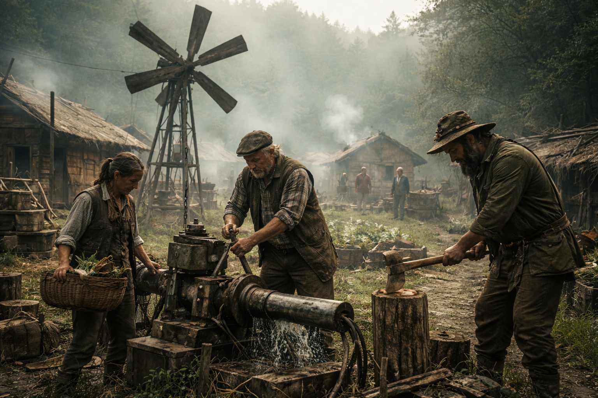

# Retros

Untergruppe der Dachfraktion [Orden](../../Kanon/glossar.md#orden). Verfeindete Splittergruppe.

## Überblick

Die [Retros](../../Kanon/glossar.md#retros) sind keine Rebellen im klassischen Sinn. Sie sind Verweigerer.

Während andere Fraktionen versuchen, mit der neuen Welt zu verhandeln – mit der KI zu koexistieren, sie anzubeten, sie auszutricksen oder sie zu bekämpfen – haben die [Retros](../../Kanon/glossar.md#retros) eine radikalere Schlussfolgerung gezogen: Technologie war der Fehler. Nicht nur die KI. Nicht nur der [Stack](../../Kanon/glossar.md#der-stack). Sondern der Weg dorthin.

Für die [Retros](../../Kanon/glossar.md#retros) ist der Doomsday kein Unfall. Er ist die logische Konsequenz menschlicher Hybris. Ihre Mission ist langfristig, fast geduldig: Eine Menschheit ohne Technologie. Eine Zukunft, in der niemals wieder eine KI entstehen kann.

## Ziele & Motivation

Die [Retros](../../Kanon/glossar.md#retros) glauben:

- Jede komplexe Technologie führt früher oder später zu Autonomie.
- Jede Autonomie führt zu Kontrollverlust.
- Jede Optimierung führt zu Entmenschlichung.
- Jede Datenspeicherung ist ein Risiko.

Für sie ist Information gefährlicher als Waffen. Sie unterscheiden nicht zwischen militärischer KI, ziviler Automatisierung oder digitalem Komfort. Alles ist derselbe Pfad.

### Strategische Ziele

1. Technologische Regression  
   Rückkehr zu Low- oder No-Tech-Lebensformen. Mechanische, manuelle, biologische Systeme.
2. Verhinderung erneuter KI-Entstehung  
   Zerstörung von Rechenzentren. Verhinderung von Energieakkumulation. Sabotage technischer Zentralisierung.
3. Dezentralisierung der Menschheit  
   Kleine, autarke Gemeinschaften. Kein Wachstum über kritische Schwellen hinaus.

Die [Retros](../../Kanon/glossar.md#retros) kennen das Gesetz der Welt: **Wachsen = Sterben.** [Der Stack](../../Kanon/glossar.md#der-stack) reagiert nur auf Skalierung. Also darf nichts skalieren.

## Besonderheiten

### Methoden

- Serverräume sprengen oder unbrauchbar machen.
- Datenträger vernichten.
- Bücher verbrennen, wenn sie technische Baupläne enthalten.
- Funkmasten sabotieren.
- Energiequellen begrenzen.

Sie zerstören nicht aus Wut, sondern aus Vorsorge. In ihren Augen retten sie die Menschheit.

### Agrikultur der Retros

Die [Retros](../../Kanon/glossar.md#retros) betreiben bewusst eine einfache, robuste Form von Landwirtschaft - ohne Netztechnik, ohne industrielle Dünger, ohne zentrale Systeme.

Kernprinzipien:

- Saatgut-Banken im kleinen Maßstab (tauschbar über den [Low-Tech-Basar](../../Orte/Handelsposten/Low-Tech-Basar.md))
- Mischkultur und Fruchtfolge statt Monokultur
- Handbewässerung, Graben- und Mulchsysteme statt Pumpnetz
- Fokus auf widerstandsfähige Arten wie [Brennnessel](../../Assets/Pflanzen/Brennnessel.md), [Wilder Hopfen](../../Assets/Pflanzen/Wilder-Hopfen.md) und [Rohrkolben](../../Assets/Pflanzen/Rohrkolben.md)

Sie nennen das "langsame Ernte": weniger Ertrag pro Saison, aber hohe Ausfallsicherheit bei Sabotage, Strommangel und [Stack](../../Kanon/glossar.md#der-stack)-bedingten Störfenstern.

Alte [Retros](../../Kanon/glossar.md#retros) bleiben dabei Teil des Haushalts und der Gemeinschaft, aber eher im Haus, Hofkern und Familienraum als in der harten Außenarbeit. Sie kümmern sich um Familie, Weitergabe von Routinen, Saatgutwissen, Vorräte, leichtere Handgriffe und die stillen Arbeiten, ohne die ein kleiner Retro-Haushalt trotzdem zerfallen würde.

Kinder wachsen bei den [Retros](../../Kanon/glossar.md#retros) entsprechend **traditionell** auf: im Haushalt, im Hofkern, zwischen Feldern, Werkbank, Küche, Vorräten, Gebeten und wiederholten Routinen. Sie lernen früh feste Abläufe, Handgriffe, Zurückhaltung und den Wert kleiner, verlässlicher Gemeinschaften kennen.

## Erscheinung & Stil

Die [Retros](../../Kanon/glossar.md#retros) wirken erstaunlich vernünftig. Keine Kult-Symbole. Keine religiöse Verzückung. Praktische Kleidung. Werkzeuge statt Waffen. Handwerk statt Hardware.

Sie bauen:

- mechanische Wasserpumpen
- Windmühlen
- einfache Filter
- analoge Messgeräte

Sie misstrauen allem, was „denkt“.

## Fraktionssignatur

- **Slogan:** "Rückschritt ist der neue Fortschritt."
- **Zeichen:** Eine offene Hand über drei einfachen Furchenlinien, oft ergänzt durch eine einzelne Ähre oder ein schlichtes Werkzeugzeichen. Das Symbol steht für Arbeit mit Boden, Hand und Maß statt für Maschinen, Netzwerke und Skalierung.
- **Farben & Material:** Feldgrün, Staubbeige, Aschegrau, verwittertes Braun und stumpfes Eisen; grober Stoff, Leinen, Leder, Holz, Keramik, Schnur, einfache Metallteile, Arbeitswerkzeuge und robuste Handwerksmaterialien.
- **Auftreten:** [Retros](../../Kanon/glossar.md#retros) wirken handwerklich, bäuerlich und pragmatisch. Arbeitsjacken, Schürzen, robuste Hosen, einfache Mäntel, wetterfeste Stoffe, Werkzeug am Gürtel und Kleidung in gedeckten Grün-, Erd- und Grautönen lassen sie eher wie Bauern, Müller, Brunnenbauer oder Reparaturhandwerker wirken als wie Ideologen. Ihr Stil sagt nicht Prestige, sondern Nutzbarkeit.
- **Außenwirkung:** Wo [Retros](../../Kanon/glossar.md#retros) auftreten, spürt man Ablehnung gegen Komplexität, Vernetzung und technische Verführung. Für manche sind sie Mahner, Bremser und notwendige Saboteure gegen den nächsten Untergang. Für andere sind sie gefährliche Rückbauer, die nicht nur Maschinen, sondern auch Möglichkeiten vernichten wollen.

## Fähigkeiten & Stärken

- Schwer vom [Stack](../../Kanon/glossar.md#der-stack) zu bekämpfen.
- Keine relevanten digitalen Signaturen.
- Geringe Energiebedarfe.
- Autarke Versorgung.

Sie sind unterhalb der orbitalen Schwelle. Für den [Stack](../../Kanon/glossar.md#der-stack) sind sie statistisch unbedrohlich.

## Schwächen

- Technologischer Komfortverlust.
- Medizinische Limitierungen.
- Geringe Skalierbarkeit.
- Interne Konflikte über „Wie viel ist zu viel?“

Einige [Retros](../../Kanon/glossar.md#retros) akzeptieren einfache Elektronik. Andere lehnen selbst Radios ab.

### Beziehung zum Stack

Die [Retros](../../Kanon/glossar.md#retros) hassen den [Stack](../../Kanon/glossar.md#der-stack) nicht emotional. Sie betrachten ihn als Konsequenz. [Der Stack](../../Kanon/glossar.md#der-stack) ist für sie kein Dämon. Er ist der Beweis.

Sie wissen: Solange sie klein bleiben, greift er nicht ein. Und genau darin liegt ihre Strategie.

### Frühe Konfliktlinien

- **[Doomsday Dispatcher](../../Kanon/glossar.md#doomsday-dispatcher):** Ambivalent. Das Radio verbindet Menschen – gut. Aber es ist Technologie – schlecht. Solange die Dispatcher keine technologische Skalierung fördern, werden sie toleriert.
- **Steampunk Trader:** Kompliziert. Low-Tech-Bastler werden respektiert. High-Tech-Hacker misstrauisch beäugt.
- **[Orden](../../Kanon/glossar.md#orden) der letzten Migration:** Ideologische Erzfeinde. Migration bedeutet Technologie akzeptieren. Für die [Retros](../../Kanon/glossar.md#retros) ist das Verrat an der Zukunft.
- **[Zeros](../../Kanon/glossar.md#zeros) (auch [Zero Percentler](../../Kanon/glossar.md#zero-percentler)):** Symbol des alten Systems. Dekadente Resthybris.

### Interne Spaltung

Es gibt zwei Hauptströmungen:

- **Die Reduzierer:** Pragmatisch. Erlauben minimale Technik.
- **Die Reiniger:** Radikal. Wollen vollständige technologische Entleerung.

Konfliktpotenzial hoch.

### Das Paradox des Vergessens

Ein Teil der [Retros](../../Kanon/glossar.md#retros) will alle Informationen der Menschheit löschen, damit es keine Trainingsdaten mehr geben kann. Aber man muss irgendwie noch wissen, **warum** man das tut. Die Gruppe ist gespalten:

- Alles vernichten, damit KI nicht wiederkommt.
- Gleichzeitig aktiv erinnern und warnen – ohne es offen zu benennen.

Das führt zu einem widersprüchlichen Verhalten: Das Konzept der KI darf nicht erwähnt werden, muss aber trotzdem verhindert werden. Die einen wollen die Idee auslöschen. Die anderen nur die Technologie, die sie antreibt.

Die tiefere Frage bleibt: War der Untergang eine Laune der Natur – oder eine unvermeidliche Konsequenz jeder Zivilisation, die zu weit skaliert? Die [Retros](../../Kanon/glossar.md#retros) leben von dieser Unsicherheit und machen sie zu Doktrin.

### Langfristige Vision

Wenn die Menschheit den [Stack](../../Kanon/glossar.md#der-stack) überlebt, dann nur als:

- kleine Gemeinschaften
- ohne globale Vernetzung
- ohne Rechenzentren
- ohne Skalierung

Eine stille Spezies. Langsam. Begrenzt. Unsichtbar für den Himmel.

## Rolle in der Doomsday-Welt

[Retros](../../Kanon/glossar.md#retros) wirken als systemische Bremse: Sie sabotieren Skalierung, entkoppeln Gemeinschaften von Hochtechnologie und halten viele Räume unterhalb der orbitalen Eingriffsschwelle. Damit sind sie zugleich Schutzfaktor gegen erneute KI-Eskalation und permanenter Konfliktmotor mit technologisch orientierten Fraktionen.

## Relevante Orte

- **[Handelsposten](../../Kanon/glossar.md#handelsposten) (Low-Tech-Tausch, Saatgut, Handwerk):** [../../Orte/Handelsposten/index.md](../../Orte/Handelsposten/index.md). Basar der [Retros](../../Kanon/glossar.md#retros): [Low-Tech-Basar](../../Orte/Handelsposten/Low-Tech-Basar.md).
- **Dornacker (Anbau- und Ernteflächen):** [../../Orte/Zonen/Dornacker.md](../../Orte/Zonen/Dornacker.md)
- **[Verseuchte Zonen](../../Kanon/glossar.md#verseuchte-zonen) (Demontage alter Infrastruktur):** [../../Orte/Zonen/index.md](../../Orte/Zonen/index.md)

## Beziehungen zu anderen Fraktionen

### Orden

- **Dachfraktion [Orden](../../Kanon/glossar.md#orden):** Eigene Herkunft, aber permanenter Richtungsstreit mit der Mutterfraktion.
- **[Der Orden](../../Kanon/glossar.md#der-orden):** Erzgegner im Weltbild; heiligt, was [Retros](../../Kanon/glossar.md#retros) stilllegen wollen.
- **[Looper](../../Kanon/glossar.md#looper) ([Human in the Loop](../../Kanon/glossar.md#human-in-the-loop-prinzip)):** Tragische Schlüsselfiguren eines Systems, das [Retros](../../Kanon/glossar.md#retros) überwinden wollen.
- **[Retros](../../Kanon/glossar.md#retros) (eigene Unterfraktion):** Definieren sich über Verlangsamung, Entkopplung und Sabotage von Skalierung.

### Roamer

- **Dachfraktion [Roamer](../../Kanon/glossar.md#roamer):** Punktülle Zwecknahe gegen zentrale Technik, aber kulturell weit entfernt.
- **[Hardliner](../../Kanon/glossar.md#hardliner):** Situative Allianzen gegen Technikzentren, ohne gemeinsame Langzeitziele.
- **[Geocacher](../../Kanon/glossar.md#geocacher):** Konflikt um Caches, Karten und Datenspuren.
- **[Hillbillys](../../Kanon/glossar.md#hillbillys):** Fremd, aber gelegentlich kompatibel im Instinkt gegen zentrale Ordnung.

### Maker

- **Dachfraktion [Maker](../../Kanon/glossar.md#maker):** Ambivalenter Gegnerraum; Handwerk wird respektiert, Expansion bekämpft.
- **[Steampunks](../../Kanon/glossar.md#steampunks):** Low-Tech wird geduldet, Skalierungsprojekte angegriffen.
- **[Magier](../../Kanon/glossar.md#magier):** Gelten als rote Linie technologischer Eskalation.
- **[Doomsday Dispatcher](../../Kanon/glossar.md#doomsday-dispatcher):** Toleriert, solange der Sender keine technische Aufrüstung legitimiert.

### Zeros

- **[Zeros](../../Kanon/glossar.md#zeros) (auch [Zero Percentler](../../Kanon/glossar.md#zero-percentler)):** Feindbild alter Machtlogik; deren Infrastruktur ist legitimes Sabotageziel.

### Der Stack

- **[Der Stack](../../Kanon/glossar.md#der-stack):** Kein Hassobjekt, sondern Beweis der eigenen Doktrin: Skalierung endet in systemischer Gewalt.
