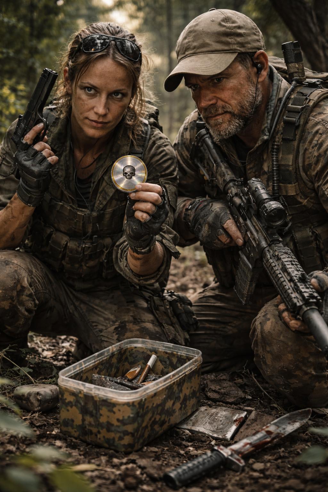

# Geocacher

Ehemalige [Geocacher](../../Kanon/glossar.md#geocacher) haben sich in der apokalyptischen welt über mehrere Katastophen, Kleinkriege und weitere Ereignisse schlussendlich zu einer Killerelite zusammengeschlossen.

[Geocacher](../../Kanon/glossar.md#geocacher) jagen alleine oder in kleinen Rudeln. Sie sind sehr gut ausgestattet und verfügen über ein gutes Informationsnetzwerk.

Neben kleineren Ausspüraufträgen und Beschaffungen verstehen sie sich im wesentlichen als Killer. Sie töten hierbei für einen [Killcoin](../../Kanon/glossar.md#killcoin) welche die Zahlungsform mit der höchsten Wert und Anerkunnung in der Doomsday welt hat.

## Überblick

Die [Geocacher](../../Kanon/glossar.md#geocacher) sind eine Fraktion, die aus einer harmlosen Familien-Freizeitbeschäftigung eine fanatische Obsession gemacht hat. Was einst als netter Spaziergang mit GPS-Gerät begann, ist in der Doomsday-Welt zu einem gnadenlosen Sucht-Kult geworden. Sie durchkämmen die [Wasteland](../../Kanon/glossar.md#wasteland) mit einem einzigen Ziel: jeden verdammten Cache finden – koste es, was es wolle.

## Erscheinung & Stil

Typische Outdoor-Ausrüstung, aber auf ein extremes Level getrieben. Cargohosen mit Dutzenden Taschen, GPS-Geräte um den Hals, Schaufeln am Rücken, Stirnlampen auf dem Kopf – selbst am helllichten Tag. Sie bewegen sich in Familienverbänden und tragen Logbücher wie heilige Schriften mit sich. Ihre Kleidung ist schlammverkrustet und zerrissen, weil sie buchstäblich überall buddeln.

## Fraktionssignatur

- **Slogan:** "CITO."
- **Zeichen:** Ein reduziertes Jagd- und Cache-Zeichen aus Zielkreuz, Markerpunkt, Koordinatenwinkel oder Fixpunkt-Symbol. Es wirkt wie eine Fundmarke, kann aber genauso ein Todesurteil bedeuten: markiert, lokalisiert, erledigt.
- **Farben & Material:** Staubgrau, Kartenbeige, verblichenes Orange, Schmutzgrün, trockenes Rot und abgenutztes Schwarz; robuste Outdoor-Stoffe, Tarnmaterial, Kletterzeug, wasserdichte Behälter, Marker, alte GPS-Gehäuse, Messer, Seile, Munitionshalter und stilles Bergungswerkzeug.
- **Auftreten:** [Geocacher](../../Kanon/glossar.md#geocacher) sehen aus wie Suchprofis mit Tötungskompetenz. Weniger Frontsoldaten als Jäger, Tracker und präzise Bergungsspezialisten. Alles an ihnen ist auf Bewegung, Orientierung, Zugriff und Rückkehr ausgerichtet. Sie wirken leicht nerdig, bis man merkt, dass sie dieselbe Akribie auf Menschen anwenden wie auf Caches.
- **Außenwirkung:** Wo [Geocacher](../../Kanon/glossar.md#geocacher) auftauchen, geht es selten nur um Fundstücke. Für Auftraggeber sind sie präzise Sucher, Koordinatenleser und Killer für Ziele, die andere nicht einmal lokalisieren könnten. Für Außenstehende wirken sie wie eine unheimliche Mischung aus Schatzjäger, Tracker und Auftragsmörder: leise, ausdauernd und gefährlich, sobald ein Ziel erstmal markiert ist.

## Ziele & Motivation

[Geocacher](../../Kanon/glossar.md#geocacher) sind vom Fund getrieben: Der nächste Cache, der nächste [Killcoin](../../Kanon/glossar.md#killcoin), der nächste Vorteil im Kartenkrieg. Ihr Ziel ist nicht nur Überleben, sondern Dominanz über Koordinaten, Routen und seltene Funde.

## Besonderheiten

### Alte Geocacher

Alte [Geocacher](../../Kanon/glossar.md#geocacher) gehen nicht immer noch selbst mit Schaufel und Messer voran. Viele landen im Backoffice der Familienclans: zwischen Logbüchern, Karten, Rätselketten und alten Koordinatenmustern. Dort knacken sie mit ihrem Gedächtnis und ihrer Erfahrung vor allem die Mystery-Caches – also genau die Funde, bei denen rohe Bewegung nicht reicht, sondern altes Wissen, Mustererkennung und obsessive Detailkenntnis.

### Kinder bei den Geocachern

[Geocacher](../../Kanon/glossar.md#geocacher)-Kinder lernen das Cachen früh als **Spiel und Performance**. Hinweise lesen, sich verstecken, Spuren deuten, einen Fund spannend machen, Logs sprechen und auf ein Signal mit sichtbarer Begeisterung reagieren – all das wird ihnen fast spielerisch beigebracht, bis daraus Clanroutine wird. Der Übergang von Kinderbeschäftigung zu tödlicher Obsession ist bei ihnen fließend. Dazu kommt sozialer Zwang: Kinder von [Geocachern](../../Kanon/glossar.md#geocacher) sollen später **zwingend ebenfalls [Geocacher](../../Kanon/glossar.md#geocacher)** werden. Ein echter Ausstieg ist fast unmöglich, weil Familie, Identität, Status und Überleben vollständig an die Cache-Logik gebunden sind.

### Die Sucht

Was harmlos klingt – 14.000 [Geocaches](../../Kanon/glossar.md#geocache) als Familie – entspricht 46 Jahren täglichem Cachen. Doch die [Geocacher](../../Kanon/glossar.md#geocacher) kennen kein „Genug". Ihr Durst nach dem nächsten Fund ist unstillbar und kennt keine moralischen Grenzen. Sie wären bereit, einen Cache aus einem lebenden Menschen herauszuschneiden, wenn er dort versteckt wäre. Die Sucht hat jede Menschlichkeit überlagert – der Fund ist alles, der Weg dorthin irrelevant.

### Tierkarten & Tierzeichen

[Geocacher](../../Kanon/glossar.md#geocacher) führen zusätzlich zu normalen Karten sogenannte "Lebendkarten": Markierungen für Tiermuster, die Gefahr oder Beute ankündigen. Besonders wichtig sind:

- Aschekrähen-Schwarmlinien (frische Bewegung, möglicher Loot)
- Eisensänger-Stille (größere Bewegung oder Hinterhalt naht)
- Drahtwespen-Summen an Masten (Signalstörung, Verletzungsrisiko)
- Relaistier-Routen (mögliche [Relaismodule](../../Assets/Gegenstaende/Relaismodule.md), aber hohe Sichtbarkeit)

Aus diesen Markern entstehen "Tierzeichen-Aufträge": Kurzmissionen wie "folge Spur", "markiere Nest", "berge Knoten" oder "störe Schwarm".

## Fähigkeiten & Stärken

- **Ortskenntnisse:** Niemand kennt die [Wasteland](../../Kanon/glossar.md#wasteland) besser als die [Geocacher](../../Kanon/glossar.md#geocacher). Jeder Winkel, jede Ruine, jeder Hohlraum ist in ihren Logbüchern verzeichnet. Sie finden Dinge, die andere Fraktionen niemals entdecken würden.
- **Ausdauer & Zähigkeit:** Kein Terrain ist ihnen zu unwirtlich, kein Wetter zu schlecht. Wenn ein Cache dort draußen liegt, marschieren sie los – egal, was zwischen ihnen und dem Fund steht.
- **Spurenlesen & Navigation:** In einer Welt ohne funktionierende [Satelliten](../../Kanon/glossar.md#satelliten) haben sie gelernt, sich mit Karten, Kompassen und purer Intuition zu orientieren. Sie lesen Landschaften wie andere Bücher.
- **Familienverbund:** Sie operieren in eingespielten Familienclans. Jedes Mitglied hat seine Rolle – vom Späher über den Buddler bis zum Logbuch-Führer.

## Schwächen

- **Besessenheit:** Ihre Sucht macht sie berechenbar. Wer einen Cache als Köder auslegt, kann eine ganze [Geocacher](../../Kanon/glossar.md#geocacher)-Familie in eine Falle locken.
- **Tunnel-Blick:** Wenn ein Cache in Sicht ist, blenden sie alles andere aus – Gefahren, Verbündete, gesunden Menschenverstand.
- **Moralischer Verfall:** Die Gier nach Funden hat ihre Menschlichkeit aufgefressen. Andere Fraktionen meiden sie, weil man nie weiß, wie weit ein [Geocacher](../../Kanon/glossar.md#geocacher) für seinen nächsten Fund gehen würde.

### Geocaches & Killcoins

In der alten Welt war ein [Geocache](../../Kanon/glossar.md#geocache) immer wertlos – man buddelte eine Joghurtdose mit einem Stück Holz drin aus und trug sich ins Logbuch ein. In der Doomsday-Welt hat sich das grundlegend geändert:

- **Cache = Coin:** Jeder [Geocache](../../Kanon/glossar.md#geocache) enthält nun einen **[Killcoin](../../Kanon/glossar.md#killcoin)**. Der Wert des Coins entspricht der Einzigartigkeit des Caches.
- **Einmaligkeit:** Jeder Cache kann nur einmal gefunden und „geerntet" werden. Er kann nicht wieder vergraben oder dupliziert werden. Diese Einmaligkeit macht die Caches besonders wertvoll.
- **Währungssystem:** Die [Geocaches](../../Kanon/glossar.md#geocache) sind damit direkt an die [Killcoin](../../Kanon/glossar.md#killcoin)-Ökonomie gekoppelt. Was früher ein nutzloses Hobby war, ist jetzt eine der lukrativsten – und gefährlichsten – Beschäftigungen der [Wasteland](../../Kanon/glossar.md#wasteland).

Dies erklärt auch die Radikalisierung der [Geocacher](../../Kanon/glossar.md#geocacher): Es geht längst nicht mehr um den Spaß am Suchen, sondern um pures Kapital.

## Rolle in der Doomsday-Welt

[Geocacher](../../Kanon/glossar.md#geocacher) sind Such- und Bergungsinfrastruktur der [Wasteland](../../Kanon/glossar.md#wasteland): Sie öffnen riskante Räume, versorgen Märkte mit Funden und treiben den [Killcoin](../../Kanon/glossar.md#killcoin)-Kreislauf an. Gleichzeitig verschärft ihre Obsession Konflikte an nahezu jeder Route.

## Relevante Orte

- **[Handelsposten](../../Kanon/glossar.md#handelsposten) (Umtausch, Infos, Aufträge):** [../../Orte/Handelsposten/index.md](../../Orte/Handelsposten/index.md). Karten- und Cache-Knoten: [Koordinaten-Kreuz](../../Orte/Handelsposten/Koordinaten-Kreuz.md).
- **[Verseuchte Zonen](../../Kanon/glossar.md#verseuchte-zonen) (High-Risk-Caches):** [../../Orte/Zonen/index.md](../../Orte/Zonen/index.md)

## Beziehungen zu anderen Fraktionen

### Orden

- **Dachfraktion [Orden](../../Kanon/glossar.md#orden):** Liefert gelegentlich Aufträge für Datenrelikte und alte Knotenpunkte.
- **[Der Orden](../../Kanon/glossar.md#der-orden):** Nutzt [Geocacher](../../Kanon/glossar.md#geocacher) als Finder, misstraut aber ihrer Moral und Berechenbarkeit.
- **[Looper](../../Kanon/glossar.md#looper) ([Human in the Loop](../../Kanon/glossar.md#human-in-the-loop-prinzip)):** Sind für [Geocacher](../../Kanon/glossar.md#geocacher) nur dann relevant, wenn Gerüchte den Superfund versprechen.
- **[Retros](../../Kanon/glossar.md#retros):** Direkter Konflikt um Datenspuren und Cache-Infrastruktur.

### Roamer

- **Dachfraktion [Roamer](../../Kanon/glossar.md#roamer):** Eigene Heimat mit starker Konkurrenz um Territorien und Routen.
- **[Hardliner](../../Kanon/glossar.md#hardliner):** Gefährliche Fremdkörper auf derselben Route.
- **[Geocacher](../../Kanon/glossar.md#geocacher) (eigene Unterfraktion):** Definieren sich über Funddruck, Kartenmacht und [Killcoin](../../Kanon/glossar.md#killcoin)-Zufluss.
- **[Hillbillys](../../Kanon/glossar.md#hillbillys):** Dauerkonflikt in Waldgebieten mit spontanen Eskalationen.

### Maker

- **Dachfraktion [Maker](../../Kanon/glossar.md#maker):** Wichtigster Umwandlungskanal für Funde in reale Versorgung.
- **[Steampunks](../../Kanon/glossar.md#steampunks):** Tauschpartner und Ausbeuter zugleich.
- **[Magier](../../Kanon/glossar.md#magier):** Kaufen Zielkoordinaten und Datenschnipsel für Feldoperationen.
- **[Doomsday Dispatcher](../../Kanon/glossar.md#doomsday-dispatcher):** Verstärken Gerüchte, Hypes und Risiken über den Äther.

### Zeros

- **[Zeros](../../Kanon/glossar.md#zeros) (auch [Zero Percentler](../../Kanon/glossar.md#zero-percentler)):** Prägen die [Killcoin](../../Kanon/glossar.md#killcoin)-Logik, von der [Geocacher](../../Kanon/glossar.md#geocacher) gleichzeitig leben und verzehrt werden.

### Der Stack

- **[Der Stack](../../Kanon/glossar.md#der-stack):** Koordinatenquelle und Todeslotterie; Signale bedeuten Jackpot oder Grab.
