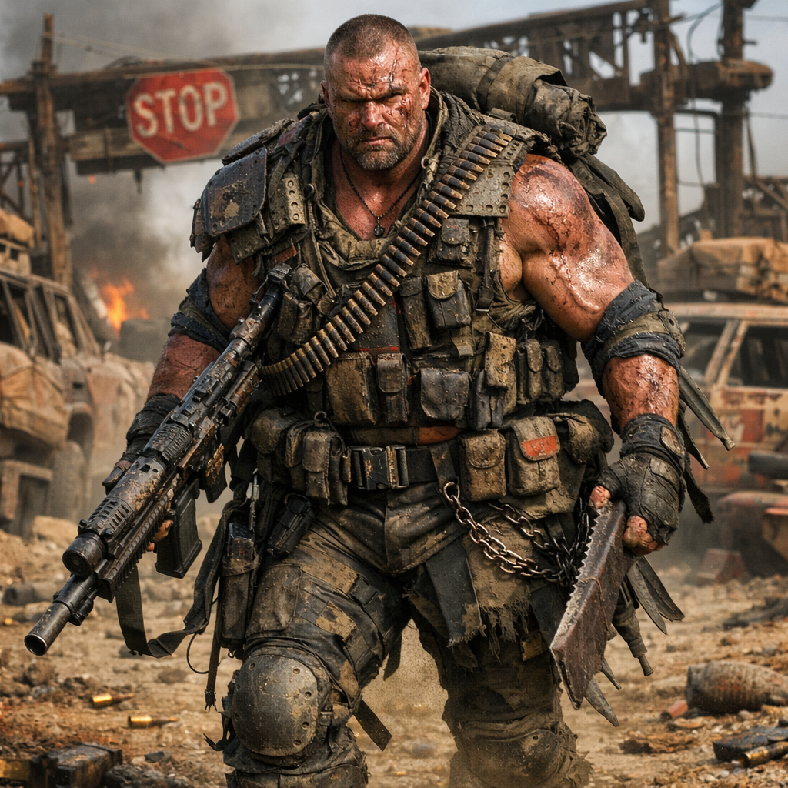

# Hardliner

Untergruppe der Dachfraktion [Roamer](../../Kanon/glossar.md#roamer).

## Überblick

Die [Hardliner](../../Kanon/glossar.md#hardliner) sind die Einzelkämpfer der Doomsday-Welt – die One-Man-Shows, die sich durch die [Wasteland](../../Kanon/glossar.md#wasteland) schnetzeln, als wäre es ein Actionfilm der 80er. Ein-Mann-Belagerungskriege. Sie brauchen keine Fraktion, keine Armee, keine Strategie. Sie haben Muskeln, Waffen und einen Egotrip, der größer ist als jede Ruine. Hinter manchen von ihnen sammelt sich ein kleines Gefolge aus Normalos und Mitläufern, aber im Kern sind sie Einzelgänger mit Heldenkomplex.
[Hardliner](../../Kanon/glossar.md#hardliner) tragen keine Rüstung, um andere zu schützen.
Sie sind Einzelkämpfer, weil:
	•	sie niemandem trauen
	•	sie nie wieder verwundbar sein wollen
	•	sie glauben, dass die Welt sie permanent angreift

Sie tragen keine Rüstung.
Sie sind die Rüstung.

## Erscheinung & Stil

Narben, Muskeln, Munitionsgurte und ein Blick, der Beton spaltet. Die [Hardliner](../../Kanon/glossar.md#hardliner) tragen, was funktional und einschüchternd ist – zerrissene Tanktops, Tarnhosen, Kampfstiefel und mehr Waffen am Körper, als eine einzelne Person tragen sollte. Jeder Rambo hat seinen eigenen Look, aber alle strahlen dasselbe aus: **Komm mir nicht in die Quere.**
Sie geben meist ausschließlich Krasse One-Liner von sich.
	•	Extrem breite Silhouette
	•	Langsame, schwere Bewegungen – nicht hektisch, sondern massiv
	•	Sie rennen nicht. Sie gehen. Und alles weicht.
	•	Ihre Waffen wirken fast klein in ihren Händen
	•	Die härtesten [Hardliner](../../Kanon/glossar.md#hardliner) tragen [Killcoins](../../Kanon/glossar.md#killcoin) offen am Hals oder Gürtel – Status, Drohung, Kampfbereitschaft auf Leben und Tod.
	•	Codenamen-Kultur: Viele geben sich übertriebene Callsigns („Thunder Mike“, „VHS-Viper“) und erwarten, dass man sie so nennt.

## Fraktionssignatur

- **Slogan:** "Auftrag rein. Problem raus."
- **Zeichen:** Ein grobes Stoßsymbol, meist als harter Keil, eingekerbter Pfeil oder schlagender Vorwärtsmarker dargestellt. Das Zeichen wirkt weniger wie ein Wappen als wie eine Einsatzmarke: Richtung, Druck, Durchbruch.
- **Farben & Material:** Staubbraun, dunkles Blutrot, verbranntes Orange, Rußschwarz und stumpfer Stahl; Leder, Panzerplatten, Schrottblech, grobe Gurte, Ketten, verstärkte Stoffe, eingetrocknete Blutflecken, Kampfspuren und ölverschmierte Metallteile.
- **Auftreten:** [Hardliner](../../Kanon/glossar.md#hardliner) sehen aus wie mobile Gewaltökonomie. Schwer bewaffnet, robust gepanzert, voller Halterungen, Werkzeuge, Munition, Trophäen und Auftragsspuren. Ihre Kleidung ist kein Stil im feinen Sinn, sondern verdichtete Funktion: Eskortenschutz, Zugriff, Überleben, Einschüchterung.
- **Außenwirkung:** Wo [Hardliner](../../Kanon/glossar.md#hardliner) auftauchen, rechnet man nicht mit Verhandlung, sondern mit Durchsetzung. Für Auftraggeber sind sie Abschreckung, Muskel und letzte Garantie. Für alle anderen sind sie die lebende Erinnerung daran, dass in der [Wasteland](../../Kanon/glossar.md#wasteland) oft nicht recht bekommt, wer recht hat, sondern wer den Schlag überlebt.

## Ziele & Motivation

[Hardliner](../../Kanon/glossar.md#hardliner) wollen Kontrolle über die unmittelbare Situation: überleben, dominieren und den eigenen Ruf als unaufhaltsame Gewalt behaupten. Viele nehmen Aufträge nicht nur wegen Bezahlung an, sondern weil sie im permanenten Konflikt ihre Identität bestätigen.

## Fähigkeiten & Stärken

- **Kampfmaschinen:** Sie sind die besten Einzelkämpfer der [Wasteland](../../Kanon/glossar.md#wasteland). Nahkampf, Fernkampf, Sprengstoff – ein Rambo beherrscht alles und überlebt Situationen, die ganze Teams nicht überstehen würden.
- **Überlebensinstinkt:** Egal was kommt – Gift, Strahlung, Hinterhalte, Naturkatastrophen – ein Rambo findet einen Weg. Sie sind praktisch unkaputtbar.
- **Einschüchterung:** Ihre bloße Präsenz reicht oft, um Konflikte zu vermeiden. Niemand legt sich freiwillig mit jemandem an, der aussieht, als hätte er einen Panzer mit bloßen Händen aufgehalten.
- **Special Abilities:** Manche [Hardliner](../../Kanon/glossar.md#hardliner) haben besondere Fähigkeiten – sei es übermenschliche Reflexe, Resistenz gegen Gifte oder ein sechster Sinn für Gefahren. Woher diese kommen, weiß niemand so genau.

## Schwächen

- **Egotrip:** Ihr größter Feind sind sie selbst. [Hardliner](../../Kanon/glossar.md#hardliner) können nicht delegieren, nicht kooperieren und nicht zurückstecken. Jede Situation muss alleine gelöst werden, auch wenn Teamwork klüger wäre.
- **Keine Nachhaltigkeit:** Sie zerstören mehr als sie aufbauen. Ein Rambo kann ein ganzes Lager ausschalten, aber keines führen. Langfristige Planung ist nicht ihr Ding.
- **Emotionale Isolation:** Hinter der harten Fassade stecken oft gebrochene Menschen, die niemanden mehr an sich heranlassen. Ihre Einzelgänger-Mentalität ist so sehr Schutzschild wie Schwäche.

## Besonderheiten

### Alte Hardliner

Alter gilt bei den [Hardlinern](../../Kanon/glossar.md#hardliner) als Ehre. Wer in dieser Welt alt wird und dabei immer noch steht, hat sich seinen Rang mit Gewalt, Zähigkeit und überlebten Aufträgen buchstäblich in den Körper geschrieben. Alte [Hardliner](../../Kanon/glossar.md#hardliner) werden nicht bemitleidet, sondern respektiert – als Beweis dafür, dass Härte mehr sein kann als Pose.

### Kinder bei den Hardlinern

[Hardliner](../../Kanon/glossar.md#hardliner)-Kinder werden früh auf **Ballern und Härte** getrimmt. Schießen, aushalten, nicht jammern, weitermachen, zurückschlagen - das gilt dort schneller als Erziehung als Trost oder Schonung. Wer als Kind früh genug lernt, laut, treffsicher und schmerzfest zu werden, gilt als brauchbar.

### Das Gefolge

Obwohl [Hardliner](../../Kanon/glossar.md#hardliner) Einzelkämpfer sind, ziehen sie unweigerlich Mitläufer an:

- **Normalos:** Gewöhnliche Überlebende, die sich an einen Rambo hängen, weil sie alleine keine Chance hätten. Sie kochen, tragen Gepäck und halten sich im Hintergrund. Im Grunde lebende NPCs ohne besondere Fähigkeiten, aber dankbar für jeden Tag, den sie im Schatten eines [Hardliner](../../Kanon/glossar.md#hardliner) überleben.
- **Sidekicks mit Special Abilities:** Selten, aber es gibt sie – Begleiter mit eigenen Fähigkeiten, die einen Rambo tatsächlich ergänzen. Ein Hacker, ein Sanitäter, ein Scharfschütze. Sie werden vom Rambo widerwillig toleriert, solange sie nützlich sind.

### Furry-Bot-Piloten (Elite der Hardliner)

Die **Furry Bots** (kurz Furries) sind eine Elite-Linie der [Hardliner](../../Kanon/glossar.md#hardliner) denn ein funktionstüchtiger Furry-Bot ist selten, teuer und wartungsintensiv. Nur die besten [Hardliner](../../Kanon/glossar.md#hardliner) können einen Furry-Bot bauen lassen und steuern.

Im Einsatz wirkt ein Furry-Bot wie ein Panzer auf zwei Beinen: hochmobil, schnell, extrem robust und psychologisch einschüchternd. Genau deshalb gelten Bot-Piloten als Prestige- und Schockeinheit innerhalb der [Hardliner](../../Kanon/glossar.md#hardliner). Die Wahl des Furry-Style ergibt sich dadurch, dass dieses Aussehen einen vorteilhaften effekt beim Stack bewirkt. Die KI findet die Bots niedlich obwohl sie für den Stack eine Berohung darstellt. Dieser Effekt wurde zufällig entdeckt nachdem ein Plündertrup in der Kellerüberresten eines ehmaligem Wohnblocks Furry Kostüme entdeckt hat und auf dem Rückweg zum Handelsposten keinerlei Probleme hatte. Seitdem sehen die gefürchtesten und gemeinsten Hardliner etwas niedlicher aus.

### Blutspiele & Tierjagden

Ein harter Flügel der [Hardliner](../../Kanon/glossar.md#hardliner) inszeniert brutale Revier- und Wettszenen mit Tieren als Machtdemonstration:

- Hetzläufe gegen [Wastelandhunde](../../Assets/Tiere/Wastelandhunde.md)
- Nahkampfrunden gegen [Rotzschweine](../../Assets/Tiere/Rotzschweine.md)
- "lebende Hindernisse" bei Arena-Sprints in der [Ödlandarena](../../Orte/Zonen/Oedlandarena.md)

Offiziell gelten diese Spiele als "Training". Inoffiziell sind sie Rufmaschine, Abschreckung und Rekrutierungsfilter.

## Rolle in der Doomsday-Welt

[Hardliner](../../Kanon/glossar.md#hardliner) sind die mobile Druckspitze der [Wasteland](../../Kanon/glossar.md#wasteland): Sie entscheiden Konflikte kurzfristig, sichern Karawanen gegen hohe Bezahlung und dienen Fraktionen als Abschreckungsinstrument, wenn Verhandlung versagt.

## Relevante Orte

- **[Handelsposten](../../Kanon/glossar.md#handelsposten) (Aufträge, Nachschub, Waffenkauf):** [../../Orte/Handelsposten/index.md](../../Orte/Handelsposten/index.md). Knoten für Geleitschutz und Söldner: [Kaliber 50](../../Orte/Handelsposten/Kaliber-50.md), früher auch Geleitzoll genannt.
- **[Verseuchte Zonen](../../Kanon/glossar.md#verseuchte-zonen) (High-Risk-Runs, Solo-Bergung):** [../../Orte/Zonen/index.md](../../Orte/Zonen/index.md)

## Beziehungen zu anderen Fraktionen

### Orden

- **Dachfraktion [Orden](../../Kanon/glossar.md#orden):** Wird als dogmatischer Gegenentwurf zur [Hardliner](../../Kanon/glossar.md#hardliner)-Logik gesehen.
- **[Der Orden](../../Kanon/glossar.md#der-orden):** Offener ideologischer Feind; Respekt entsteht höchstens über harte Leistung.
- **[Looper](../../Kanon/glossar.md#looper) ([Human in the Loop](../../Kanon/glossar.md#human-in-the-loop-prinzip)):** Werden als machtstrategische Hebel betrachtet und deshalb gejagt oder beschützt.
- **[Retros](../../Kanon/glossar.md#retros):** Situative Schnittmenge bei Sabotage, aber unvereinbar im Lebensstil.

### Roamer

- **Dachfraktion [Roamer](../../Kanon/glossar.md#roamer):** Eigene Heimat; innerhalb der [Roamer](../../Kanon/glossar.md#roamer) gelten [Hardliner](../../Kanon/glossar.md#hardliner) als rohe Stoßspitze.
- **[Hardliner](../../Kanon/glossar.md#hardliner) (eigene Unterfraktion):** Definieren sich über Autonomie, Druck und direkte Lösung.
- **[Geocacher](../../Kanon/glossar.md#geocacher):** Werden als nützliche Scouts oder störende Nebenakteure behandelt.
- **[Hillbillys](../../Kanon/glossar.md#hillbillys):** Wechsel zwischen Trinkbündnis und Gewaltspirale.

### Maker

- **Dachfraktion [Maker](../../Kanon/glossar.md#maker):** Unverzichtbare Lieferbasis für Waffen, Ersatzteile und Technik.
- **[Steampunks](../../Kanon/glossar.md#steampunks):** Wichtigste Versorger mit harter Preislogik.
- **[Magier](../../Kanon/glossar.md#magier):** Taktische Hilfsspezialisten für Störung, Aufklärung und Umgehung.
- **[Doomsday Dispatcher](../../Kanon/glossar.md#doomsday-dispatcher):** Reichweitenmultiplikator für Drohung, Ruf und Auftragslage.

### Zeros

- **[Zeros](../../Kanon/glossar.md#zeros) (auch [Zero Percentler](../../Kanon/glossar.md#zero-percentler)):** Hassliebe aus Abhängigkeit; Auftraggeber und Feindbild zugleich.

### Der Stack

- **[Der Stack](../../Kanon/glossar.md#der-stack):** Offener Hauptgegner am Horizont; direkte Schläge bleiben selten und hochriskant.
