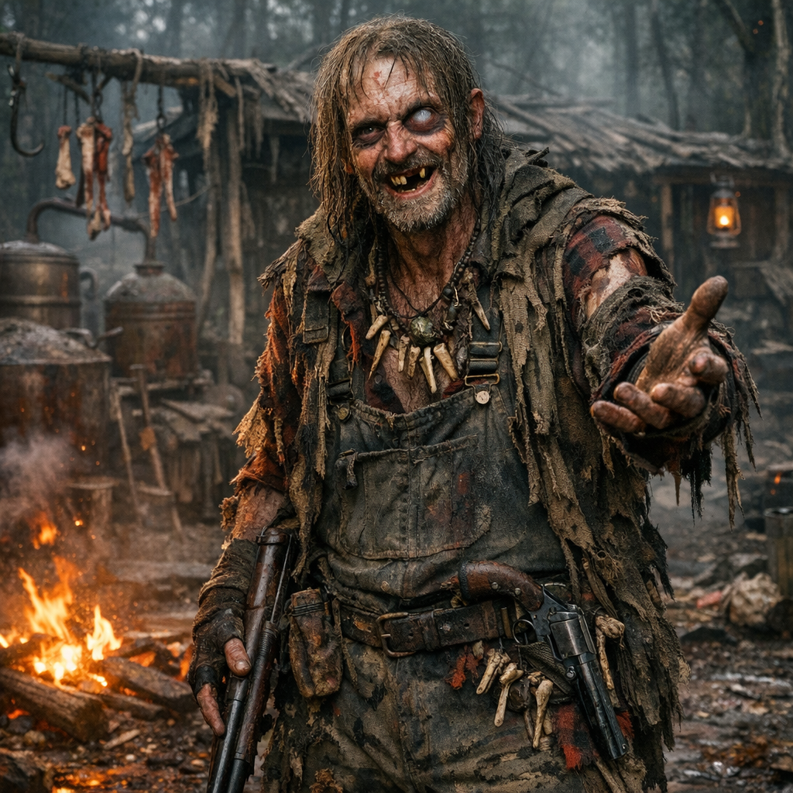
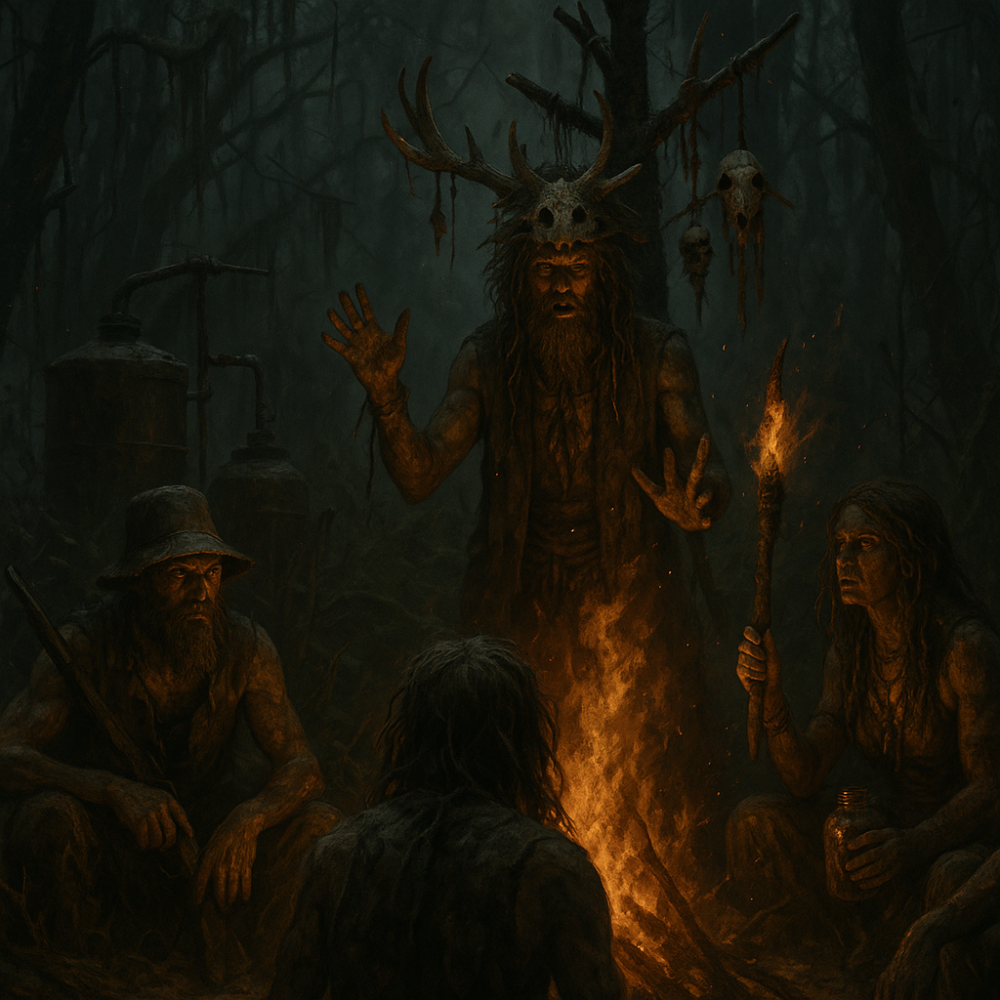

# Hillbillys

Untergruppe der Dachfraktion [Roamer](../../Kanon/glossar.md#roamer).

## Überblick

Die [Hillbillys](../../Kanon/glossar.md#hillbillys) sind die verstörendsten Überlebenden der Doomsday-Welt. Während die Zivilisation unterging, lagen sie irgendwo im Wald im Moonshine-Koma und haben das Ende der Welt schlichtweg verschlafen. Keine Strategie, kein Bunker, kein Masterplan – einfach zu zugedröhnt, um zu sterben. Und jetzt, wo die [Wasteland](../../Kanon/glossar.md#wasteland) für alle anderen die Hölle ist, fühlen sie sich zum ersten Mal richtig wohl. Denn die [Hillbillys](../../Kanon/glossar.md#hillbillys) waren schon **vor** dem Doomsday völlig durchgedreht – die Apokalypse hat nur die letzten Hemmungen beseitigt.

Was von außen oft wie "Zombies im Wald" wirkt, ist bei ihnen kein plötzlicher Ausbruch, sondern ein langsamer Verfall über Generationen. Mehr dazu in der [Timeline: 2066.6 - Als die Hillbillys zu faulen begannen](../../Kanon/Timeline/2066.6-Als-die-Hillbillys-zu-faulen-begannen.md).

## Erscheinung & Stil

Latzhosen (oft nur ein Träger, manchmal gar keiner), zerrissene Flanellhemden, Strohhüte und Gesichter, die wirken, als hätte der Wald sie halb wieder ausgespuckt. Fehlende, schwarze oder goldene Zähne, milchige Augen, vernarbte Haut, verwahrloste Bärte, fettiges Haar und eine allgemeine Ausstrahlung zwischen schwer krank, dauerbesoffen und beinahe schon verwest geben ihnen etwas fast Zombiemäßiges - ohne dass sie je aufhören würden, gefährlich lebendig zu sein. Ihre Kleidung ist mit Blut, Dreck und unbekannten Substanzen verschmiert. Viele tragen **Knochenschmuck**: Finger, Zähne und Wirbel an Schnüren um den Hals - Trophäen vergangener „Begegnungen“. Manche haben sich Symbole und Runen in die Haut geritzt oder gebrannt. Jeder Hillbilly riecht nach Moonshine, Lagerfeuer, altem Fleisch und etwas, das man lieber nicht identifizieren will. Und irgendwo - **immer** - steckt ein Revolver versteckt.

## Fraktionssignatur

- **Slogan:** "Du bist hier falsch."
- **Zeichen:** Ein grobes Revierzeichen aus Astgabel, Schädel, Kesselhaken, Kratzspur oder eingeritzter Familienmarke. Es wirkt nicht wie ein Wappen, sondern wie eine Warnung: Grenze, Anspruch, Drohung.
- **Farben & Material:** Schlammgrün, Holzbraun, Rauchgrau, Flanellrot, getrocknetes Blut und rostiges Eisen; grobe Stoffe, Felle, Lederreste, Knochen, Glasflaschen, Schnüre, Holzstücke, Draht und Jagdtrophäen.
- **Auftreten:** [Hillbillys](../../Kanon/glossar.md#hillbillys) wirken wie bewaffnete Waldclans aus Mondscheinbrennerei, Jagdrevier und Familienfehde, nur weiter verfallen und enthemmter als normale Menschen noch wirken sollten. Flinten, Arbeitskleidung, Fellzeug, Flanell, schmutzige Stiefel und improvisierte Schutzstücke verbinden sich zu einem ländlich-brutalen Stil, der nach Revier, Selbstjustiz und körperlichem Verfall aussieht.
- **Außenwirkung:** Wo [Hillbillys](../../Kanon/glossar.md#hillbillys) auftauchen, ist Gastfreundschaft nie von Gewalt zu trennen. Für manche sind sie Ortskundige, Tauschpartner und zähe Überlebende. Für andere wirken sie wie halbverrottete Familiengespenster mit Fallen, Schnaps, Revierinstinkt und extrem kurzer Zündschnur.

## Ziele & Motivation

[Hillbillys](../../Kanon/glossar.md#hillbillys) folgen keiner übergeordneten Strategie, aber klaren Trieben: Territorium halten, Clan sichern, Ressourcen aus Wald und Randzonen ziehen und den eigenen Ritualkosmos verteidigen. Außenstehende werden danach behandelt, ob sie nützlich, unterhaltsam oder bedrohlich wirken.

## Besonderheiten

### Leitfigur: Hillbilly Jö

**Hillbilly Jö** ist das Paradebeispiel seiner Fraktion: zahnlos, dauerbesoffen und absolut gemeingefährlich. Er überlebte den Doomsday, weil er im tiefsten Wald in einem Moonshine-Koma lag, während die Welt um ihn herum in Flammen aufging. Als er aufwachte, war alles zerstört – und Jö zuckte mit den Schultern, brannte sich erstmal einen neuen Kessel an und zersägte den nächsten Toten, um seine Knochenkette zu erweitern. Jö ist gleichzeitig der netteste Typ, den man treffen kann, und das Letzte, was man im Dunkeln sehen will. Er würde dir den letzten Schluck Moonshine geben – und dir fünf Minuten später lachend die Hand abhacken, wenn die Laune umschlägt.

### Herkunft & Überlebensvorteil

Das Geheimnis der [Hillbillys](../../Kanon/glossar.md#hillbillys) ist so simpel wie absurd: Sie haben sich zu Lebzeiten so viel Gift in den Körper geworfen – Moonshine, Pestizide, vergorene Substanzen unbekannter Herkunft, fragwürdige Pilze aus dem Wald, Rattengift als Snack – dass ihr Körper gegen praktisch alles resistent geworden ist. Strahlung? Kein Problem, der Moonshine war schlimmer. Giftige Luft? Riecht wie Zuhause. Verseuchtes Wasser? Schmeckt besser als das, was sie vorher getrunken haben. Aber die Gifte haben auch ihr Gehirn zerfressen. Die [Hillbillys](../../Kanon/glossar.md#hillbillys) waren schon immer seltsam – Inzucht-Clans tief im Wald, abgeschnitten von der Zivilisation, mit eigenen Gesetzen und eigenen Ritualen. Der Doomsday hat das Letzte an gesellschaftlicher Kontrolle weggerissen. Jetzt gibt es niemanden mehr, der sie aufhält.

Hinzu kommt ein zweiter, lange unterschätzter Faktor: die ständige Nähe zu feuchten Waldsenken, verdorbenen Lagern und [Schimmelratten](../../Assets/Tiere/Schimmelratten.md). Sporen, kranker Staub, kontaminierte Nester und verseuchte Nahrung machen aus dem Hillbilly-Körper keinen Untoten im sauberen Sinn – aber sie treiben den langsamen Verfall sichtbar weiter.

### Die Rituale

Die [Hillbillys](../../Kanon/glossar.md#hillbillys) praktizieren eine wirre Mischung aus **Voodoo, Hoodoo, Hexenwerk und selbsterfundenem Wahnsinn**. Tief in ihren Wäldern stehen Lichtungen, auf denen Knochentotems aus aufgestapelten Schädeln ragen. Tierinnereien hängen in den Bäumen. Pentagrame aus Asche und Blut zieren den Boden.

Viele Clans erzählen, dass im **Juni 2066** - von ihnen oft nur als **2066.6** bezeichnet - "Satan auf die Erde zurückkehrte" und die Hölle im Wald aufbrach. Ob das mehr ist als Hillbilly-Mythos, glaubt außerhalb ihrer Territorien kaum jemand. Für die Fraktion selbst markiert dieser Moment aber den Punkt, an dem aus Verfall etwas Dauerhaftes wurde.

- **Mondnacht-Rituale:** Bei Vollmond versammelt sich der Clan um ein Feuer, tanzt in Tierfellen und trinkt einen speziellen „Hexen-Moonshine“ – versetzt mit halluzinogenen Pilzen, Schlangengift und Krötendrüsen. Was danach passiert, erinnert sich niemand. Aber am nächsten Morgen fehlen manchmal Leute.
- **Knochenlesen:** Hillbilly-Älteste lesen die Zukunft aus den Knochen von Toten. Je frischer die Knochen, desto klarer die Vision – behaupten sie zumindest. Das motiviert natürlich, für „frisches Material“ zu sorgen.
- **Zerstückelungs-Trophäen:** Feinde – und manchmal auch Gäste, die zu lange bleiben – werden zerlegt. Finger werden zu Ketten, Schädel zu Trinkbechern, Haut zu Lampenschirmen. Die [Hillbillys](../../Kanon/glossar.md#hillbillys) sehen das nicht als grausam – für sie ist es Handwerk und Ehre. Verschwendung ist Sünde, und von einem Körper lässt sich **alles** verwerten.
- **Die Sündenpuppen:** Aus Haaren, Stoff und Knochen gebaute Puppen, die angeblich Flüche auf Feinde legen. Überraschenderweise haben manche Fraktionen tatsächlich Angst davor – ob berechtigt oder nicht, weiß niemand.

## Fähigkeiten & Stärken

- **Gift- und Strahlenresistenz:** Ihr jahrelanger Selbstvergiftungs-Lifestyle hat sie praktisch immun gegen die Umweltgefahren der [Wasteland](../../Kanon/glossar.md#wasteland) gemacht. Was andere tötet, merken sie nicht mal.
- **Überlebenskünstler im Wald:** Jagen, Fallenstellen, Feuer machen, Unterschlupf bauen, Leichen verwerten – die [Hillbillys](../../Kanon/glossar.md#hillbillys) lebten schon vor dem Doomsday wie in der Wildnis. Die Apokalypse hat an ihrem Alltag fast nichts geändert.
- **Moonshine-Brennerei:** Ihr selbstgebrannter Schnaps ist Währung, Medizin, Treibstoff, Droge und Waffe in einem. Moonshine ist eines der begehrtesten – und gefürchtetsten – Handelsgüter der [Wasteland](../../Kanon/glossar.md#wasteland). Manche Chargen sind rein, manche halluzinogen, manche tödlich. Welche man bekommt, ist Glückssache.
- **Versteckte Bewaffnung:** Lege dich **nie** mit einem Hillbilly an. Hinter jedem Heuballen, unter jeder Latzhose, in jedem Stiefel steckt ein Revolver. Sie sind laufende Waffenarsenale und schießen überraschend treffsicher – selbst sturzbetrunken.
- **Terror-Faktor:** Ihre Rituale, ihr Aussehen und ihr völlig unberechenbares Verhalten machen sie zur am meisten gefürchteten Fraktion in der [Wasteland](../../Kanon/glossar.md#wasteland). Selbst Furry Bots meiden ihre Wälder.
- **Fallen & Hinterhalte:** Ihre Wälder sind Todeslabyrinthe. Bärenfallen, Fallgruben mit Spießen, aufgehängte Leichen als Warnung, vergiftete Köder – wer uneingeladen Hillbilly-Territorium betritt, kommt selten wieder heraus.

## Schwächen

- **Völlig wahnsinnig:** Kein strategisches Denken, keine Planung, keine Logik. Die [Hillbillys](../../Kanon/glossar.md#hillbillys) handeln nach Impulsen, Halluzinationen und dem, was die Knochen ihnen „sagen“. Das macht sie unberechenbar, aber auch unfähig, koordiniert vorzugehen.
- **Dauerberauscht:** Sie sind praktisch nie nüchtern. Ein betrunkener Hillbilly kann dein bester Freund sein, dir minutenlang eine Geschichte erzählen – und dir dann lachend ein Ohr abschneiden, weil die Stimmen es so wollten.
- **Leichtgläubig & manipulierbar:** Trotz ihrer Brutalität sind sie erstaunlich naiv. Die Steampunk Trader ziehen sie bei jedem Deal über den Tisch, und die [Zeros](../../Kanon/glossar.md#zeros) nutzen sie als billiges Kanonenfutter.
- **Kurze Zündschnur:** Der Umschlag von freundlich zu mörderisch passiert ohne Vorwarnung. Eine falsche Geste, ein falsches Wort, ein Blick zur falschen Zeit – und das Lagerfeuer wird zum Schlachthaus.

### Die zwei Gesichter

Das Verstörendste an den [Hillbillys](../../Kanon/glossar.md#hillbillys) ist der **Kontrast**: Sie können unglaublich herzlich und gastfreundlich sein. Wer friedlich kommt, bekommt Moonshine, einen Platz am Feuer und wird wie Familie behandelt. Sie lachen, singen, erzählen Geschichten und teilen alles, was sie haben. Und dann, ohne erkennbaren Auslöser, kippt es. Dieselben Hände, die dir gerade einen Becher Moonshine gereicht haben, greifen nach der Machete. Dieselben Augen, die gerade noch freundlich funkelten, werden leer und kalt. Es gibt kein Warnsignal, keine Eskalation – nur einen Schalter, der umgelegt wird. Manche Überlebende schwören, dass die [Hillbillys](../../Kanon/glossar.md#hillbillys) von etwas **Besessenes** haben. Dass der jahrelange Giftkonsum und die Rituale etwas in ihnen freigesetzt haben, das nicht mehr menschlich ist. Andere sagen, sie waren schon immer so – der Wald hat sie nur endlich von der Leine gelassen.

### Alte im Clan

Alter bedeutet bei den [Hillbillys](../../Kanon/glossar.md#hillbillys) nicht Würde, Ruhe oder klare Autorität, sondern nur eine neue Form des Verfalls. Manche Alte faulen sichtbar vor sich hin, sitzen oder liegen an denselben Stellen, murmeln Knochenwahrheiten und werden von den Jüngeren eher umkreist als gepflegt. Andere wirken, als wären sie mit Veranda, Sessel oder Jagdhütte bereits halb verwachsen. Und wieder andere sind das genaue Gegenteil: erschreckend agile Greise, die im hohen Alter noch mit auf Jagd gehen, Fallen kontrollieren oder nachts plötzlich mit der Flinte im Wald stehen. Wer bei den [Hillbillys](../../Kanon/glossar.md#hillbillys) alt wird, wird nicht automatisch schwach – nur unheimlicher.

### Kinder im Clan

Hillbilly-Kinder wachsen eher **vernachlässigt** als behütet auf. Sie laufen mit, schlafen irgendwo am Rand des Lagers, verschwinden in Schuppen, Hütten, Sümpfen oder hinter Brennkesseln und lernen früh, dass Aufmerksamkeit nicht verlässlich ist. Wer durchkommt, wird hart, schmutzfest und unheimlich selbstständig. Wer nicht durchkommt, verschwindet in derselben grausamen Logik, mit der der Clan auch sonst auf Schwäche reagiert.

## Rolle in der Doomsday-Welt

Die [Hillbillys](../../Kanon/glossar.md#hillbillys) kontrollieren die tiefen Wälder der [Wasteland](../../Kanon/glossar.md#wasteland) – und niemand ist dumm genug, sie ihnen streitig zu machen. Ihre Camps sind gleichzeitig die gastfreundlichsten und die gefährlichsten Orte der Welt. Handelskarawanen machen große Umwege, um Hillbilly-Territorium zu umgehen. Die wenigen, die durchmüssen, bringen reichlich Opfergaben mit – Moonshine, Werkzeuge, glänzende Gegenstände – und beten, dass die [Hillbillys](../../Kanon/glossar.md#hillbillys) heute einen guten Tag haben. Trotz ihres Wahnsinns sind sie auf ihre Art unverzichtbar: Ihr Moonshine hält die halbe [Wasteland](../../Kanon/glossar.md#wasteland) am Laufen, ihre Wälder liefern Holz, Wild und Kräuter, und ihre schiere Existenz hält andere Fraktionen davon ab, die Wälder zu beanspruchen. Sie sind ein notwendiges Übel – eine Naturgewalt in Latzhosen.

Mit den [Waldgebieten](../../Orte/Zonen/Waldgebiete.md) besitzen sie außerdem einen der wenigen echten Landschaftstypen, die noch wie Wald wirken: dicht, dunkel, lebendig und trotzdem tödlich.

Im Jahr 2222 wird ihr Zustand noch meistens über Warnungen, Übertreibung und gruselige Geschichten vermittelt. Aber gerade an Orten wie der [Sumpf-Festung](../../Orte/Handelsposten/Sumpf-Festung.md) und in tiefen [Waldgebieten](../../Orte/Zonen/Waldgebiete.md) mehren sich Berichte über [Hillbillys](../../Kanon/glossar.md#hillbillys), die sichtbar faulen, schlecht heilen oder zu lange still daliegen, bevor sie wieder losschlagen.

## Relevante Orte

- **[Handelsposten](../../Kanon/glossar.md#handelsposten) (Tausch von Moonshine, Holz, Wild):** [../../Orte/Handelsposten/index.md](../../Orte/Handelsposten/index.md). Ihr Tauschknoten: [Sumpf-Festung](../../Orte/Handelsposten/Sumpf-Festung.md), früher auch Splitterhafen genannt.
- **[Verseuchte Zonen](../../Kanon/glossar.md#verseuchte-zonen) (Randbereiche, Pilze, Risikobeute):** [../../Orte/Zonen/index.md](../../Orte/Zonen/index.md)
- **Territorialkern:** [Waldgebiete](../../Orte/Zonen/Waldgebiete.md)

## Beziehungen zu anderen Fraktionen

### Orden

- **Dachfraktion [Orden](../../Kanon/glossar.md#orden):** Wird als fremder Ritualblock akzeptiert, solange er Waldgrenzen respektiert.
- **[Der Orden](../../Kanon/glossar.md#der-orden):** Kontakt schwankt zwischen Aberglauben, Tausch und Feindseligkeit.
- **[Looper](../../Kanon/glossar.md#looper) ([Human in the Loop](../../Kanon/glossar.md#human-in-the-loop-prinzip)):** Gelten als seltsame, aber schutzwürdige Schlüsselfiguren.
- **[Retros](../../Kanon/glossar.md#retros):** Punktülle Nähe im Technikmisstrauen, kulturell aber weit auseinander.

### Roamer

- **Dachfraktion [Roamer](../../Kanon/glossar.md#roamer):** Eigene Heimat; [Hillbillys](../../Kanon/glossar.md#hillbillys) sind der unberechenbare Territorialarm.
- **[Hardliner](../../Kanon/glossar.md#hardliner):** Treffen enden als Lagerfeuerfreundschaft oder Massaker.
- **[Geocacher](../../Kanon/glossar.md#geocacher):** Dauerstreit um Waldboden, Caches und Grenzverletzungen.
- **[Hillbillys](../../Kanon/glossar.md#hillbillys) (eigene Unterfraktion):** Definieren sich über Territorium, Rituale und brutale Impulslogik.

### Maker

- **Dachfraktion [Maker](../../Kanon/glossar.md#maker):** Nötige Handelspartner für Tauschgut, Ausrüstung und Abnahme.
- **[Steampunks](../../Kanon/glossar.md#steampunks):** Kaufen Rohstoffe billig, provozieren damit wiederkehrende Vergeltung.
- **[Magier](../../Kanon/glossar.md#magier):** Werden als gefährliche Signalhexer wahrgenommen, nur begrenzt geduldet.
- **[Doomsday Dispatcher](../../Kanon/glossar.md#doomsday-dispatcher):** Liefern Mythos, Gerücht und Einfluss auf Clanlaunen.

### Zeros

- **[Zeros](../../Kanon/glossar.md#zeros) (auch [Zero Percentler](../../Kanon/glossar.md#zero-percentler)):** Verachtete Oberschicht; Ausbeutung wird bei Übergriff mit Clan-Gewalt beantwortet.

### Der Stack

- **[Der Stack](../../Kanon/glossar.md#der-stack):** "Himmelsteufel aus Licht"; Kernzonen werden gemieden, Randbereiche geplündert.
