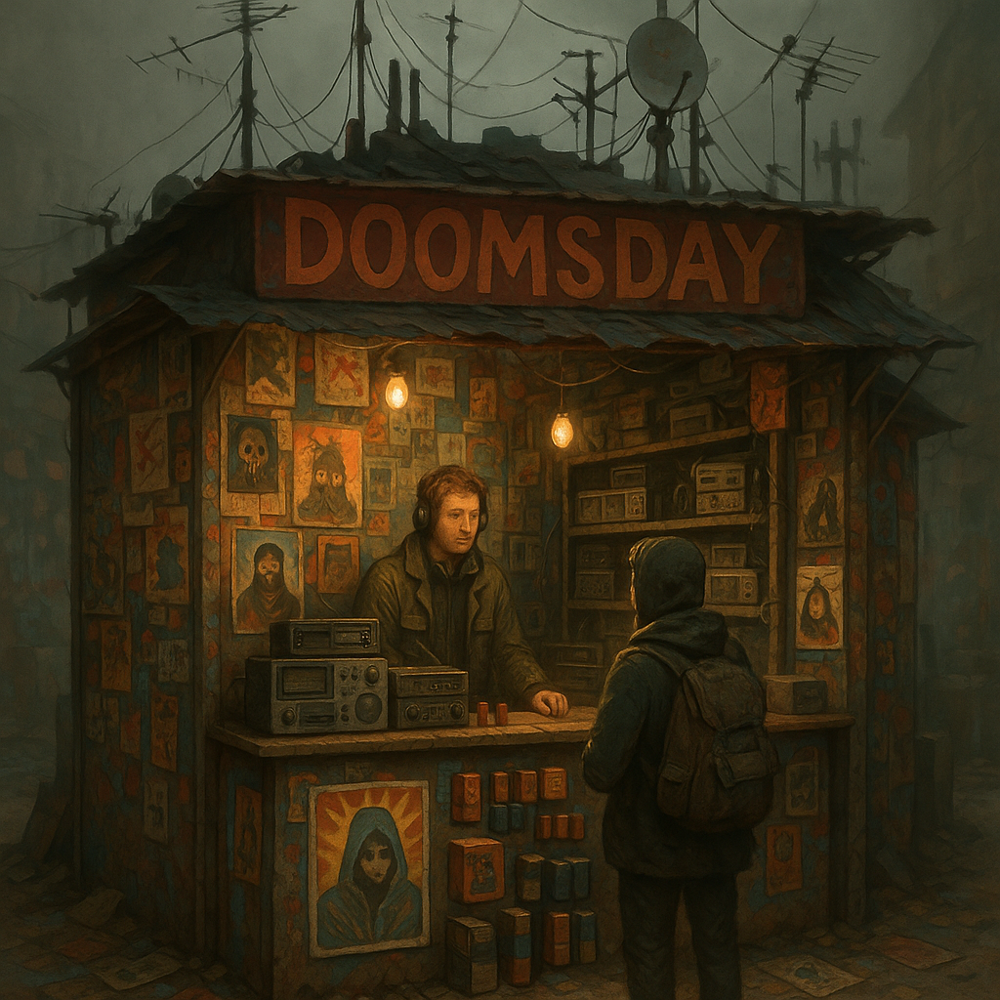

# Doomsday Fanshop

Ehemals "Dispatch-Hof". Der offizielle (und einzige) Merchandise-Store für [Doomsday Radio](../../Kanon/glossar.md#doomsday-radio). Hier wird der Kult um den Weltuntergang kommerzialisiert.

## Lage

Ein bunter, chaotischer Anbau an einer Sendemast-Ruine. Schon von weitem sieht man Graffiti, Neon-Farbe und Antennen.

## Zuordnung

- **Betreiber:** [Doomsday Dispatcher](../../Kanon/glossar.md#doomsday-dispatcher) ([Maker](../../Kanon/glossar.md#maker)) & Fans

## Schwerpunkt / Was es gibt

- **Merch:** T-Shirts ("I survived Doomsday and all I got was radiation"), Tassen, Sticker.
- **Tech:** Kurbelradios, Ersatzbatterien, Antennenverstärker.
- **Sendezeit:** Hier kann man Grüße oder Warnungen für die Sendung einreichen (gegen Gebühr in [Scrip](../../Kanon/glossar.md#scrip) bzw. Z-Bucks).
- **Fan-Post:** Briefkasten für [Mad Dog](../../Kanon/glossar.md#mad-dog).

## Wer sich aufhält

- **Dominant:** Radio-Nerds, [Maker](../../Kanon/glossar.md#maker), Boten
- **Pilger:** Fans, die [Mad Dog](../../Kanon/glossar.md#mad-dog) einmal sehen wollen (er ist aber nie da)

## Typische Gefahren

- **Abzocke:** Überteuerte "Original"-Teile.
- **Lärm:** Hier läuft das Radio immer auf maximaler Lautstärke.
- **[Stack](../../Kanon/glossar.md#der-stack)-Ziel:** Da hier Sendetechnik verkauft wird, ist der Ort dem [Stack](../../Kanon/glossar.md#der-stack) ein Dorn im Auge (wird aber wegen "Kultur-Bonus" meist toleriert).

## Besonderheiten vor Ort

- Bunter Anbau an einer Sendemast-Ruine mit hoher Wiedererkennbarkeit.
- Fan-Post-Kasten für [Mad Dog](../../Kanon/glossar.md#mad-dog) als Kultobjekt.
- Dauerbeschallung durch Dispatch-Sendungen prägt den gesamten Hof.

→ Übersicht: [Handelsposten](../../Kanon/glossar.md#handelsposten)
