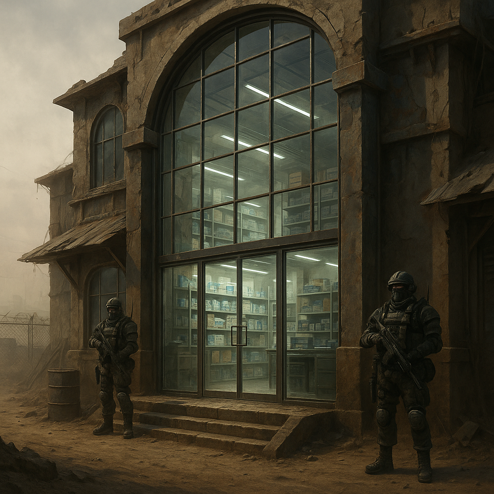

# Glaspforte

Kleiner, elitärer Posten nahe einer Zero-Versorgungsroute. Außen unscheinbar, innen sauberer als alles in der Umgebung. Die Glaspforte ist der Zugang der [Zeros](../../Kanon/glossar.md#zeros) zur [Wasteland](../../Kanon/glossar.md#wasteland) – ohne dass sie selbst sichtbar werden müssen.

## Lage

Nahe einer Zero-Versorgungsroute; gut angebunden an Enklaven und Karawanenwege. Das Gebäude wirkt von außen schlicht; innen herrschen Ordnung, Licht und kontrollierte Bedingungen.

## Zuordnung

- **Betreiber / Kontrolle:** [Zeros](../../Kanon/glossar.md#zeros) (auch [Zero Percentler](../../Kanon/glossar.md#zero-percentler)); betrieben von Vertrags-Tradern mit Zero-Lizenz

## Schwerpunkt / Was es gibt

- **Premium-Ware:** Seltene Ersatzteile in verlässlicher Qualität, Medizinpakete, Reinwasser-Kits
- **Dienstleistungen:** Zero-Kredite, [Scrip](../../Kanon/glossar.md#scrip)-Einlösung, Vermittlung zu Enklaven
- **Daten:** Hochpreisige Informationen über Personen und Fraktionen
- Kein offener Massenmarkt; Zugang nur mit Empfehlung oder Pfand

## Wer sich aufhält

- **Dominant:** Vertrags-Trader mit Zero-Lizenz
- **Häufig:** Bezahlte Wachen, gelegentlich [Hardliner](../../Kanon/glossar.md#hardliner) / Furry Bots als Sicherheit
- **Sehr selten:** [Zeros](../../Kanon/glossar.md#zeros) persönlich

## Typische Gefahren

- Zugang nur mit Empfehlung oder Pfand – wer keinen hat, kommt nicht rein oder wird abgezockt
- Harte Sanktionen bei Regelverstoß
- Unsichtbare Beobachtung: Jeder Deal wird protokolliert und kann gegen einen verwendet werden

## Besonderheiten vor Ort

- Außen unscheinbar, innen klinisch geordnet und kontrolliert.
- Zugangssystem über Empfehlung, Pfand und Lizenzstatus.
- Dient als vorgeschobene Zero-Schnittstelle zur [Wasteland](../../Kanon/glossar.md#wasteland).

→ Übersicht: [Handelsposten](../../Kanon/glossar.md#handelsposten)
