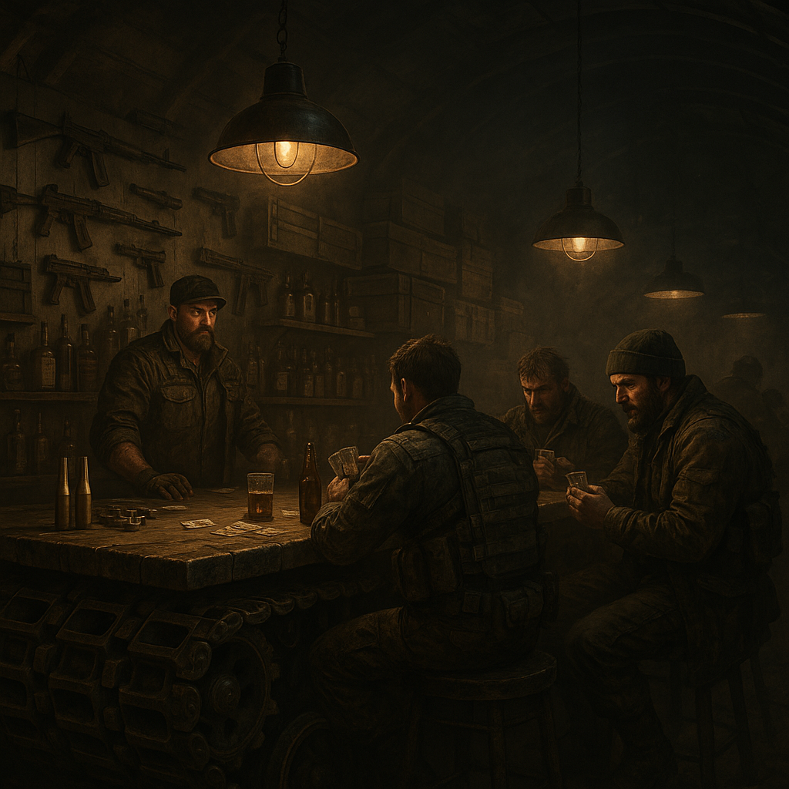

# Kaliber 50

Ehemals "Geleitzoll". Eine schwer befestigte Bar, gebaut in und um einen alten Panzer-Hangar. Der Tresen besteht aus einer Panzerkette. Hier trinken die, die vom Töten leben.

## Lage

An einer strategischen Engstelle einer Hauptroute. Man muss durch die Bar, um sicher weiterzukommen – oder man zahlt den "Zoll" (einen Drink für die Wachen).

### Lage & Architektur

- **Bunker darunter:** Die Bar hat einen Bunker im Untergrund.
- **Außenwirkung:** Unspektakulär, halb verfallen, wirkt verlassen.
- **Innen:** Stahlträger, Beton, Neonröhren, Zigarettenrauch in Lichtkegeln.
- **Soundkulisse:** Leise Synthwave aus einem alten Kassettendeck.
- **Beleuchtung:** Viel Schatten. Spotlights nur auf Arbeitsflächen.

## Zuordnung

- **Betreiber / dominant:** [Hardliner](../../Kanon/glossar.md#hardliner) ([Roamer](../../Kanon/glossar.md#roamer)), Söldner

## Schwerpunkt / Was es gibt

- **Drinks:** "Schmieröl" (Starkbier), "Mündungsfeuer" (Chili-Schnaps).
- **Aufträge:** Das "Schwarze Brett" für Söldner-Jobs, Eskorten, Kopfgeldjagden.
- **Waffenbörse:** Unter dem Tisch werden Waffen und Munition gehandelt.
- **Schutz:** Wer hier drin ist, ist sicher (solange er keinen Streit anfängt).

## Wer sich aufhält

- **Dominant:** Söldner, [Hardliner](../../Kanon/glossar.md#hardliner), Furry-Bot-Piloten (ohne Anzug, meistens)
- **Gäste:** Händler auf der Suche nach Schutz, Mutige
- **Unerwünscht:** [Zeros](../../Kanon/glossar.md#zeros) (zu arrogant), [Looper](../../Kanon/glossar.md#looper) (zu weich)

## Musik & Auftritte

Wenn Kaliber 50 voll ist, laufen härtere Sender-Mitschnitte oder Live-Sets aus dem [Stranded-Stranglers](../Sonstiges/Stranded-Stranglers.md)-Katalog, vor allem von [Rostköter](../../Radio/Bands/Rostkoeter.md). Die Band spielt hier regelmäßig kompakte, aggressive Nachtsets für [Hardliner](../../Kanon/glossar.md#hardliner), Söldner und Karawanenfahrer.

Gerade solche Konzerte sind im Kaliber 50 ein echter Grund zum **Feiern**. Ein Rostköter-Auftritt kann den Laden für ein paar Stunden von Auftragsbar, Waffenbörse und Drohkulisse in etwas verwandeln, das fast schon an alte Nachtkultur erinnert - nur mit mehr Staub, mehr Narben und deutlich schlechteren Entscheidungen.

[Stranded Stranglers](../../Kanon/glossar.md#stranded-stranglers) schaltet dafür regelmäßig Ticket-Spots bei [Doomsday Radio](../../Kanon/glossar.md#doomsday-radio). Wer im Sender eine „enge Nacht, kurzer Weg zum Ärger" angekündigt hört, weiß meist, dass im Kaliber 50 wieder Karten gegen [Scrip](../../Kanon/glossar.md#scrip) beziehungsweise **Z-Bucks** getauscht werden.

## Typische Gefahren

- **Schlägereien:** Gehören zum guten Ton.
- **Waffen:** Jeder ist bewaffnet. Die Sicherung sitzt locker.
- **Alkohol:** Wer betrunken redet, verrät Geheimnisse.

## Besonderheiten vor Ort

### Kernbereiche

### Die Werkbank-Zone

- Metalltische mit Schraubstöcken
- Waffenreinigungskits
- Ersatzteile in beschrifteten Metallkisten
- Schweißgerät, Funkenflug
- Alte Blaupausen an der Wand

Niemand hilft. Man arbeitet schweigend nebeneinander.

### Die Informationsecke

- Wand voller Karten mit Stecknadeln und Fäden
- Münztelefon mit Direktleitung zu dubiosen Kontakten
- Kurzwellenfunkgerät
- Faxgerät, das gelegentlich mysteriös losrattert
- Zeitungsarchive in Kisten

Infos bekommt man anonym gegen Bargeld.

### Die Garage

- Kaputte Muscle Cars (Charger, Camaro, Mustang)
- Eine staubige Enduro
- Ein alter Helikopter auf dem Dach (zerstört)
- Benzingeruch
- Ersatzreifen

### Der Trainingsbereich

- Sandsäcke
- Klimmzugstange aus Stahl
- Messerwurfscheiben
- Schießstand im Keller
- Ein rostiger Käfig für Sparring

Kein Trainer. Keine Regeln.

### Der Tresen

- Ein wortkarger Barkeeper
- Whiskey. Schwarz. Ohne Eis.
- Keine Smalltalks
- Barhocker aus Metall
- Flackerndes Neon-Bierschild

Hier sitzt man allein. Maximal ein Nicken.

### Persönliche Spinde

- Jeder hat einen anonymen Spind
- Nur Nummern, keine Namen
- Darin: Ersatzkleidung, alte Fotos, Erkennungsmarken
- Manche Spinde seit Jahren unberührt

Niemand fragt, wem welcher gehört.

### Stil-Elemente, die nicht fehlen dürfen

- Ventilator mit quietschendem Lager
- Altes Röhrenfernsehgerät mit Nachrichten über Militärputsche
- Wände mit Einschusslöchern
- US-Flagge irgendwo im Hintergrund
- Ein Dobermann, der nur auf den Barkeeper hört
- Zeitkapsel-Tech: ein alter Arcade-Automat, der nur „DEAD AIR“ zeigt
- Neon-Totem: flackerndes Schild „HARDLINER ’84“ als ironisches Relikt

### Das unausgesprochene Gesetz

- Keine Fragen zur Vergangenheit
- Keine Allianzen
- Keine Rettungsaktionen
- Man schuldet sich nichts

Aber: Wenn draußen die Hölle losbricht, stehen plötzlich doch mehrere nebeneinander. Ohne Absprachen.

→ Übersicht: [Handelsposten](../../Kanon/glossar.md#handelsposten)
