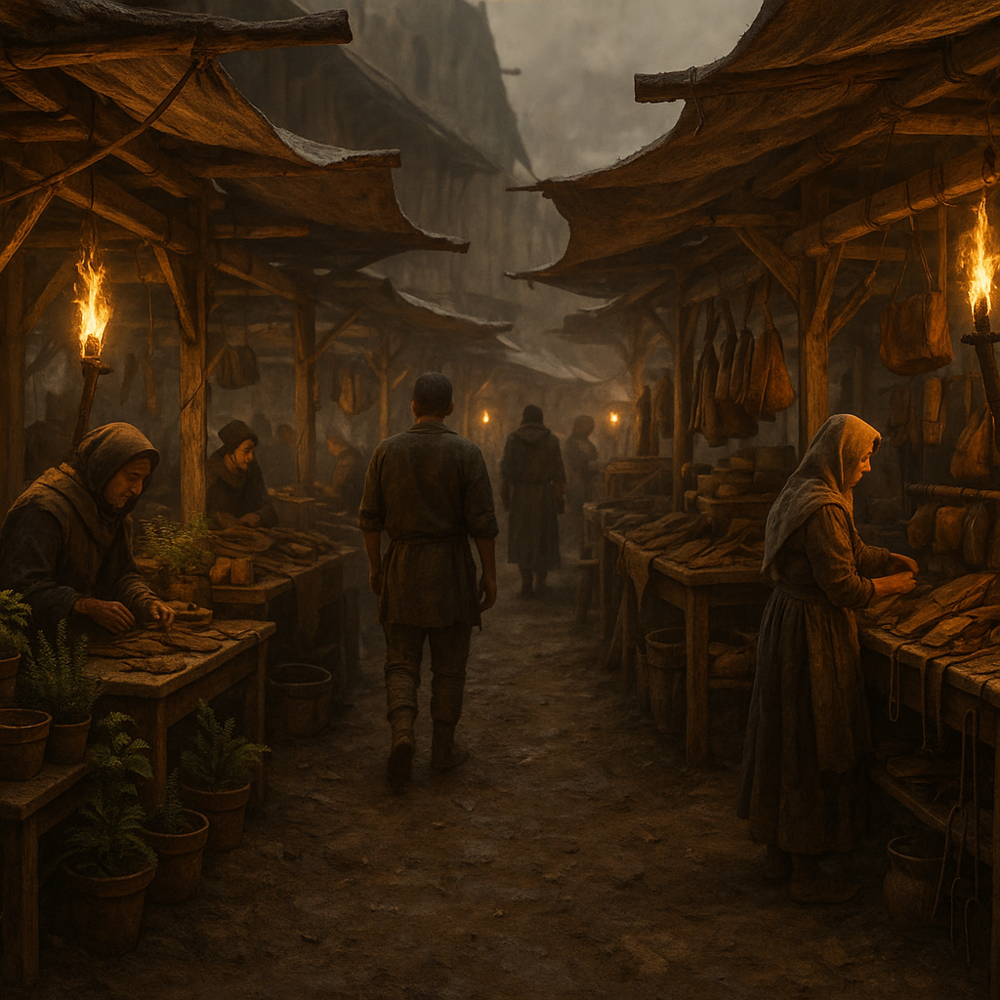

# Low-Tech-Basar

Basar der [Retros](../../Kanon/glossar.md#retros): Low-Tech-Werkzeuge, mechanische Teile, Saatgut, Handwerk – bewusst **keine** Elektronik, keine Funkgeräte, keine [Stack](../../Kanon/glossar.md#der-stack)-nahe Tech. Wer hier handelt, unterstützt die Rückwärts-Idee: Eine Zukunft ohne die Fehler der alten Technik.

## Lage

Oft am Rand von Siedlungen oder an Orten, die die [Retros](../../Kanon/glossar.md#retros) kontrollieren oder tolerieren; bewusst abseits großer Handelsknoten mit hoher Tech-Dichte. Erkennbar an der Abwesenheit von Generatoren, Antennen und modernen Geräten.

## Zuordnung

- **Betreiber / dominant:** [Retros](../../Kanon/glossar.md#retros) ([Orden](../../Kanon/glossar.md#orden))

## Schwerpunkt / Was es gibt

- **Werkzeuge:** Mechanische Werkzeuge, Handwerkszeug, Schmiedeware, Seile, Leder
- **Saatgut & Biologisches:** Samen, Nutzpflanzen, traditionelle Heilmittel ohne industrielle Basis
- **Agrikultur-Wissen:** Fruchtfolgepläne, Bodenpflege, Trocknung, Einlagerung und Saatgutselektion
- **Dienstleistungen:** Handwerk ohne Strom, Reparatur von mechanischen Dingen
- **Keine:** Elektronik, Funk, Energiezellen, alles was den [Stack](../../Kanon/glossar.md#der-stack) oder Zentralisierung fördert

## Wer sich aufhält

- **Dominant:** [Retros](../../Kanon/glossar.md#retros), Handwerker und Händler mit Low-Tech-Ausrichtung
- **Regelmäßig:** Überlebende, die bewusst ohne Tech leben wollen oder müssen
- **Selten:** Neugierige aus anderen Fraktionen; [Steampunks](../../Kanon/glossar.md#steampunks) und [Maker](../../Kanon/glossar.md#maker) werden misstrauisch beäugt

## Typische Gefahren

- [Retros](../../Kanon/glossar.md#retros) dulden keine Tech-Propaganda; wer mit Funk oder moderner Ware prahlt, fliegt raus oder schlimmer
- Der Basar wird von anderen Fraktionen teils als „rückständig“ belächelt – Konflikte mit [Maker](../../Kanon/glossar.md#maker) oder [Zeros](../../Kanon/glossar.md#zeros) möglich
- Kein militärischer Schutz wie bei Zero-Posten; Überfälle möglich

## Besonderheiten vor Ort

- Konsequente Tech-Abstinenz: keine Elektronik, keine Funkgeräte, keine [Stack](../../Kanon/glossar.md#der-stack)-nahe Infrastruktur.
- Handel folgt der Retro-Idee einer dezentralen, mechanischen Zukunft.
- Sichtbare Marker sind Handwerk, Saatgut und analoge Reparaturkultur.

→ Übersicht: [Handelsposten](../../Kanon/glossar.md#handelsposten)
