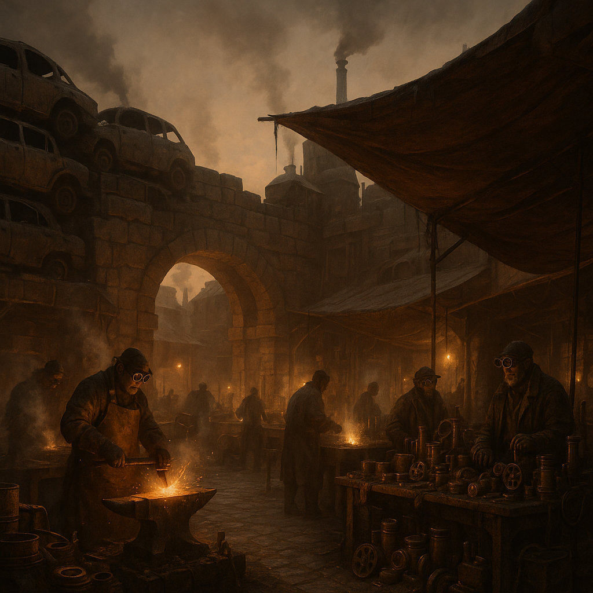

# Messingmarkt 9

Ein großer, stark befestigter Trader-Posten auf alter Ringstraße – Schmiede, Auktionshof, Teilelager und abgeschirmter „Stillraum“ für heikle Verhandlungen. Der Messingmarkt 9 ist das Rückgrat des Steampunk-Handels.

## Lage

Auf alter Ringstraße, in einem Abschnitt, der noch befahrbar und von mehreren Zufahrten erreichbar ist. Die Befestigung wirkt wie eine Mini-Festung: Mauern, Wachen, kontrollierte Tore.

## Zuordnung

- **Betreiber / dominant:** [Steampunks](../../Kanon/glossar.md#steampunks) ([Maker](../../Kanon/glossar.md#maker))

## Schwerpunkt / Was es gibt

- **Werkzeuge:** Hochwertige Werkzeugkits, Präzisionsteile für Funktechnik und Handwerk
- **Dienstleistungen:** Schmiedearbeiten, Auktionen, Teilelagerung, Vermittlung von Karawanen
- **Daten:** Zugang zu exklusiven Karawanenrouten (teuer, oft gegen [Killcoins](../../Kanon/glossar.md#killcoin) oder langfristige Schulden)
- **Schwarzmärkte:** Verbotene Teile, gesperrte Module, unverarbeitete Alt-Hardware
- **[Killcoin](../../Kanon/glossar.md#killcoin)-Hüllen:** Leere, wertlose Hullen und Schutzfassungen für Coins (Sammler, Tausch, Tarnung)
- Essen und Trinkwasser in begrenztem Umfang; kein Schwerpunkt

## Wer sich aufhält

- **Dominant:** Steampunk-Trader, Werkstattleiter, Auktionatoren
- **Regelmäßig:** [Geocacher](../../Kanon/glossar.md#geocacher), Furry-Bot-Geleite der [Hardliner](../../Kanon/glossar.md#hardliner)
- **Selten sichtbar, aber einflussreich:** Zero-Broker und Kreditschreiber

## Typische Gefahren

- Schuldenfalle über [Killcoin](../../Kanon/glossar.md#killcoin)-Vorschüsse und Vorschussgeschäfte
- Verdeckte Bieterkriege zwischen Trader-Zirkeln
- Gezielte Falschinformationen über angebliche „sichere“ Routen

## Besonderheiten vor Ort

- Abgeschirmter „Stillraum“ für heikle Verhandlungen.
- Auktionshof und Teilelager als zentrale Infrastruktur des Postens.
- Stark kontrollierte Tore mit Festungscharakter.

→ Übersicht: [Handelsposten](../../Kanon/glossar.md#handelsposten)
