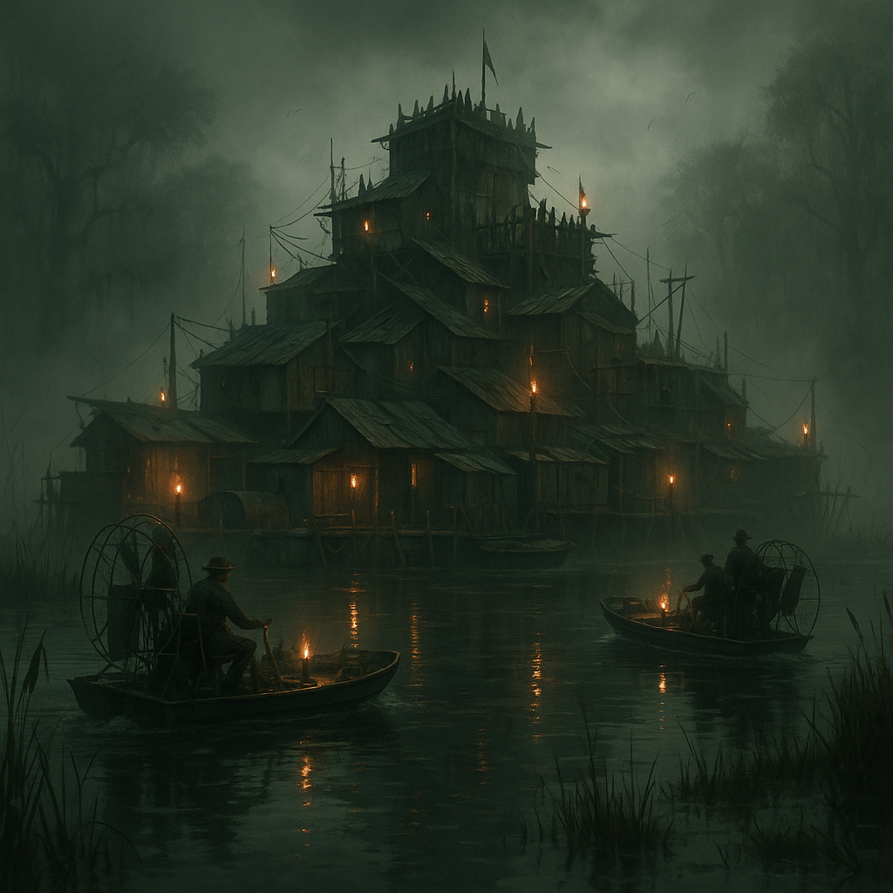

# Sumpf-Festung

Ehemals "Splitterhafen". Ein aus Schrott, alten Booten und Containern zusammengeschweißtes Fort mitten in einem verseuchten Sumpfgebiet. Hier herrschen die [Hillbillys](../../Kanon/glossar.md#hillbillys). Es stinkt nach Moder, Moonshine und gebratenem Ungeziefer.

## Lage

Tief in einem Sumpfgebiet, nur über wackelige Stege oder mit flachen Booten erreichbar. Die Festung selbst schwimmt teilweise auf Pontons. Nebel und Gase schützen vor neugierigen Blicken (und [Satelliten](../../Kanon/glossar.md#satelliten)).

## Zuordnung

- **Dominant / prägend:** [Hillbillys](../../Kanon/glossar.md#hillbillys) ([Roamer](../../Kanon/glossar.md#roamer))

## Schwerpunkt / Was es gibt

- **Moonshine:** Der beste (und giftigste) Selbstgebrannte der [Wasteland](../../Kanon/glossar.md#wasteland). Währung und Medizin zugleich.
- **Nahrung:** "Sumpf-Hühnchen" (Ratten/Echsen), Pilze, Algenpaste.
- **Schrott-Tech:** Improvisierte Waffen, Fallen, Sumpfboot-Teile.
- **Informationen:** Die [Hillbillys](../../Kanon/glossar.md#hillbillys) wissen alles, was im Sumpf passiert – und wer dort verschwindet.

## Wer sich aufhält

- **Dominant:** Hillbilly-Clans, Sumpf-Bewohner, Outcasts
- **Mutige:** Händler, die den Moonshine exportieren wollen
- **Verirrte:** [Geocacher](../../Kanon/glossar.md#geocacher), die Koordinaten im Sumpf suchen (und oft bleiben)

## Typische Gefahren

- **Die Umgebung:** Treibsand, mutierte Alligatoren, giftige Gase.
- **Die Bewohner:** [Hillbillys](../../Kanon/glossar.md#hillbillys) sind misstrauisch und schießwütig. Wer den "Familiencode" nicht kennt, lebt gefährlich.
- **Der Moonshine:** Kann blind machen oder explodieren.

## Besonderheiten vor Ort

- Fort aus Schrott, Booten und Containern; teils auf Pontons gebaut.
- Dichte aus Nebel und Sumpfgasen wirkt als natürlicher Sichtschutz.
- Moonshine fungiert zugleich als Ware, Medizin und lokale Währung.

→ Übersicht: [Handelsposten](../../Kanon/glossar.md#handelsposten)
