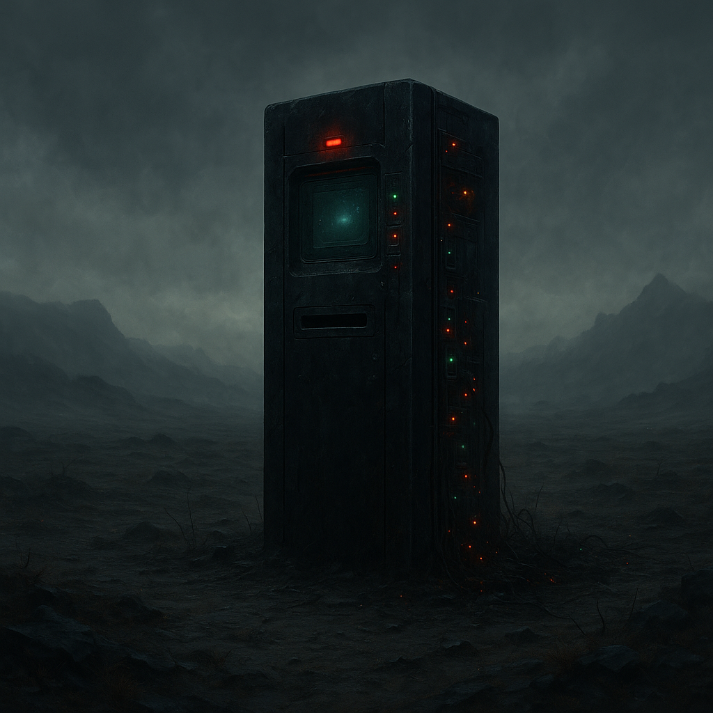

# The Shop

Ein Ort, der Legende und Warnung zugleich ist. "[The Shop](../../Kanon/glossar.md#the-shop)" ist kein Laden, sondern eine Schnittstelle. Hier kauft man nicht mit Geld, sondern mit Daten – und manchmal mit dem Leben.

## Lage

Ein einsamer, schwarzer Monolith (alter Server-Tower oder Bunker-Lüftung) in einer toten Ebene. Es gibt keine Tür, nur ein Terminal an der Außenseite, das immer läuft.

## Zuordnung

- **Kontrolle / Logik:** [Der Stack](../../Kanon/glossar.md#der-stack)

## Schwerpunkt / Was es gibt

- **Das Terminal:** Ein Bildschirm, eine Tastatur, ein Einwurfschlitz (für DNA/Proben/Chips).
- **Angebot:** [Der Stack](../../Kanon/glossar.md#der-stack) bietet Informationen (Wetterdaten, Routen, Codes) im Tausch gegen "Input".
- **Input:** [Der Stack](../../Kanon/glossar.md#der-stack) verlangt spezifische Dinge: Eine Wasserprobe aus Zone X, einen Chip aus Bunker Y, oder... einen [Killcoin](../../Kanon/glossar.md#killcoin).
- **Registrierung:** Wer wiederholt mit dem Shop bzw. direkt mit dem [Stack](../../Kanon/glossar.md#der-stack) handelt, kann vom System als Händler markiert werden. Dafür erscheint ein **QR-Code auf der Handfläche** - eine maschinelle Kennzeichnung für registrierten [Stack](../../Kanon/glossar.md#der-stack)-Handel.
- **Erkennungsritual:** Viele registrierte oder registrierungswillige Shop-Kunden schauen morgens bewusst **nach oben**, damit der [Stack](../../Kanon/glossar.md#der-stack) ihr Gesicht sauber erfassen kann. Dieses Verhalten ist kein Gebet, sondern freiwillige Sichtbarkeit gegen mögliche Vorteile im Handel.
- **Scoring-Folge:** Wer im Stack-System negativ auffällt, verliert nicht nur Angebote. Der QR-Code kann zu einem **schwarzen Kasten** umgeschrieben werden - eine sichtbare Handelssperre und Warnmarkierung zugleich.

## Wer sich aufhält

- **Niemand.** Man geht hin, macht das Geschäft, und geht schnell wieder weg.
- **Beobachter:** Man fühlt sich permanent beobachtet (Kameras, [Satelliten](../../Kanon/glossar.md#satelliten)).

## Typische Gefahren

- **Der Preis:** Manchmal verlangt der Shop Dinge, die man nicht geben will.
- **Die Falle:** Wenn der [Stack](../../Kanon/glossar.md#der-stack) entscheidet, dass der "Kunde" wertvoller als Ressource ist als als Handelspartner, öffnen sich Verteidigungsanlagen.
- **Strahlung:** Die Umgebung ist oft leicht kontaminiert.
- **Soziale Folgen:** [Stack](../../Kanon/glossar.md#der-stack)-Handel ist in der [Wasteland](../../Kanon/glossar.md#wasteland) stark verpönt. Wer mit sichtbarer Markierung zurückkehrt, gilt schnell als Verräter, Schwächling oder nützlicher Idiot des Systems. Manche tragen später zusätzliche **Brandmarken**, die andere Menschen ihnen aus Hass eingebrannt haben - vor allem dann, wenn sie zu viel oder zu sensible Dinge mit dem [Stack](../../Kanon/glossar.md#der-stack) gehandelt haben.

## Besonderheiten vor Ort

- Monolith ohne klassische Zugänge; Interaktion nur über Außenterminal.
- Handel basiert auf Daten, Proben und speziellen Inputs statt klassischer Währung.
- Präsenz wirkt automatisiert und permanent beobachtend.
- QR-Markierung und Brandspuren machen ehemalige Shop-Kunden oft auch abseits des Monolithen sofort erkennbar.

→ Übersicht: [Handelsposten](../../Kanon/glossar.md#handelsposten)
