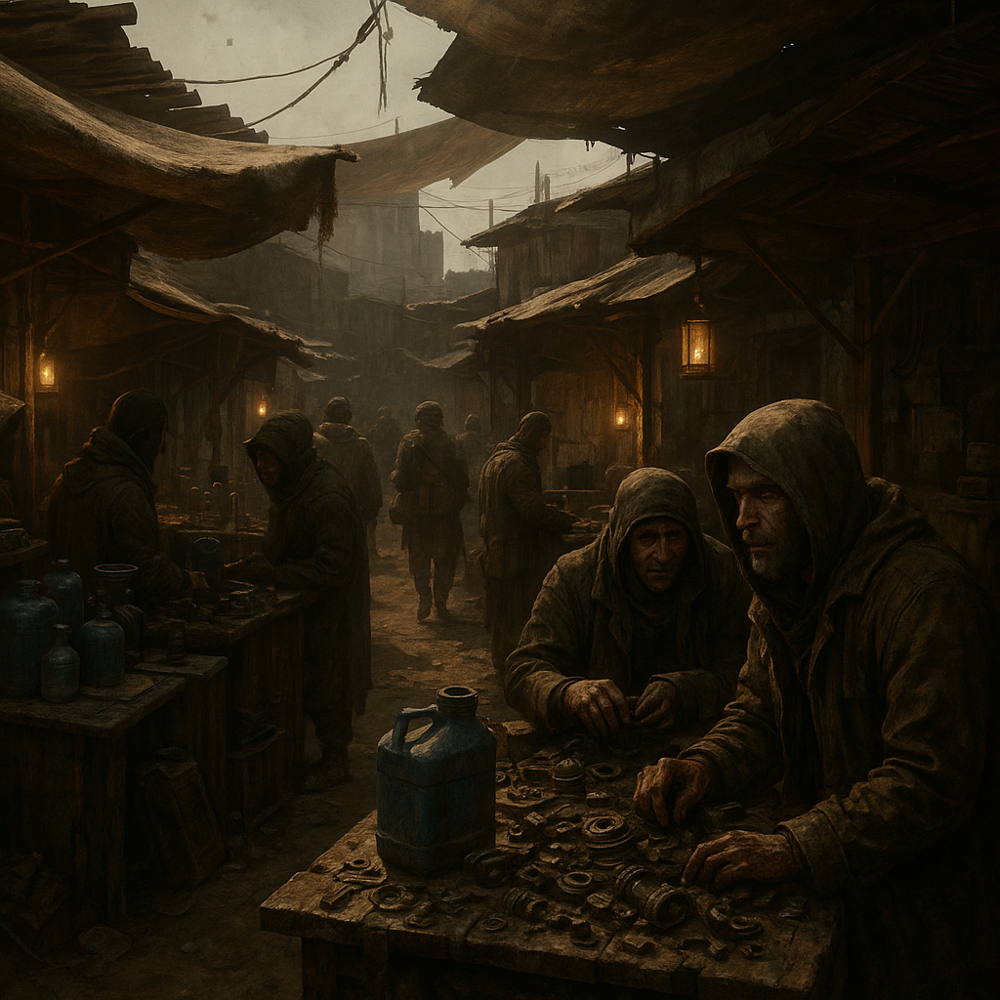

# Handelsposten

Jede Fraktion und Unterfraktion hat mindestens einen Knotenpunkt.

Typische kleine Deals laufen fast überall ähnlich: gefundene oder gebundene Sachen gegen **[Scrip](../../Kanon/glossar.md#scrip)**, Nahrung, Information, kleine Reparaturen oder die Behandlung von Wunden. Nicht jeder Besuch führt zu einem großen Auftrag; oft geht es einfach darum, etwas Brauchbares in etwas unmittelbar Überlebensrelevantes zu verwandeln.

Details in den verlinkten Einträgen.

| [Handelsposten](../../Kanon/glossar.md#handelsposten)                             | Fraktion / Unterfraktion                                                  | Schwerpunkt                                                      |
|-------------------------------------------|---------------------------------------------------------------------------|------------------------------------------------------------------|
| [Messingmarkt 9](Messingmarkt-9.md)       | [Steampunks](../../Kanon/glossar.md#steampunks) ([Maker](../../Kanon/glossar.md#maker))                   | Werkzeuge, Präzisionsteile, Schmiede, Karawanenrouten            |
| [Chaos-Kapelle](Chaos-Kapelle.md)         | [Magier](../../Kanon/glossar.md#magier) ([Maker](../../Kanon/glossar.md#maker)) (auch „Schrauberkapelle“) | Tech-Rituale, Spoofer/Relay, Reparatur Alt-Hardware              |
| [Doomsday Fanshop](Doomsday-Fanshop.md)   | [Doomsday Dispatcher](../../Kanon/glossar.md#doomsday-dispatcher) ([Maker](../../Kanon/glossar.md#maker)) | Sendezeit, Merch, Empfänger-Reparatur, Fan-Kult                  |
| [Glaspforte](Glaspforte.md)               | [Zeros](../../Kanon/glossar.md#zeros) (auch [Zero Percentler](../../Kanon/glossar.md#zero-percentler))              | Premium-Ware, Medizin, Reinwasser, Zero-Lizenzen, Daten          |
| [Pilgerrast](Pilgerrast.md)               | [Der Orden](../../Kanon/glossar.md#der-orden) ([Orden](../../Kanon/glossar.md#orden))              | Pilgerverpflegung, Archivzugang, Deutung, Schutz für Reisende    |
| [Nullpunkt](Nullpunkt.md)                 | [Looper](../../Kanon/glossar.md#looper) ([Orden](../../Kanon/glossar.md#orden))                           | Rast für [Looper](../../Kanon/glossar.md#looper)-Boten, Freigabe-Infos, Archiv, kein Handel       |
| [Low-Tech-Basar](Low-Tech-Basar.md)       | [Retros](../../Kanon/glossar.md#retros) ([Orden](../../Kanon/glossar.md#orden))                           | Low-Tech-Werkzeuge, Saatgut, Handwerk, keine Elektronik          |
| [Kaliber 50](Kaliber-50.md)               | [Hardliner](../../Kanon/glossar.md#hardliner) ([Roamer](../../Kanon/glossar.md#roamer))                   | Bar, Söldner-Treff, Waffen/Munition, Geleitschutz                |
| [Sumpf-Festung](Sumpf-Festung.md)         | [Hillbillys](../../Kanon/glossar.md#hillbillys) ([Roamer](../../Kanon/glossar.md#roamer))                 | Moonshine, Sumpf-Nahrung, Schrott, Geheimversteck                |
| [Koordinaten-Kreuz](Koordinaten-Kreuz.md) | [Geocacher](../../Kanon/glossar.md#geocacher) ([Roamer](../../Kanon/glossar.md#roamer))                   | Karten, Cache-Logs, [Killcoin](../../Kanon/glossar.md#killcoin)-Umtausch, Teufelsberg-Ruine         |
| [The Shop](../../Kanon/glossar.md#the-shop)                   | [Der Stack](../../Kanon/glossar.md#der-stack)                              | [Stack](../../Kanon/glossar.md#der-stack)-Schnittstelle: Daten gegen Ware, unheimlich, automatisiert |
