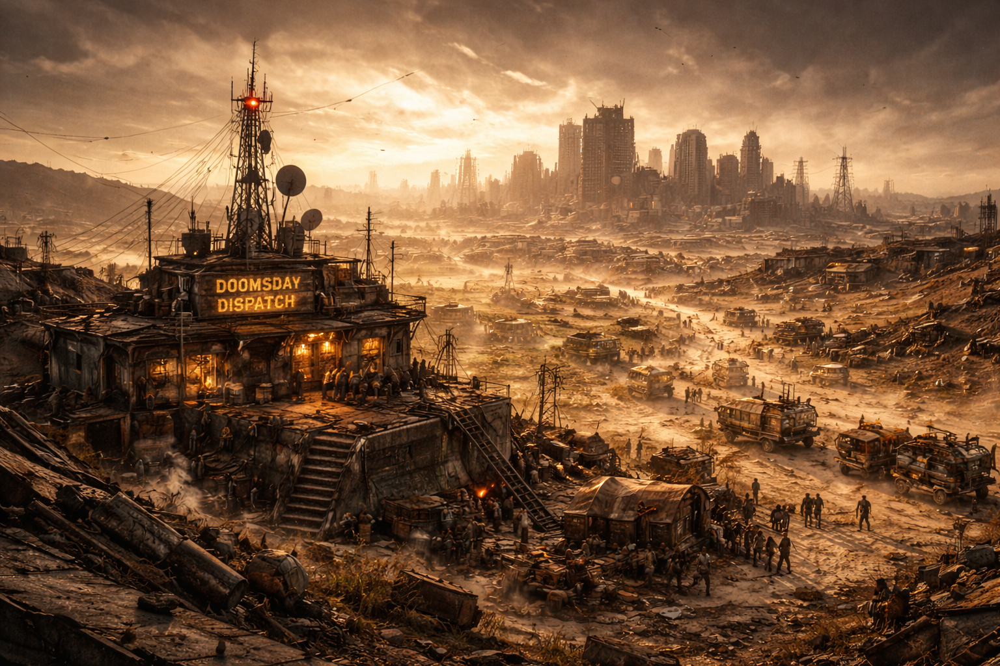

# Doomsday Radiosender

## Überblick

Der **Doomsday Radiosender** ist der physische Kern von [Doomsday Radio](../../Kanon/glossar.md#doomsday-radio): kein sauberer Sendeturm, sondern ein widerstandsfähig zusammengeflickter Funk- und Produktionsknoten. Von hier aus hält die Crew ein Signal am Leben, das Warnung, Unterhaltung, Gerücht, Kultur und Koordination zugleich ist.

## Der erste Sender

Der heutige Knoten ist ein Nachfolger. Der ursprüngliche Sender von [Viktor Weiß](../../Charaktere/Viktor-Weiss.md) wurde im Juni 2066 während Viktors letzter Sendung zerstört. Gebäude, Haupttechnik und das anwesende Gründungsteam verschwanden in einem Krater.

Viktor hatte den Standort als Maker-Pionier von einer Werkstatt mit Einzelantenne zu einem kleinen, unabhängigen Relaisnetz ausgebaut. Die verbreitetste historische Lesart lautet, dass der [Stack](../../Kanon/glossar.md#der-stack) diese wachsende Gegeninfrastruktur schließlich als Bedrohung behandelte und den Standort löschte. Ob es ein direkter orbitaler Eingriff, eine ausgelöste Bodenreaktion oder eine bereits instabile Infrastrukturkaskade war, lässt sich nicht mehr beweisen.

Geborgen wurden nur Teile der Archive, beschädigte Relais und Fragmente der Sendetechnik. Aus diesen Resten entstand später der heutige, verteilte Sender. Deshalb ist Doomsday Radio zugleich ein Ort und eine Rekonstruktion: Der Name und das Signal behaupten Kontinuität, obwohl der Gründungsort nur noch als abgesperrter Krater existiert.

## Standort & Infrastruktur

Der heutige Sendekern liegt nahe einer Steampunk-Hochburg, aber nicht offen im Zentrum. Das schützt ihn vor direkter Sichtbarkeit und hält dennoch die technische Nähe zu Werkstattnetz, Ersatzteilen und improvisierter Energieversorgung. Der ursprüngliche Krater liegt an einem anderen, nur noch aus alten Karten und Relaispeilungen rekonstruierbaren Standort.

Wichtig für den Betrieb ist die verteilte Struktur:

- modulare Technikinseln statt eines einzigen Hauptturms
- redundante Energie aus Generatoren, Batteriebänken und improvisierten Einspeisern
- verteilte Signal- und Produktionspunkte, damit ein einzelner Treffer nicht den ganzen Sender löscht

## Reichweite & Empfang

Im Jahr `2222` ist [Doomsday Radio](../../Kanon/glossar.md#doomsday-radio) **kein flächendeckender Sender**. Das Programm erreicht nur einen begrenzten, unregelmäßigen Raum von grob **300 bis 500 Kilometern** um den Sendekern.

Diese Reichweite ist kein sauberer Kreis:

- Höhenlagen, freie Korridore und brauchbare Alttechnik verbessern den Empfang
- Wetter, Zonenstörung, beschädigte Relais und bewusste Abschirmung reißen Löcher ins Signal
- manche Handelsachsen hören den Sender tagelang sauber, andere nur in kurzen Fenstern oder als verzerrtes Gerücht im Rauschen

Jenseits dieses Kernraums ist der Sender oft nur sporadisch oder gar nicht zu empfangen. Mit zusätzlichen Relais, geborgener Technik oder politischen Deals kann sich das Sendegebiet später erweitern.

## Wer den Sender am Leben hält

- [Maker](../../Kanon/glossar.md#maker): Hardware, Ersatzteile und Reparaturpraxis
- unabhängige Hackerzellen: Relay-Patches, Frequenzsprünge und Notfallrouting
- die Kerncrew um [Mad Dog](../../Charaktere/Mad-Dog.md), [Rasti](../../Charaktere/Rasti.md) und das Nachhallen von [Viktor Weiß](../../Charaktere/Viktor-Weiss.md)
- Bot-Module und Programmschienen aus [../../Radio/programm.md](../../Radio/programm.md) und [../../Radio/Bots/index.md](../../Radio/Bots/index.md)

## Warum der Stack den Sender nicht einfach löscht

Der Schutzstatus des Senders gilt im Feld als **Operation Human Shield**. Gemeint ist kein absoluter Frieden, sondern eine systemische Bremse: sichtbare [Human-in-the-Loop](../../Kanon/glossar.md#human-in-the-loop-prinzip)-Nähe und menschliche Präsenz am Standort machen die direkte Vernichtung riskant.

Für den [Stack](../../Kanon/glossar.md#der-stack) ist der Sender außerdem nicht nur Störquelle, sondern auch nützlich:

- Warnungen und Gerüchte stabilisieren Verhalten in der Fläche
- kontrollierte Information ist oft billiger als direkter Eingriff
- ein hörbarer Menschenkanal bündelt Risiken, statt sie unsichtbar zu verteilen

Dieser Schutz ist nicht dauerhaft. Wenn der Sender zu zentral, zu gefährlich oder zu systemrelevant wird, kann sich die Eingriffslage jederzeit ändern.

## Permanente Bedrohungen

- Funkpeilung durch Rivalen, Söldner oder Zero-nahe Broker
- Infiltration über Sponsoring, gekaufte Slots und gezielte Falschmeldungen
- technischer Verschleiß, Treibstoffmangel und Ersatzteilknappheit
- Überblendung und psychologischer Druck durch [STACKCAST](../../Kanon/glossar.md#stackcast)

## Kontext

- Radiostations-Hub: [../../Radio/index.md](../../Radio/index.md)
- Dispatcher: [../../Charaktere/index.md](../../Charaktere/index.md) und [../../Gruppen/Maker/doomsday-dispatcher.md](../../Gruppen/Maker/doomsday-dispatcher.md)
- Programmlogik: [../../Radio/programm.md](../../Radio/programm.md)
