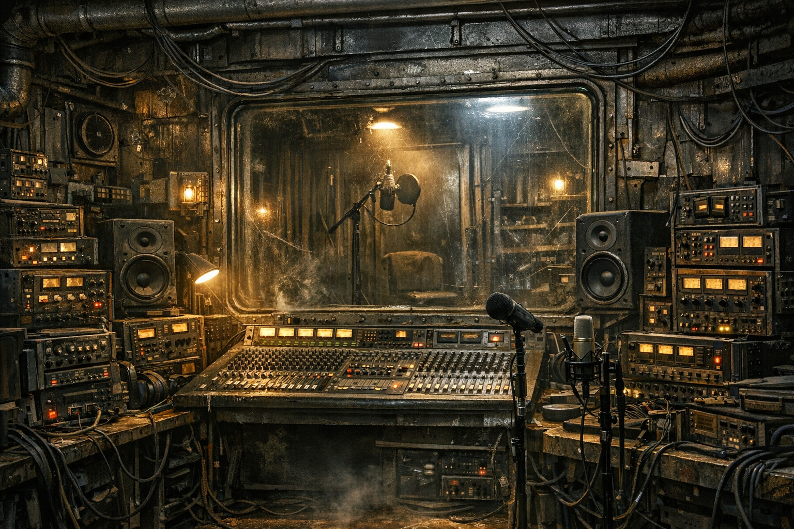

# Stranded Stranglers

## Überblick

**[Stranded Stranglers](../../Kanon/glossar.md#stranded-stranglers)** ist die Musikplattform, das Label und der Studioverbund für Künstler in der Welt von [Doomsday Radio](../../Kanon/glossar.md#doomsday-radio). Das Ganze ist **maker-gehostet**, technisch eng mit dem Sender verzahnt und wird von **[Doomsday Radio](../../Kanon/glossar.md#doomsday-radio) gesponsert**. Gleichzeitig ist [Stranded Stranglers](../../Kanon/glossar.md#stranded-stranglers) faktisch das einzige Musiklabel und der einzige Studioverbund in Doomsday: kein bloßer Senderkanal, sondern ein eigener Musikdienst mit Katalog, Live-Geschäft und Produktionsraum für alles, was im [Wasteland](../../Kanon/glossar.md#wasteland) laut genug werden will.

Hier landen nicht nur Endzeit-Bands, sondern praktisch alle Künstler, die zwischen Ruinen, Generatoren und Schießständen noch Musik machen. Wer Songs veröffentlicht, Live-Mitschnitte verkauft oder im Äther landen will, landet früher oder später bei [Stranded Stranglers](../../Kanon/glossar.md#stranded-stranglers).

## Rolle im Sendergefüge

[Stranded Stranglers](../../Kanon/glossar.md#stranded-stranglers) liefert die musikalische Basis, auf der [Doomsday Radio](../../Kanon/glossar.md#doomsday-radio) arbeitet:

- wiederverwendbare Songs statt täglicher Komplett-Neuproduktion
- Künstlerprofile, Live-Mitschnitte und Label-Rotation für den Sender
- technische Schnittstellen für [Echo-1](../../Radio/Bots/Echo-1.md), der Auswahl, Mixing, Anmoderation und Einordnung übernimmt
- Ticket-Promos und Eventblöcke für Shows im [Wasteland](../../Kanon/glossar.md#wasteland)

Die Trennung ist wichtig:

- **Programm, Moderationen und viele Redeanteile** werden jeden Tag neu generiert.
- **Songs** bleiben im Katalog, rotieren weiter und können immer wieder eingesetzt werden.
- **Alle Songs im Sender** kommen aus diesem Katalog. Selbst Altweltfunde oder Sonderfassungen laufen erst dann on air, wenn [Stranded Stranglers](../../Kanon/glossar.md#stranded-stranglers) sie restauriert, archiviert oder als eigenen Katalogeintrag freigegeben hat.

## Label, Studio und Dienst

[Stranded Stranglers](../../Kanon/glossar.md#stranded-stranglers) ist kein sauberer Streamingdienst aus der alten Welt, sondern ein improvisiertes [Wasteland](../../Kanon/glossar.md#wasteland)-System mit mehreren Funktionen gleichzeitig:

- **Label:** vergibt Sichtbarkeit, bündelt Künstler und markiert offizielle Releases
- **Studio:** bietet Aufnahmeräume, Generatorzeit, Mikrofoninseln, Mastering unter Schrottbedingungen
- **Plattform:** hält den Katalog, die Mitschnitte und die Sender-Zugänge zusammen
- **Dienst:** verwaltet Buchungen, Tauschdeals, Ticketing und Reichweitenfenster

Der Kern gilt als maker-gehostet, weil Technik, Archivierung und Distribution aus Werkstattstrukturen der [Maker](../../Kanon/glossar.md#maker) stammen. Gerade deshalb ist die Plattform robust genug, um auch bei halbem Netzausfall noch Musik auszuliefern.

## Live-Geschäft

[Stranded Stranglers](../../Kanon/glossar.md#stranded-stranglers) verkauft nicht nur Songs, sondern auch Abende, an denen Menschen so tun können, als gäbe es noch Zukunft. Besonders wichtig sind zwei Orte:

- [Kaliber 50](../Handelsposten/Kaliber-50.md): enge, harte Clubnacht für Söldner, [Hardliner](../../Kanon/glossar.md#hardliner) und alle, die Bass nur akzeptieren, wenn er weh tut
- [Ödlandarena](../Zonen/Oedlandarena.md): große [Wasteland](../../Kanon/glossar.md#wasteland)-Shows vor Rennen und Sonderläufen, oft mit [Magier](../../Kanon/glossar.md#magier)-Pyro und Staubfeuer

Dafür schaltet [Stranded Stranglers](../../Kanon/glossar.md#stranded-stranglers) regelmäßig Radio-Werbung für Konzerttickets. Diese Spots laufen aggressiv, kurz und mit dem klaren Versprechen, dass man für ein paar **Z-Bucks** wenigstens stilvoll untergehen kann.

## Verhältnis zu Doomsday Radio

[Doomsday Radio](../../Kanon/glossar.md#doomsday-radio) finanziert Reichweite, Sponsorfenster und Teile der Infrastruktur. Diese Senderfenster werden im Alltag über [Scrip](../../Kanon/glossar.md#scrip) bzw. **Z-Bucks** abgewickelt. [Stranded Stranglers](../../Kanon/glossar.md#stranded-stranglers) liefert dafür Kultur, Katalogtiefe und Live-Stoff. Die Partnerschaft ist eng, aber nicht identisch:

- **[Doomsday Radio](../../Kanon/glossar.md#doomsday-radio)** braucht Musik, Ticket-Spots und wiedererkennbare Künstler
- **[Stranded Stranglers](../../Kanon/glossar.md#stranded-stranglers)** braucht Reichweite, Sponsoring und eine Frequenz, die die [Wasteland](../../Kanon/glossar.md#wasteland) wirklich hört

Wenn es Streit gibt, erinnert [Stranded Stranglers](../../Kanon/glossar.md#stranded-stranglers) den Sender gern daran, dass Sponsoring nicht Besitz bedeutet. Und der Sender erinnert zurück, wer die Lautsprecher betreibt.

## Wirkung in der Wasteland

- **[Roamer](../../Kanon/glossar.md#roamer):** kaufen Tickets, wenn der Abend laut, kurz und gefährlich klingt
- **[Maker](../../Kanon/glossar.md#maker):** sehen die Plattform als seltenen Beweis, dass Kultur unter Schrottbedingungen skalieren kann
- **[Orden](../../Kanon/glossar.md#orden):** misstrauen der Lautstärke, akzeptieren aber den sozialen Kitt
- **[Zeros](../../Kanon/glossar.md#zeros):** beobachten Verkäufe, Trends und Eventdichte als Markt- und Unruheindikator
- **Künstler:** betrachten eine Rotation bei [Stranded Stranglers](../../Kanon/glossar.md#stranded-stranglers) als schnellsten Weg zu echtem Kultstatus
