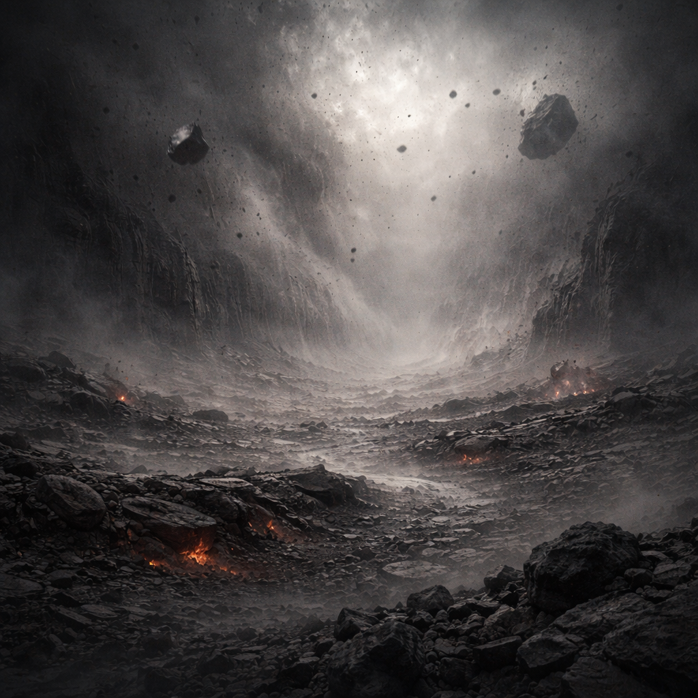

# Aschepuls

Periodisch „atmende“ Aschefelder, in denen der Staub pulsierend wabert und schwebt. Nur vereinzelt glimmt irgendwo ein kleines Lavafeuer durch, die Sicht ist schlecht und der Horizont verschluckt alles. [Der Orden](../../Kanon/glossar.md#der-orden) deutet den Rhythmus als Zeichen des Stacks; [Roamer](../../Kanon/glossar.md#roamer) halten es für einen mechanischen Herzschlag der alten Welt, und die [Magier](../../Kanon/glossar.md#magier) nennen es den Feuerschlund, an dem sie ihre Flammenrituale schärfen.

## Aufenthalt

- [Orden](../../Kanon/glossar.md#orden)-Pilger bei Pulsnacht
- [Roamer](../../Kanon/glossar.md#roamer)-Scouts mit Atemfiltern
- [Maker](../../Kanon/glossar.md#maker) für Hitzesensorik
- [Magier](../../Kanon/glossar.md#magier) (Feuerschulen) auf Ritualpfad

## Gefahren

- Bodeneinbrüche in Glutkammern
- Atemstillstände durch Aschewolken
- plötzliche Hitzeausbrüche

## Zu holen

- hitzefeste Bleche
- Ruß-Filtermedien
- Keramikreste aus Schmelzkammern
- [Strahlenlilie](../../Assets/Pflanzen/Strahlenlilie.md) in kurzen Erntefenstern (nur mit Schutz)

→ Zurück: [Zonen](index.md)
