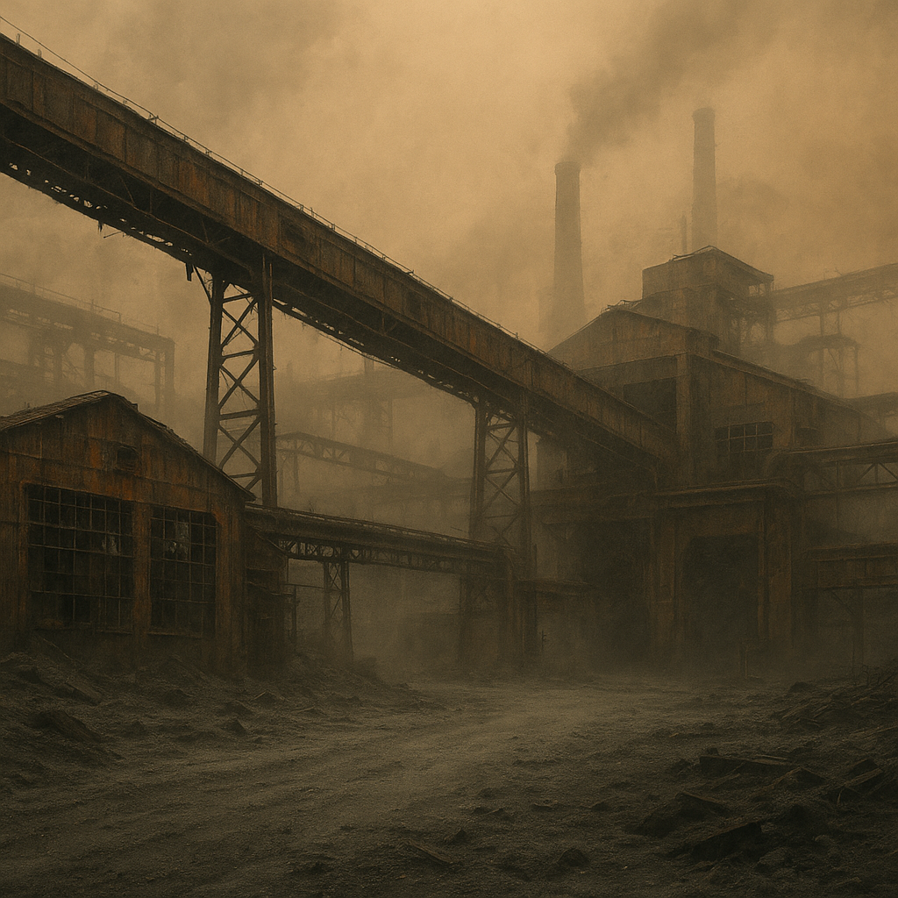

# Aschering

Ein ehemaliger Industriebezirk, in dem Metallstaub und Asche wie Wetter funktionieren. Die Sicht ist schlecht, die Luft schmeckt nach Batterie.
[Zeros](../../Kanon/glossar.md#zeros) haben hier früh die letzten Motorwicklungen aufgekauft und die Routen mit [Killcoin](../../Kanon/glossar.md#killcoin)-Aufträgen gesichert. Gerüchte sagen, der [Stack](../../Kanon/glossar.md#der-stack) habe die Staubstürme „stabilisiert“, um unkontrollierte Bergung zu verhindern.

## Aufenthalt

- [Geocacher](../../Kanon/glossar.md#geocacher) in kleinen Trupps
- Trader-Bergungsteams mit Filtertechnik
- Furry-Bot-Eskorten bei großen Aufträgen

## Gefahren

- Staubstürme mit Schwermetallpartikeln
- Einsturzgefährdete Hallen
- Sensorfallen in alten Werkstoren

## Zu holen

- robuste Maschinenteile
- Kugellager, Spindeln, Motorwicklungen
- gut versteckte Cachepunkte in Förderkanälen
- [Brennnessel](../../Assets/Pflanzen/Brennnessel.md) und [Moose/Flechten](../../Assets/Pflanzen/Moose-und-Flechten.md) an Schacht- und Hallenrändern

→ Zurück: [Zonen](index.md)
