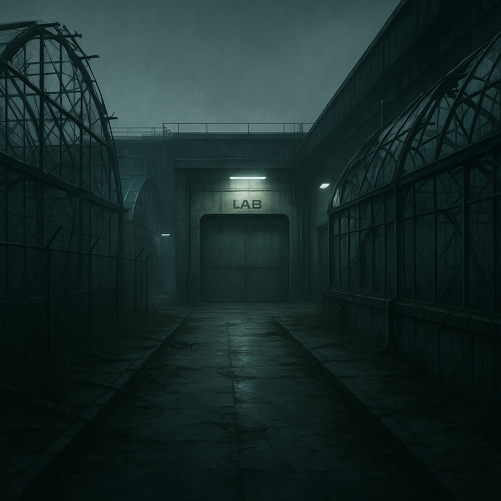

# Bleigarten

Ehemaliger Forschungspark mit versiegelten Gebäuden, zerbrochenen Gewächshäusern und einem Labyrinth aus Servicegängen.
Der Bleigarten gilt als einer der Orte, an denen das [Human-in-the-Loop-Prinzip](../../Kanon/glossar.md#human-in-the-loop-prinzip) physisch „verankert“ war – alte Konsolen, die angeblich noch immer Bestätigungen verlangen. [Looper](../../Kanon/glossar.md#looper) suchen hier nach Interface-Relikten, während [Zeros](../../Kanon/glossar.md#zeros) die Zugänge mit stillem [Stack](../../Kanon/glossar.md#der-stack)-Schutz vermuten.

## Aufenthalt

- [Geocacher](../../Kanon/glossar.md#geocacher)-Elite auf Datensuche
- [Human-in-the-Loop](../../Kanon/glossar.md#human-in-the-loop-prinzip)-nahe Vermittler (selten und verdeckt)
- [Stack](../../Kanon/glossar.md#der-stack)-nahe Beobachtung vermutet

## Gefahren

- alte Zutrittsprotokolle mit Lockdown-Funktion
- kontaminierte Klimaanlagen-Schächte
- stille Zonen ohne Funkempfang

## Zu holen

- Laborcontainer mit Spezialchemie
- Datenspeicher zu KI-Altprojekten
- hochwertige Filtermedien und Reinraumteile

→ Zurück: [Zonen](index.md)
