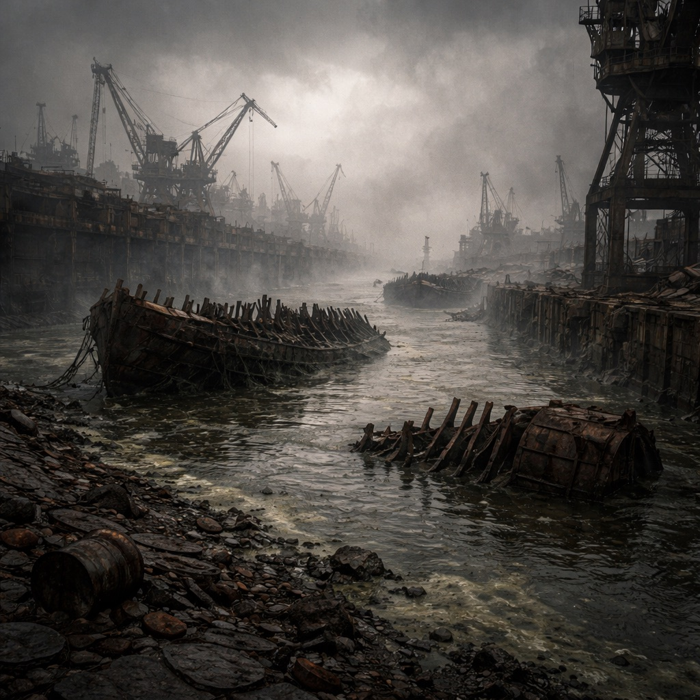

# Der Hafen

Ein verrotteter Binnenhafen, in dessen Schlick verstrahlte Rippen alter Frachter stecken. Die [Zeros](../../Kanon/glossar.md#zeros) ließen den Umschlagplatz nach dem Untergang räumen und markierten ihn als [Killcoin](../../Kanon/glossar.md#killcoin)-Quelle – die [Roamer](../../Kanon/glossar.md#roamer) nennen ihn seitdem nur „Die Zähne“.

## Aufenthalt

- [Roamer](../../Kanon/glossar.md#roamer)-Schrotthändler auf Kurztrupp
- Zero-nahe Bergungsaufträge mit Eskorte
- vereinzelte [Maker](../../Kanon/glossar.md#maker) für Ketten- und Windenbau

## Gefahren

- toxischer Schlick mit Sogzonen
- stützlose Kräne und Kaimauern
- Restnet-Alarm auf alten Verladeterminals

## Zu holen

- Ketten, Kurbelwinden, Stahlseile
- Ölreste in versiegelten Lagertanks
- Navigationsmarken aus Hafen-Servern

→ Zurück: [Zonen](index.md)
