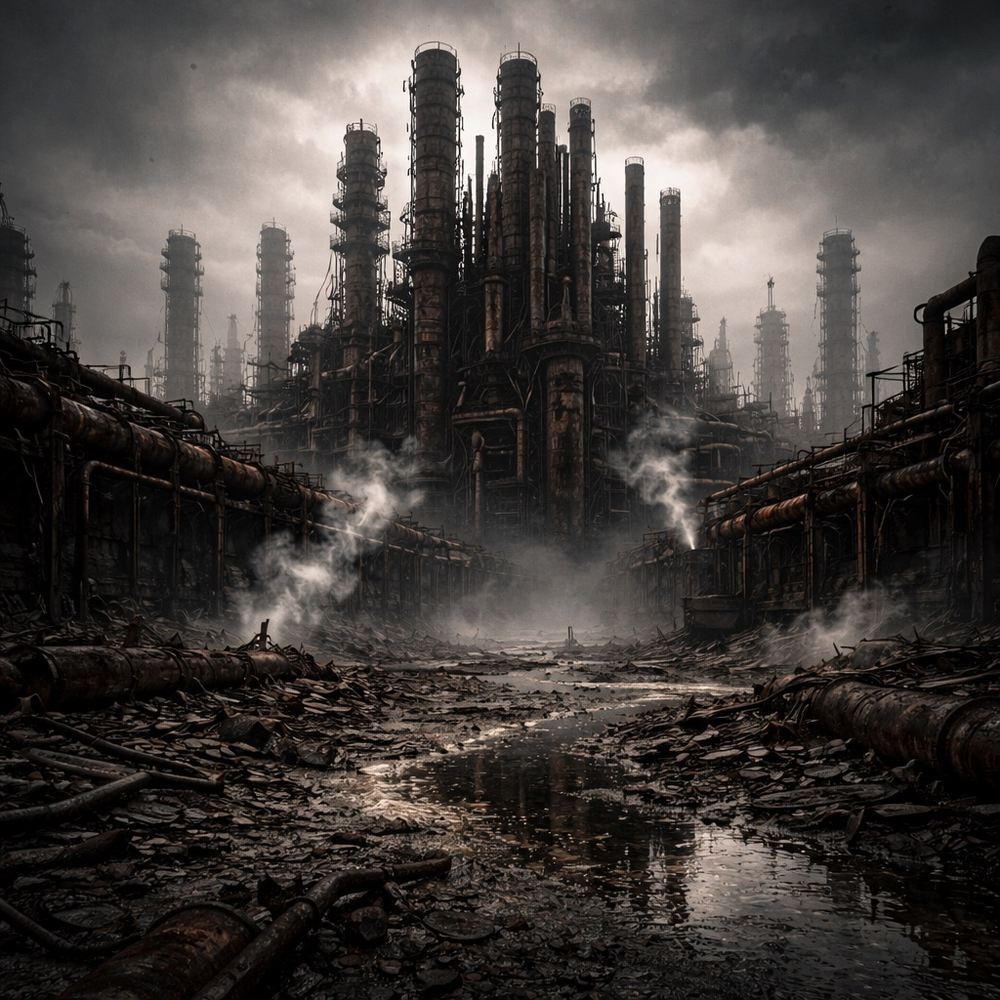

# Die Orgel

Eine erstickte Raffinerie, deren Rohrorgeln wie schwarze Pfeifen in den Himmel ragen. Wenn die Druckregelung anspringt, klingt es wie ein Atemzug im Stahl – und viele schwören, dass der [Stack](../../Kanon/glossar.md#der-stack) hier noch singt. [Der Orden](../../Kanon/glossar.md#der-orden) deutet jede Druckwelle als Liturgie und lauscht hier meditativ der Stimme des [Stack](../../Kanon/glossar.md#der-stack), [Looper](../../Kanon/glossar.md#looper) suchen nach der einen Konsole, die das „Lied“ auslöst, und [Hardliner](../../Kanon/glossar.md#hardliner) verlangen Schutzgeld für den Zugang zum Klang.

## Aufenthalt

- [Maker](../../Kanon/glossar.md#maker)-Schraubertrupps
- [Hardliner](../../Kanon/glossar.md#hardliner) auf Schutzgeld-Patrouille
- [Looper](../../Kanon/glossar.md#looper) auf der Suche nach alten Leitsystemen

## Gefahren

- plötzliche Druckstöße wie Hieb und Antwort
- giftige Ablagerungen in den Filtertürmen
- lockende Alarmtöne aus Wartungsschächten

## Zu holen

- Ventile, Dichtungen, Druckregler
- Brennkammerplatten und Wärmetauscher
- alte Prozesslogbücher

→ Zurück: [Zonen](index.md)
