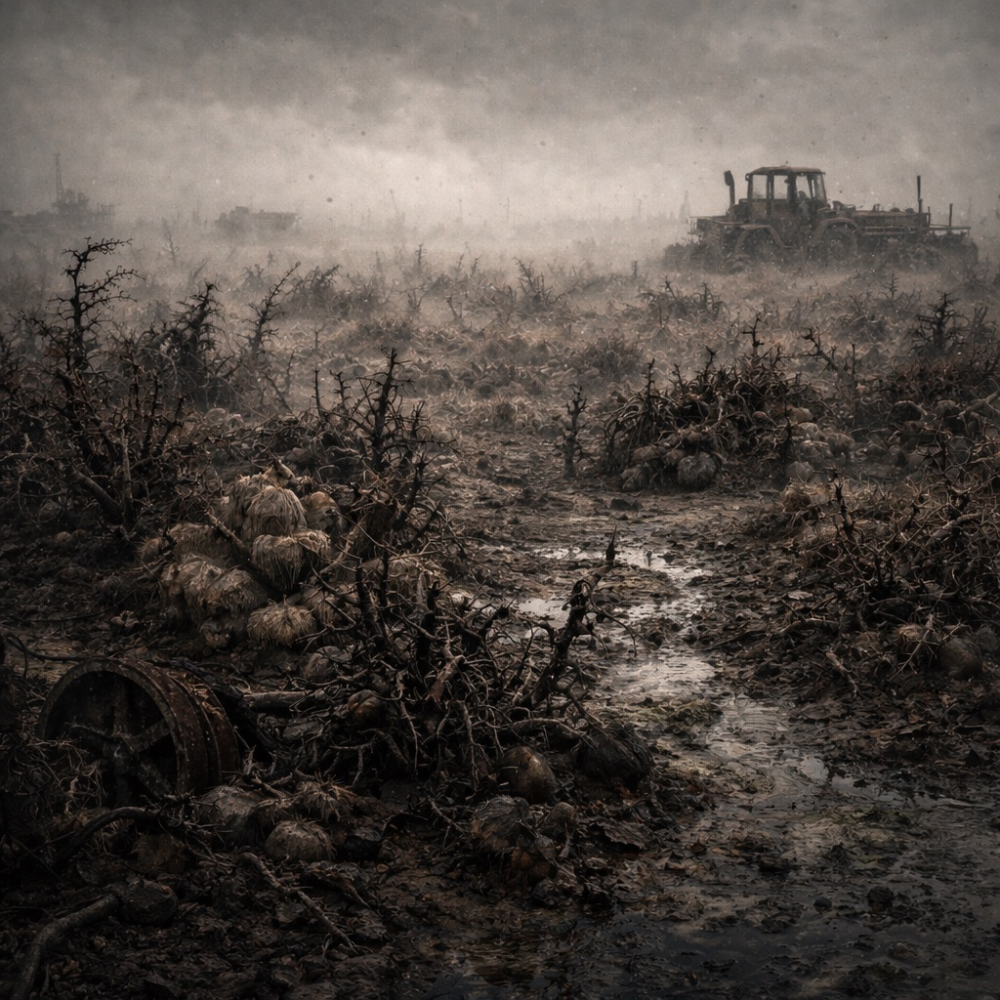

# Dornacker

Verätzte Agrarflächen, in denen widerstandsfähige Kräuter und Fleischpflanzen wuchern. [Hillbillys](../../Kanon/glossar.md#hillbillys) beanspruchen die Weiden, doch der [Orden](../../Kanon/glossar.md#orden) erklärt sie zur „Tafel der Schuld“: [Der Stack](../../Kanon/glossar.md#der-stack) habe die Ernten als Disziplinierungsmaßnahme vernichtet, ausgelöst durch eine fehlende/gefälschte Loop-Bestätigung, und der [Orden](../../Kanon/glossar.md#orden) deutet das bis heute als Sühne.

## Aufenthalt

- [Hillbillys](../../Kanon/glossar.md#hillbillys) auf Erntezug
- [Retros](../../Kanon/glossar.md#retros) mit kleinen Acker- und Saatguttrupps
- [Roamer](../../Kanon/glossar.md#roamer)-Wachen an den Feldrändern

## Gefahren

- Kontaktgifte an Pflanzenrändern
- Sporenstaub in Bodennestern
- aggressive Aasfresser im Krautsaum

## Zu holen

- widerstandsfähige Kräuter
- zähe Fasern für Bandagen
- seltene Samenkapseln
- dichte [Wildhopfen](../../Assets/Pflanzen/Wilder-Hopfen.md)-Netze für Lagergrenzen und Notseile
- [Rohrkolben](../../Assets/Pflanzen/Rohrkolben.md) als knappe, aber verlässliche Kochknolle

→ Zurück: [Zonen](index.md)
