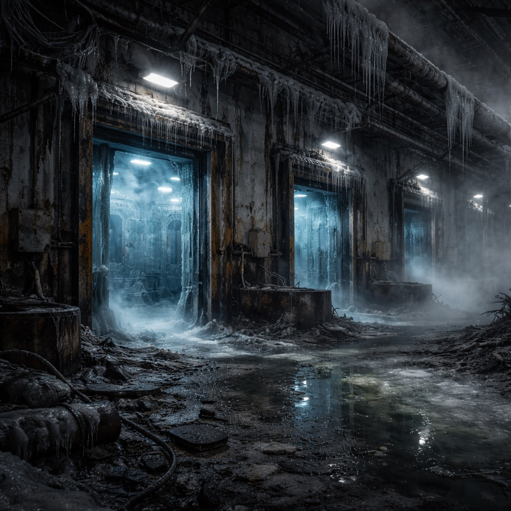

# Frostwerk 9

Ein altes Tiefkühl-Logistikzentrum, innen noch eisig, außen von toxischem Nebel umspült. [Der Stack](../../Kanon/glossar.md#der-stack) hielt die Kühlkaskaden jahrelang aktiv – angeblich, um abgeriegelte Kühlkammern unangetastet zu konservieren.

## Aufenthalt

- [Maker](../../Kanon/glossar.md#maker) für Kälte-Module
- [Zeros](../../Kanon/glossar.md#zeros) mit Spezialaufträgen
- [Hillbillys](../../Kanon/glossar.md#hillbillys) auf Beuteroute

## Gefahren

- plötzliche Kälteschocks in Korridoren
- vereiste Türen mit Lockdown-Triggern
- Nebeltaschen mit ätzender Feuchte

## Zu holen

- Isoliermaterial und Kältemodule
- Kryo-Filtereinsätze
- versiegelte Frachtkisten

→ Zurück: [Zonen](index.md)
