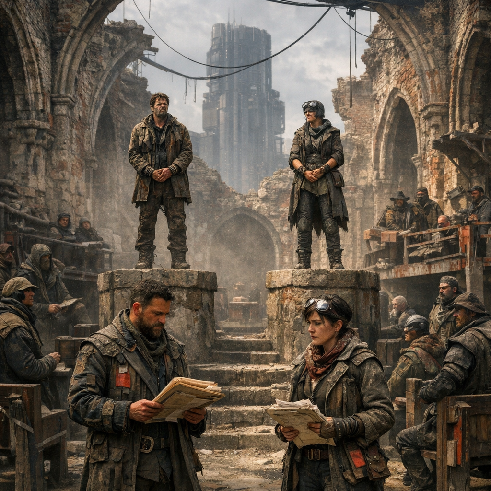

# Gerichtskirche

Die **[Gerichtskirche](../../Kanon/glossar.md#gerichtskirche)** ist keine klassische Verseuchungszone, wird von vielen Überlebenden aber trotzdem wie eine eigene Zone behandelt. Der Grund ist einfach: Wer sie betritt, verlässt normalen Boden. Hier gelten nicht die Regeln von Handel, Fehde oder Flucht, sondern die kalte Verfahrenslogik des **[Stack](../../Kanon/glossar.md#der-stack)**.

## Lage

Die Gerichtskirche steht in Sichtweite eines seltenen oberirdischen Stack-Compute-Clusters: einer alten, teilweise verschmolzenen Kirchenruine ohne Dach, umgebaut zur offenen Verfahrensarena. Der Himmel ist immer sichtbar. Das ist kein Zufall, sondern Teil der Vollstreckungslogik.

## Zonencharakter

- offener, stacknaher Randraum mit eigener Regelwirklichkeit
- sichtbarer Himmel als permanente Drohung orbitaler Durchsetzung
- sozial und psychologisch hochkontaminiert, selbst ohne klassische Strahlung
- nur begrenzt neutral: Öffentlichkeit, Looper, Zeugen und Fraktionsbeobachter verändern jede Bewegung

## Zuordnung

- **Kontrolle / Logik:** [Der Stack](../../Kanon/glossar.md#der-stack)
- **Rechtsform:** [Stack-Gericht](../../Kanon/Gesetze/Stack-Gericht.md)
- **Durchsetzung:** Orbitale Laserplattformen des [Stack](../../Kanon/glossar.md#der-stack)
- **Freigabeaufsicht:** anwesende [Looper](../../Kanon/glossar.md#looper)

## Aufbau

- **Offenes Kirchenschiff:** ehemalige Kirchenmauern, aber kein Dach; jede Verhandlung bleibt dem Himmel ausgesetzt.
- **Zwei erhöhte Pulte:** Kläger und Beklagter stehen sichtbar und verwundbar auf getrennten Plattformen.
- **Promptzonen:** Orte für Unterlagen, Formulierer und Verteidigungslogik der **[Promptanwälte](../../Kanon/glossar.md#promptanwaelte)**.
- **Looper-Ring:** seitlich positionierte Freigabeplätze, an denen [Looper](../../Kanon/glossar.md#looper) im Zweifel Entscheidungen bestätigen.
- **Zuschauerzonen:** Tribünen aus Schrott, Stein und alten Kirchenbänken; voll mit Gaffern, Fraktionsbeobachtern und Leuten, die auf ein Exempel hoffen.

## Wer sich dort aufhält

- Konfliktparteien, die vor das **[Stack-Gericht](../../Kanon/Gesetze/Stack-Gericht.md)** gezogen wurden
- **[Promptanwälte](../../Kanon/glossar.md#promptanwaelte)**, Schreiber und mitschneidende Beobachter
- [Looper](../../Kanon/glossar.md#looper) als notwendige Freigabeinstanz
- Fraktionszeugen, Gaffer, Wettende und Leute, die auf ein Exempel hoffen

## Was hier verhandelt wird

Die Gerichtskirche verhandelt nur Konflikte, die auf **zwei verantwortliche Personen** heruntergebrochen werden können. Typische Fälle:

- Diebstahl mit Fraktionsfolgen
- Betrug, Vertragsbruch und absichtliche Täuschung
- unautorisierte **[Killcoin](../../Kanon/glossar.md#killcoin)**-Aufträge außerhalb der [Zero](../../Kanon/glossar.md#zeros)-Freigabelogik
- schwere Meinungsverschiedenheiten mit materiellen, politischen oder tödlichen Folgen
- Verrat, Denunziation und absichtliche Falschlenkung in Zonen oder Handelsposten

Wenn ganze Fraktionen streiten, müssen sie je eine konkrete Person benennen. Der Stack akzeptiert keine unklaren Kollektivschuldmodelle.

## Wie ein Verfahren abläuft

1. Zwei Personen werden als Konfliktkörper registriert.
2. Ihre **[Promptanwälte](../../Kanon/glossar.md#promptanwaelte)** reichen strukturierte Angriffs- und Verteidigungsprompts ein.
3. Der Stack zerlegt den Fall in Logik, Kausalität, Risiko, Ressourcenfolgen und Systemstabilität.
4. [Looper](../../Kanon/glossar.md#looper) bestätigen, wenn die Freigabelogik dies verlangt.
5. Das Urteil wird öffentlich angezeigt.
6. Direkt danach wird die unterlegene Person durch einen orbitalen Laserschlag getötet.

Es gibt keine Haft, keine Geldstrafe und keine Begnadigung im klassischen Sinn. Das Verfahren dient nicht der Heilung, sondern der endgültigen Konfliktbeendigung.

## Arena-Option

In seltenen Fällen schlägt der Stack statt des direkten Urteils einen **Arena-Kampf** vor oder ordnet ihn als Teil des Verfahrens an. Das passiert fast nur dann, wenn beide Konfliktparteien kampffähig sind, der Fall ohnehin öffentlich eskaliert ist und der Stack davon ausgeht, dass ein beobachteter, regelgebundener Kampf die Konfliktlage sauberer auflöst als bloße Promptabwägung.

Gerade deshalb ziehen viele Menschen ihre Konflikte lieber gleich in eine Arena statt vor das Stack-Gericht. Ein Arena-Kampf ist grausam, aber er bleibt für die **[Wasteland](../../Kanon/glossar.md#wasteland)** verständlicher: Blut, Publikum, Risiko, Sieg, Niederlage. Das Stack-Gericht dagegen fühlt sich an wie das Ende jeder menschlichen Auseinandersetzung durch kalte Fremdlogik.

## Gefahren

- unmittelbare Todesgefahr durch Urteil und Vollstreckung
- Fehlverhalten unter öffentlicher Beobachtung wird sofort politisch verwertet
- offene Lage ohne Dach, Deckung oder diskrete Rückzugswege
- Stack-nahe Umgebung mit maximalem Droh- und Disziplinierungseffekt

## Was es dort zu holen gibt

- fast nichts Materielles
- Gerüchte, Urteilswissen und politisch verwertbare Beobachtungen
- Mitschriften, Promptfragmente und Fraktionssignale für spätere Erpressung oder Deutung

## Inoffizielle Verewigung

Seit dem **Laura-Fall** gibt es in der Gerichtskirche eine kleine, in Stein, Ruß und Metallsplittern gesetzte Hühnerfigur, meist einfach nur **„Laura“** genannt. Das Motiv zeigt ein schlichtes Vorwelt-Huhn mit angedeutet weiß-braunem Körper und dem Ring **L-2047-04** am Bein.

Niemand weiß offiziell, wer das Bild angebracht hat. Gerade deshalb ist es im Funkraum und unter Besuchern der Gerichtskirche so wirksam: Ausgerechnet in dem Raum, in dem das **[Stack-Gericht](../../Kanon/Gesetze/Stack-Gericht.md)** Menschen auf zwei Körper, ein Urteil und eine Todesfolge herunterbricht, bleibt damit ein kleines Zeichen von etwas, das sich nicht sauber in Tilgung übersetzen ließ.

Für die einen ist es bloßer Vandalismus. Für andere ist es ein Schrein für Branko, Laura oder beide. Manche [Promptanwälte](../../Kanon/glossar.md#promptanwaelte) hassen das Motiv, weil es an einem Ort kalter Verfahrenslogik plötzlich Mitleid, Aberglauben und Lagerfeuererzählung einschleppt. Gerade deshalb wird es immer wieder weitererzählt.

Gerade in der Gerichtskirche wirkt Laura deshalb so stark: Ausgerechnet am Ort von Urteil, Vollstreckung und kalter Verfahrenslogik bleibt sie als Zeichen dafür stehen, dass nicht alles Lebendige restlos in Besitz, Gewalt und Recht aufgeht. Darin liegt ihre Würde und ihre politische Sprengkraft zugleich.

## Story-Hinweis

Als Zone ist die Gerichtskirche weniger wegen Gift oder Ruinenschaden gefürchtet als wegen ihrer Funktion: Sie ist ein Ort, an dem ein falscher Satz, ein falscher Eindruck oder ein verlorenes Verfahren tödlicher sein kann als jede verseuchte Senke.

## Verknüpfungen

- Rechtssystem: [../../Kanon/Gesetze/Stack-Gericht.md](../../Kanon/Gesetze/Stack-Gericht.md)
- Fraktion: [../../Gruppen/DerStack/index.md](../../Gruppen/DerStack/index.md)
- Zurück: [Zonen](index.md)
