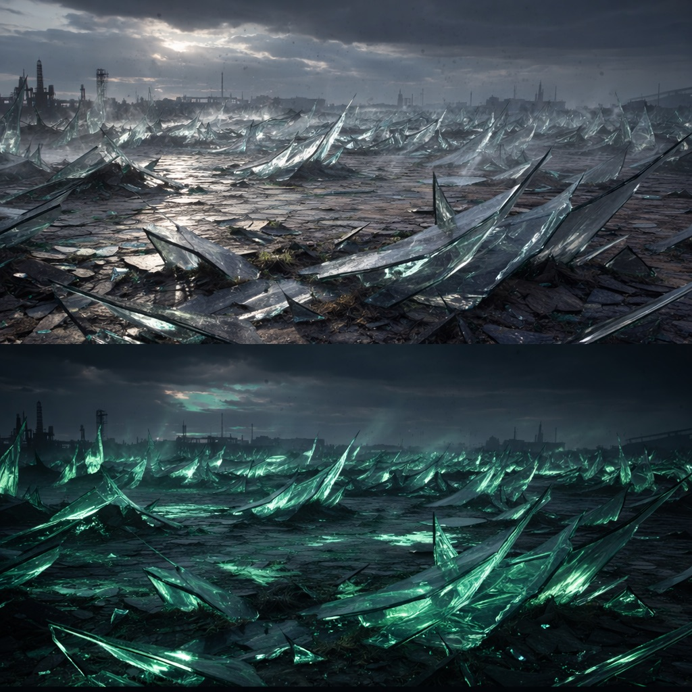

# Glasfeld-Delta

Ein ehemaliges Industrieareal, das bei den ersten KI-Schlägen zu einer scharfkantigen Glaswüste verbacken ist. Das Glas liegt in Platten, Zähnen und Schuppen; es knirscht unter jedem Schritt, splittert bei Wind und wirft kalte, zerschnittene Spiegelbilder zurück. Nachts leuchtet es grün wie Uranglas. Die [Orden](../../Kanon/glossar.md#orden)-Archive vermerken hier widersprüchliche Stackcast-Sichtmeldungen – deshalb pilgern [Retros](../../Kanon/glossar.md#retros) regelmäßig zu den Spiegelungen.

## Aufenthalt

- [Retros](../../Kanon/glossar.md#retros) in Ritualtrupps
- [Geocacher](../../Kanon/glossar.md#geocacher) auf Reflektor-Route
- [Maker](../../Kanon/glossar.md#maker) für hitzeresistente Funde

## Gefahren

- splitternde Glasböen
- Hitzenester unter der Oberfläche
- optische Täuschungen durch Reflektionen

## Zu holen

- hitzefeste Keramikteile
- Glasfaserbündel
- intakte Sensorgläser aus Werkhallen
- [Ackerschachtelhalm](../../Assets/Pflanzen/Ackerschachtelhalm.md) für Silikatstaub und robuste Faserzuschläge

→ Zurück: [Zonen](index.md)
