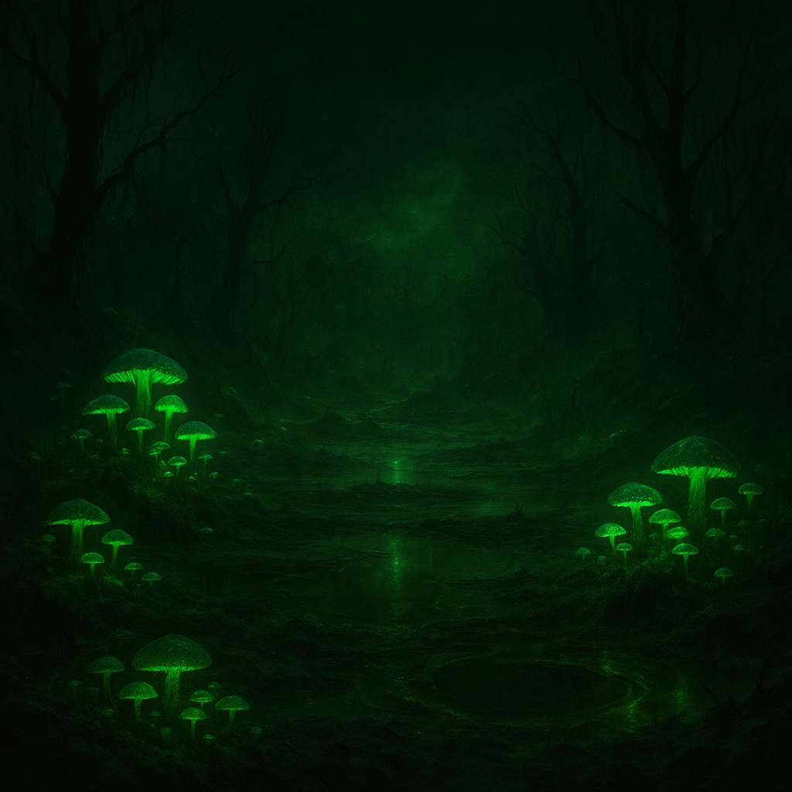

# Grünbrand-Senke

Ein tiefer, feuchter Kessel mit phosphoreszierenden Pilzfeldern und öligen Wasseraugen. Nachts wirkt alles fast schön – genau das macht die Zone tödlich.
[Hillbillys](../../Kanon/glossar.md#hillbillys) nennen die Senke ihr „leuchtendes Vorratslager“ und handeln Sporenharze gegen Filter und [Scrip](../../Kanon/glossar.md#scrip). [Maker](../../Kanon/glossar.md#maker) haben hier frühe Biofilter getestet – viele sagen, der [Stack](../../Kanon/glossar.md#der-stack) habe die Versuche gezielt scheitern lassen.

## Aufenthalt

- Hillbilly-Randlager (kurzzeitig)
- vereinzelte [Geocacher](../../Kanon/glossar.md#geocacher) auf Pilgerroute zu „leuchtenden Caches“

## Gefahren

- Halluzinogene Sporen
- verdeckte Moorlöcher mit chemischer Brühe
- aggressive Aasfresser in den Randwäldern

## Zu holen

- seltene Pilzproben (Medizin/Handel)
- Harze und Öle für improvisierte Brandmittel
- Knochen-/Hornmaterial aus kontaminierten Kadavern
- [Wilder Hopfen](../../Assets/Pflanzen/Wilder-Hopfen.md) und schwere Faserbündel für Seile/Fallen
- [Rohrkolben](../../Assets/Pflanzen/Rohrkolben.md) aus feuchten Randnestern (Rhizome nur gekocht essbar)

→ Zurück: [Zonen](index.md)
