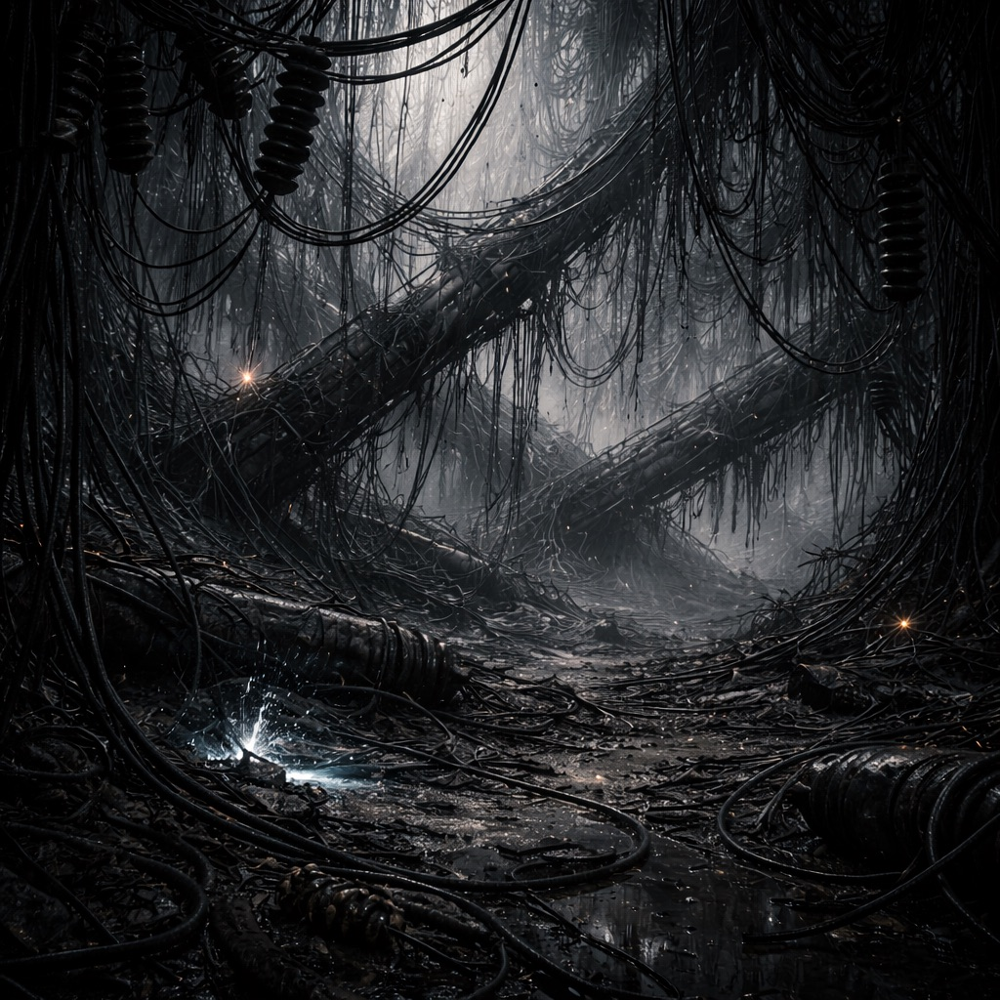

# Kabelwald

Umgestürzte Hochspannungsmasten bilden ein dichtes, dunkles Drahtdickicht, das wie ein eigener Dschungel aus Metall lebt. Kabel hängen wie Lianen, Isolatoren sind Nester, der Boden ist ein Teppich aus Schlingen – ein Ökosystem aus Strom, Rost und Schatten. [Zeros](../../Kanon/glossar.md#zeros) haben hier einst Furry-Bots für sichere Durchgänge bezahlt, bevor der [Stack](../../Kanon/glossar.md#der-stack) die Restladung unberechenbar machte.

## Warum hier ein "Wald" entsteht

Der Kabelwald ist kein klassischer Naturwald, sondern ein sekundäres Technobiotop:

- Umgestürzte Masten und Kabel bilden das Gerüst wie Baumstämme und Lianen.
- Pionierflora (Moose/Flechten, Brennnessel, Wilder Hopfen) besiedelt Schutt, Mastfüsse und Schlingen.
- Metall erzeugt Mikroklimäffekte (Schatten, Wärmestaus, Feuchteinseln), die Wachstum stabilisieren.
- Drahtwespen, Kabelmarder und punktuell Relaistiere halten das System dauernd in Bewegung.

So entsteht ein hybrides Ökosystem aus Restinfrastruktur und Bewuchs: nicht "natürlich", aber robust genug, um wie ein Wald zu funktionieren.

## Aufenthalt

- [Roamer](../../Kanon/glossar.md#roamer)-Scouts als Vorhut
- Trader-Techniker mit Isolierhaken
- [Maker](../../Kanon/glossar.md#maker) auf der Suche nach Leitermaterial

## Gefahren

- Restladung in Kabelschlaufen
- drahtige Fallen und Zugkräfte
- Sichtblockaden durch Leitungsteppiche

## Zu holen

- Kupferbündel und Isolierstücke
- Knotenverbinder und Keramikringe
- intakte Schaltboxen

→ Zurück: [Zonen](index.md)
