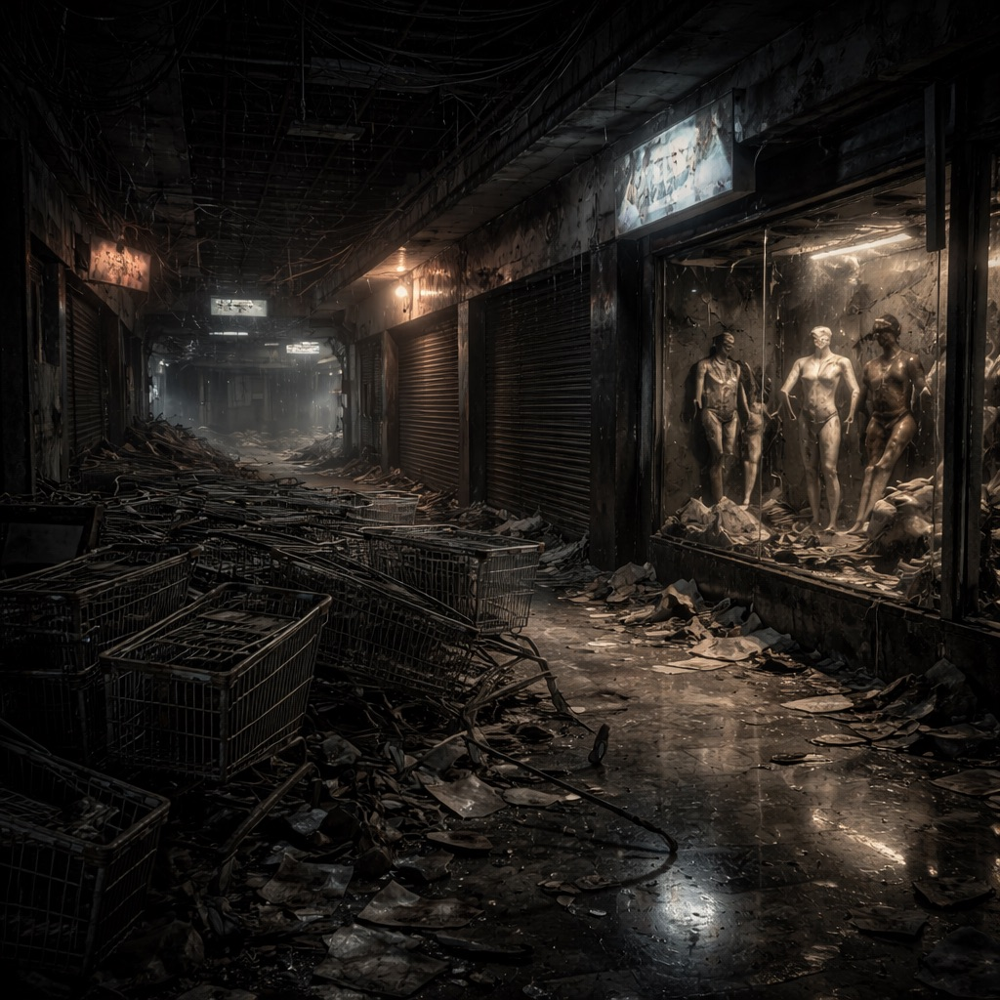

# Konsumschlund-Arkaden

Ein ehemaliges Einkaufszentrum, inzwischen ein Labyrinth aus Ruß, Rollgittern und stillen Lockdowns. Berge von Einkaufswagen liegen wie Wellenkämme, Schaufensterpuppen hängen schief in zerborstenen Vitrinen und blinde Werbedisplays flackern noch. Die [Zeros](../../Kanon/glossar.md#zeros) nutzen die oberen Ebenen als Tauschbörse, der [Stack](../../Kanon/glossar.md#der-stack) lässt die unteren bewusst dunkel.

## Aufenthalt

- Zero-Kuriere und stille Händler
- [Geocacher](../../Kanon/glossar.md#geocacher) auf alten Automatenrouten
- [Hardliner](../../Kanon/glossar.md#hardliner), die Schutzgeld kassieren

## Gefahren

- alte Zutrittsprotokolle mit Lockdown
- enge Korridore mit Hinterhaltpotenzial
- „blinde“ Zonen ohne Funk

## Zu holen

- Automatenkerne und Zahlungsmodule
- Stahlspinde und Sicherheitsgitter
- intakte Rolltor-Antriebe

→ Zurück: [Zonen](index.md)
