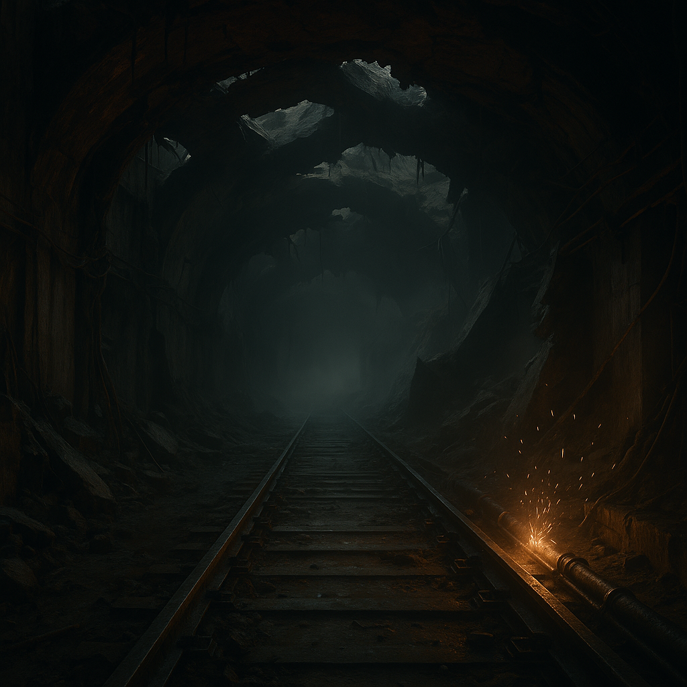

# Nullbahn-Korridor

Alte Hochgeschwindigkeitsstrecke mit zerschmolzenen Tunneln und sporadisch aktiven Stromschienen. Manche Abschnitte sind überraschend intakt.
[Der Orden](../../Kanon/glossar.md#der-orden) nennt die Strecke „Pfeil der Migration“ und versucht, alte Signalprotokolle als Pilgerpfad zu lesen. [Zeros](../../Kanon/glossar.md#zeros) nutzen intakte Segmente als verdeckte Transitrouten, solange der [Stack](../../Kanon/glossar.md#der-stack) die Schienen nicht wieder unter Sperrlogik stellt.

## Aufenthalt

- Trader-Techniker für Leitungsbergung
- Zero-bezahlte Scouts
- Furry Bots als Vorhut

## Gefahren

- Restspannung in Schienenfeldern
- enge Engstellen mit Hinterhaltpotenzial
- [Beacon](../../Kanon/glossar.md#beacons)-Spoofing durch unbekannte Sender

## Zu holen

- Kupfer, Leitermaterial, Schaltmodule
- intakte Schleusenmechanik
- Transitknoten, die als geheime Abkürzung nutzbar sind

→ Zurück: [Zonen](index.md)
