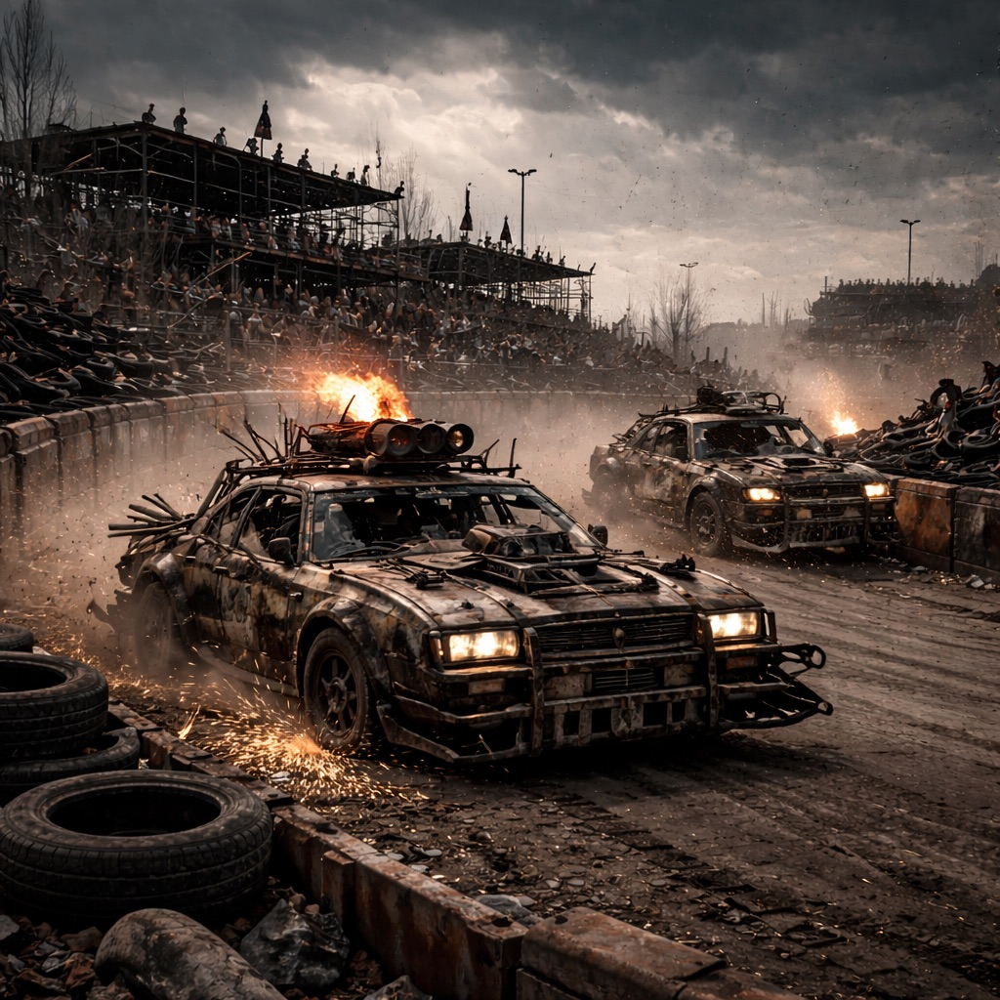

# Ödlandarena

Eine verlassene Autobahnschleife, die zu einer wilden Schrottarena umgebaut wurde. Die [Steampunks](../../Kanon/glossar.md#steampunks) nennen sie den „Karrenkranz“ und jagen hier ihre Karren durch Funkenregen, während der [Stack](../../Kanon/glossar.md#der-stack) das Spektakel still protokolliert. Die Sieger nehmen nicht nur Schrott, sondern Rang – wer hier gewinnt, bekommt Werkstattzugang, Schutz und den nächsten Auftrag. Bei den großen Abenden wird der Tagessieger in der [Wasteland](../../Kanon/glossar.md#wasteland) unter Johlen, Pyro und schlechtem Geschmack symbolisch zum `Phallus Maximus` gekrönt: kein offizieller Titel im alten Sinn, sondern eine Arena-Auszeichnung für den größten, lautesten und anmaßendsten Triumph des Abends. [Zeros](../../Kanon/glossar.md#zeros) lassen gelegentlich [Killcoin](../../Kanon/glossar.md#killcoin)-Sprintläufe ausrichten, um den Markt zu testen, und die [Hardliner](../../Kanon/glossar.md#hardliner) kassieren am Eingang „Staubzoll“ für die Menge.

Die Arena ist längst mehr als nur Rennstrecke. Sie ist **Brot und Spiele für [Killcoins](../../Kanon/glossar.md#killcoin)**: ein riesig aufgezogenes [Wasteland](../../Kanon/glossar.md#wasteland)-Spektakel aus Wettläufen, Blutrunden, Bühnenprogramm, Handelsbuden und öffentlicher Eskalation. Für größere Abende werden **Tickets verkauft**, Ränge freigeräumt, Wettschalter aufgebaut und ganze Konvois nur für Einlass, Ausschank und Absicherung abgestellt. Zu den beliebtesten Disziplinen gehören inzwischen auch **Streitwägen** aller Art: Motorradwagenrennen, gepanzerte Schrottschlitten und völlig absurde Impro-Konstruktionen, darunter mehrbeinige **Motorradschwein-[Chimärenplattformen](../../Assets/Tiere/Chimaerenplattformen.md)**, die eher nach Wahn als nach Fahrwerk aussehen und genau deshalb Publikum ziehen.

Gerade hier zeigt sich, dass die [Wasteland](../../Kanon/glossar.md#wasteland) nicht nur aus Überlebenspanik besteht. In der Arena wird gebrüllt, gefeiert, geprahlt, gewettet und kollektiv so getan, als gäbe es für ein paar Stunden wieder so etwas wie gemeinsamen Spaß. Erfolg, Risiko, Lärm und kurz zurückgewonnene Normalität reichen oft schon, um aus Feinden wenigstens für einen Abend ein Publikum zu machen.

## Aufenthalt

- [Steampunks](../../Kanon/glossar.md#steampunks) und ihre Crews
- [Maker](../../Kanon/glossar.md#maker)-Schrauber für Notflicks
- [Roamer](../../Kanon/glossar.md#roamer) als Wetten- und Schutzleute
- [Hardliner](../../Kanon/glossar.md#hardliner)-Ringe für Blutspiele mit Rotzschweinen und Wastelandhunden
- [Magier](../../Kanon/glossar.md#magier)-Zirkel mit [Chimärenplattformen](../../Assets/Tiere/Chimaerenplattformen.md) für Sonderläufe

## Musik & Showfenster

In Nachtfenstern und vor größeren Läufen treten regelmäßig laute [Wasteland](../../Kanon/glossar.md#wasteland)-Acts aus dem Umfeld von [Stranded Stranglers](../../Kanon/glossar.md#stranded-stranglers) auf. Besonders häufig spielt [Rostköter](../../Radio/Bands/Rostkoeter.md) vor Rennblöcken, Einläufen und nach Sonderläufen, wenn das Publikum noch Wetten offen und genug Staub in der Lunge hat.

Bei den großen Events bekommt das Ganze Festivalmaßstab: **Rostköter** und andere Acts spielen auf einer massiven Schrottbühne mit Lautsprechertürmen, Kranträgern, Lichtgerüsten und improvisierten Seitentribünen. Die Arena wird dann zur vollwertigen [Killcoin](../../Kanon/glossar.md#killcoin)-Showmaschine, in der Rennen, Gewalt, Musik und Marktware ineinander übergehen.

Zu den Nummern, die hier am zuverlässigsten alles in einen einzigen gröhlenden Block verwandeln, gehört Rostköters `Phallus Maximus`: ein primitiver Arena-Brecher über Schrott, Größenwahn und die feste Überzeugung, dass man Peinlichkeit nur laut genug spielen muss, damit sie wieder Kult wird.

[Doomsday Radio](../../Kanon/glossar.md#doomsday-radio) fährt vor Arena-Abenden aggressive Ticket-Werbung: Wastelandarena, Staub im Hals, Einlass solange noch Zäune stehen. Viele hören die Spots nur, um zu wissen, wann es sich lohnt, mit Schutzbrille und schlechten Entscheidungen aufzutauchen.

Zu den größeren Shows gehört oft ein **[Magier](../../Kanon/glossar.md#magier)-Pyro-Set**: kontrollierte Fehlzündungen, Flammenbögen aus Feldtechnik, brennende Luftzeichen und leuchtende Funkenstöße über der Strecke. Niemand nennt das sicher. Genau deshalb bleibt das Publikum bis zum Schluss.

## Sonderläufe: Chimärenrunden

Neben Karrenrennen gibt es unregelmäßige Chimärenrunden:

- Umbau gegen Umbau auf Kurzstrecke
- Last- und Rammtests vor Publikum
- Wettbörsen auf Ausfall, Kontrollverlust oder Zielankunft
- Streitwagenklassen mit Motorradwagen, Schrottgespannen und tierähnlichen Plattform-Chimären
- Sonderläufe, in denen reine Fahrbarkeit fast schon als Stilbruch gilt

Die Arena gilt damit als Hauptschaufenster für Chimärenwerk in der [Wasteland](../../Kanon/glossar.md#wasteland).

Neben Show und Wetten dient die Ödlandarena auch als inoffizieller Rechtsraum der Straße: Viele Fehden, Schuldenstreits und Ehrkonflikte werden lieber hier im offenen Kampf entschieden, bevor jemand vor das **[Stack-Gericht](../../Kanon/glossar.md#stack-gericht)** gezogen wird. Für viele ist das immer noch die "menschlichere" Art zu verlieren.

## Gefahren

- scharfe Trümmerkanten auf der Ideallinie
- Kollisionen mit improvisierten Barrieren
- plötzliche Lockdown-Sperren am Ausgang
- unkontrollierte Tierhetzen in Nebenläufen

## Zu holen

- Motorteile, Ketten, Drosselmodule
- Reifenreste und Felgenstahl
- Datenspuren aus Rennen (für Taktik)

→ Zurück: [Zonen](index.md)
