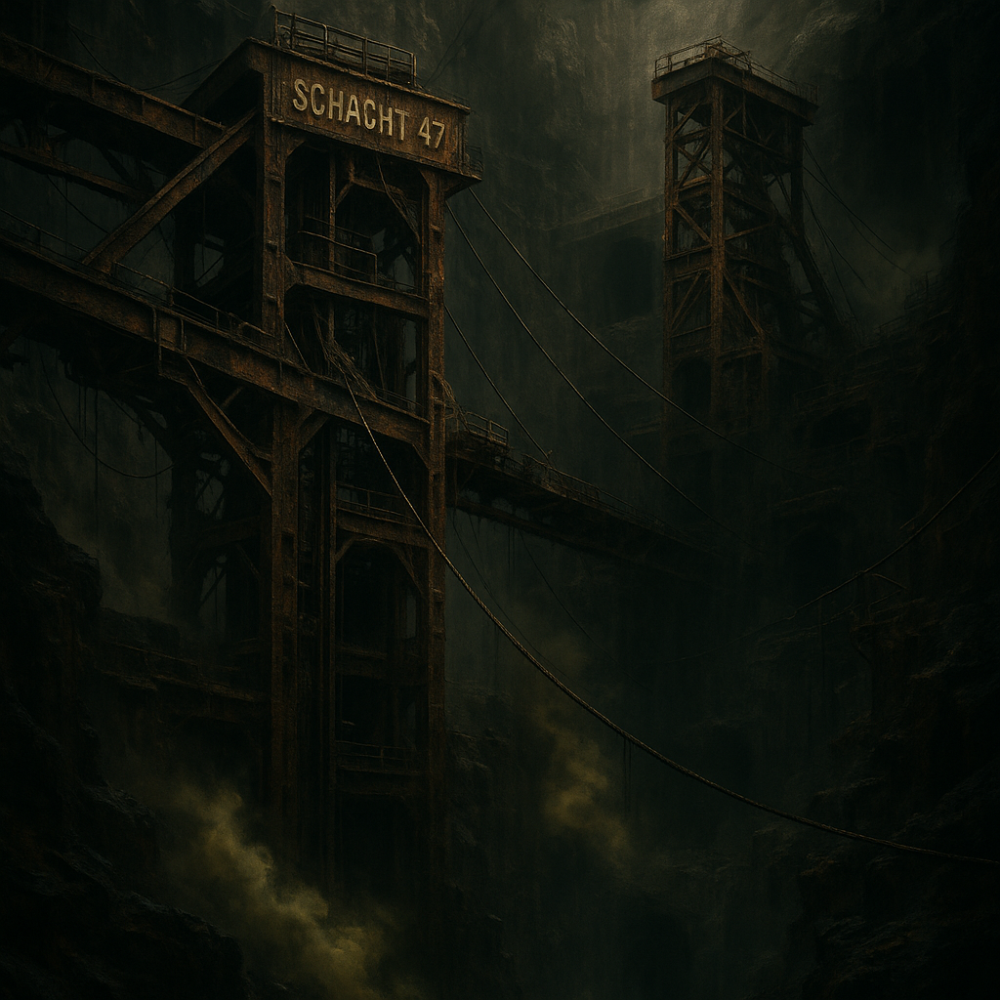

# Schacht 47 („Der lange Husten“)

Ein vertikales Minensystem, das bei Wetterwechsel toxische Gasfahnen ausstößt. Von außen unscheinbar, innen ein mehrstöckiges Todeslabyrinth.
[Der Stack](../../Kanon/glossar.md#der-stack) hat die unteren Ebenen seit dem Untergang mehrfach abgeriegelt – nur mit Loop-Konsolen ließ sich der letzte Lockdown umgehen. [Zeros](../../Kanon/glossar.md#zeros) zahlen Kopfgeld auf die Batteriekerne, und der [Orden](../../Kanon/glossar.md#orden) wertet jede Rückkehr als „Stackcast-Antwort“.

## Aufenthalt

- Outcast-Bergleute mit kurzfristigen Camps
- [Geocacher](../../Kanon/glossar.md#geocacher) nur bei klar bestätigten Funden

## Gefahren

- plötzliche Gasdruckstöße
- Sauerstoffarme Taschen
- lose Seile, alte Förderzüge, tiefe Abstürze

## Zu holen

- seltene Erze und Batteriekerne
- Werkzeug aus alten Wartungsdepots
- Caches in stillgelegten Kontrollräumen

→ Zurück: [Zonen](index.md)
