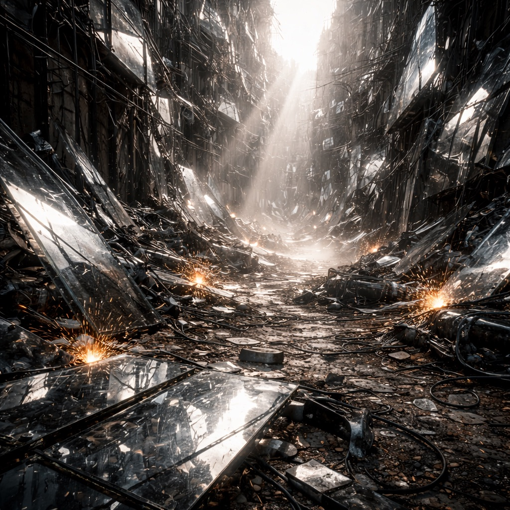

# Spiegelschlucht

Eine Schlucht voller reflektierender Trümmer – zerborstene Fassadenplatten, metallisierte Sicherheitsgläser, spiegelnde Werbetafeln und polierte Maschinenverkleidungen –, die Funk und Sicht verzerren. Vereinzelte Sonnenstrahlen werden gebündelt und entfachen an zufälligen Stellen Feuer. In Zero-Routenplänen taucht die Schlucht als „sicher“ auf, weil bezahlte Scouts sie kartieren; für alle anderen bleibt sie unberechenbar.

## Aufenthalt

- Zero-Kuriere unter Funkstille
- [Geocacher](../../Kanon/glossar.md#geocacher), die falsche Koordinaten jagen
- vereinzelte [Roamer](../../Kanon/glossar.md#roamer)-Scouts

## Gefahren

- Funk-Echos mit falschen Herkunftsmarken
- Blendkorridore bei Sonnenstand
- Lockvögel und Hinterhaltlinien

## Zu holen

- Spiegelstahlplatten
- Signalverstärker aus Trümmerkernen
- versteckte Caches in Scheinwänden

→ Zurück: [Zonen](index.md)
