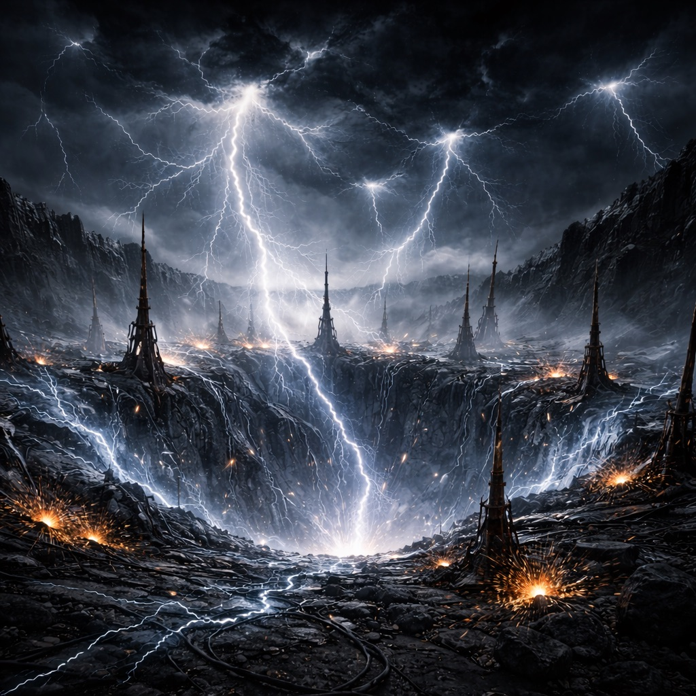

# Sturmtrog

Eine geologische Senke, die Gewitter anzieht und einschließt. [Looper](../../Kanon/glossar.md#looper) interessieren sich kaum dafür – zu müde, zu ausgebrannt –, nur einzelne wühlen in den alten Blitzfängern, wenn sie glauben, eine Synchronisation zu hören. Die [Magier](../../Kanon/glossar.md#magier) nennen den Ort ein Resonanzbecken und versuchen, Ladung und Signal mit Ritualen zu „formen“.

## Aufenthalt

- [Looper](../../Kanon/glossar.md#looper) für Messrituale
- [Magier](../../Kanon/glossar.md#magier) bei Blitznächten
- [Maker](../../Kanon/glossar.md#maker) auf Akkukernjagd
- [Roamer](../../Kanon/glossar.md#roamer) als Blitzfänger-Eskorte

## Gefahren

- plötzliche Entladungen
- magnetische Störungen im Boden
- umstürzende Fangmasten

## Zu holen

- blitzfeste Metalle
- Akkukerne mit Ladung
- Fangspitzen und Leitstäbe

→ Zurück: [Zonen](index.md)
