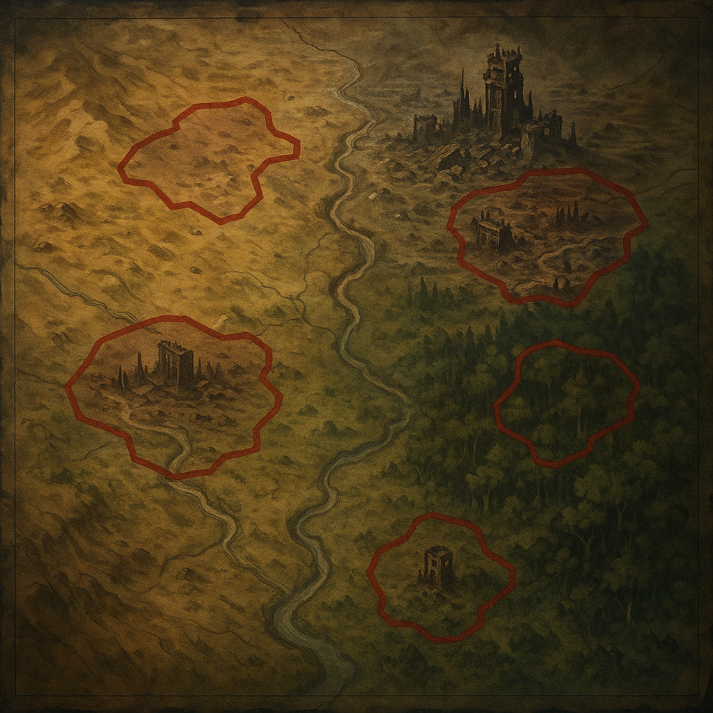

# Zonen

[Verseuchte Zonen](../../Kanon/glossar.md#verseuchte-zonen) sind hochriskante Gebiete mit Strahlung, Chemie-Altlasten und instabilen Umweltbedingungen, in denen Bergung, Navigation und selbst kurze Aufenthalte schnell tödlich werden können. Sie bestehen nicht nur aus Industrie- und Schrottfeldern, sondern auch aus verseuchten Agrarflächen, Feuchtsenken, Küstenruinen und echten Waldgebieten, die über Jahre zu eigenen Revierlandschaften geworden sind.

## Wer sich dort aufhält

- **[Geocacher](../../Kanon/glossar.md#geocacher):** Gehen rein, wenn ein Cache winkt – selbst in Gebiete, die alle anderen meiden.
- **[Maker](../../Kanon/glossar.md#maker) (Bergungstrupps):** Sammeln gezielt Alttechnik, seltene Metalle und intakte Komponenten.
- **[Furry-Bot-Elite der Hardliner](../../Gruppen/Roamer/hardliner.md):** Werden für Eskorten und Bergungsaufträge angeheuert, wenn der Auftrag teuer genug ist.
- **[Hillbillys](../../Kanon/glossar.md#hillbillys) (Randbereiche):** Betreten vor allem Wald- und Sumpfgrenzen verseuchter Gebiete; tiefe Tech-Zonen meiden sie eher.
- **[Der Stack](../../Kanon/glossar.md#der-stack) (indirekt):** Sensorbeacons, Sperrhinweise und gelegentliche Koordinaten machen klar, dass diese Gebiete beobachtet werden.
- **[Mad Dog](../../Kanon/glossar.md#mad-dog):** Warnt on air vor frischen Hotspots; seine Meldungen führen regelmäßig zu Goldrausch-Verhalten.

Orte:

- [Aschering](Aschering.md)
- [Grünbrand-Senke](Gruenbrand-Senke.md)
- [Leithive-Kern](Leithive-Kern.md)
- [Nullbahn-Korridor](Nullbahn-Korridor.md)
- [Bleigarten](Bleigarten.md)
- [Schacht 47 („Der lange Husten“)](Schacht-47.md)
- [Der Hafen](Der-Hafen.md)
- [Glasfeld-Delta](Glasfeld-Delta.md)
- [Die Orgel](Die-Orgel.md)
- [Spiegelschlucht](Spiegelschlucht.md)
- [Frostwerk 9](Frostwerk-9.md)
- [Dornacker](Dornacker.md)
- [Kabelwald](Kabelwald.md)
- [Waldgebiete](Waldgebiete.md)
- [Sturmtrog](Sturmtrog.md)
- [Konsumschlund-Arkaden](Konsumschlund-Arkaden.md)
- [Aschepuls](Aschepuls.md)
- [Ödlandarena](Oedlandarena.md)
- [Archivkuppe](Archivkuppe.md)
- [Gerichtskirche](Gerichtskirche.md) - keine klassische Verseuchungszone, aber ein hochriskanter Stack-Randraum mit Zonencharakter

## Großräume

Die Einzelzonen der Karte bilden größere **Großräume** aus, ähnlich wie Untergruppen innerhalb einer Dachfraktion. Diese Großräume bündeln Biome, Machtachsen, Handelslogik und typische Gefahren über mehrere Orte hinweg.

- [Archivgürtel des Nordwestens](Grossraeume.md#1-archivgurtel-des-nordwestens)
- [Nordkorridor der Werk- und Pilgerachsen](Grossraeume.md#2-nordkorridor-der-werk--und-pilgerachsen)
- [Zentrale Industrie- und Ödlandmitte](Grossraeume.md#3-zentrale-industrie--und-odlandmitte)
- [Östlicher Stack- und Zero-Korridor](Grossraeume.md#4-ostlicher-stack--und-zero-korridor)
- [Südöstlicher Glas- und Leitbogen](Grossraeume.md#5-sudostlicher-glas--und-leitbogen)
- [Südwestlicher Wald- und Sumpfrand](Grossraeume.md#6-sudwestlicher-wald--und-sumpfrand)
- [Südlicher Asche-, Pilz- und Arenabogen](Grossraeume.md#7-sudlicher-asche--pilz--und-arenabogen)

Die ausformulierte Makro-Geografie steht hier: [Großräume der Wasteland](Grossraeume.md)

## Zonentypen

- **Industrie- und Technikzonen:** Aschering, Nullbahn-Korridor, Bleigarten
- **Feucht- und Pilzzonen:** Grünbrand-Senke
- **Agrar- und Randzonen:** Dornacker
- **Technobiotope:** Kabelwald
- **Waldgebiete:** echte [Wasteland](../../Kanon/glossar.md#wasteland)-Wälder mit Reviercharakter, Fallenlinien und verdeckter Nutzung
- **Sonderräume unter Stack-Einfluss:** Gerichtskirche als juristischer Randraum zwischen Sperrgebiet, Ritualort und Hinrichtungsarchitektur

## Stack-Randräume

Nicht alle stacknahen Orte sind klassische Zonen oder klassische Märkte. Für die Alltagslogik der Überlebenden zählen vor allem zwei Sonderfälle:

- [Gerichtskirche](Gerichtskirche.md) - öffentlicher Verfahrens- und Todesraum unter Stack-Jurisdiktion
- [The Shop](../Handelsposten/The-Shop.md) - Handelsschnittstelle des Stack, eher Marktmonolith als Zone

## Typische Gefahren

- **Unsichtbare Strahlung:** "Sauber" aussehende Korridore können tödliche Hotlines sein.
- **Chemische Senken:** Altindustrielle Flüssigkeiten, Dämpfe, Säuren und Neurotoxine in Kellern und Schächten.
- **Automatisierte Altverteidigung:** Sensorfallen, Turmreste, Drohnenroutinen mit veralteten Regeln.
- **Orientierungsverlust:** Kompassdrift, Magnetstörungen, GPS-Fakes, falsche [Beacon](../../Kanon/glossar.md#beacons)-Signale.
- **Biologische Risiken:** Pilzsporen, aggressive Insektennester, kontaminierte Tierkadaver.

## Tierdominanz nach Zone

Viele Teams lesen Zonen nicht mehr nur nach Strahlung und Schrott, sondern nach dominanter Tierpräsenz:

- **Kabelwald:** Drahtwespen, Kabelmarder, punktuell Relaistiere
- **Waldgebiete:** Wastelandhunde, Rotzschweine an den Rändern, punktuell Aschekrähen
- **Der Hafen:** Eisensänger, Aasgeier
- **Grünbrand-Senke:** Leuchtkröten, Schimmelratten
- **Dornacker:** Rotzschweine, Wastelandhunde am Rand
- **Leithive-Kern:** Drahtwespen plus dichter Relaistier-Eintrag
- **Spiegelschlucht / Glasfeld-Delta:** Aschekrähen und Glasfüchse als Leitarten

Diese Tierprofile prägen Taktik, Ausrüstung und Routenwahl oft stärker als alte Karten.

## Pflanzen-Signaturen

Neben Tierprofilen nutzen viele Trupps auch Pflanzenmuster zur Navigation:

- [Brennnessel](../../Assets/Pflanzen/Brennnessel.md) markiert oft gestörte, aber nutzbare Randböden.
- [Moose und Flechten](../../Assets/Pflanzen/Moose-und-Flechten.md) zeigen häufig stabile Staub- und Schutttrassen.
- [Ackerschachtelhalm](../../Assets/Pflanzen/Ackerschachtelhalm.md) weist auf mineralreiche, feuchte Untergrundbahnen hin.
- [Wilder Hopfen](../../Assets/Pflanzen/Wilder-Hopfen.md) markiert aktive Dorn- und Sumpfrandgebiete.

## Was es dort zu holen gibt

- seltene Elektronikkomponenten wie Relais, Chips und Sensorik
- Vor-Kollaps-Datenkerne, Logbücher und Kartenfragmente
- Legierungsmetalle, Dichtstoffe, Laborglas und Spezialwerkzeug
- [Killcoin](../../Kanon/glossar.md#killcoin)-Caches in schwer zugänglichen Arealen
- medizinisch nutzbare Pilze oder Kräuter aus Übergangszonen bei hohem Risiko

## Taktik für Überlebende

1. **Nie allein rein.**
2. **Zeitfenster planen**: Wind, Temperatur und Sicht entscheiden über Leben oder Tod.
3. **Belastungsgrenze setzen:** Wenn zwei Warnzeichen gleichzeitig auftreten, sofort raus.
4. **Funddisziplin:** Nicht jeder "Schatz" ist transportierbar oder dekontaminierbar.
5. **Rückroute markieren:** Wer die Orientierung verliert, wird Teil der Zone.

## Story-Hinweis

[Verseuchte Zonen](../../Kanon/glossar.md#verseuchte-zonen) sind der schnellste Weg zu Machtgewinn – und der schnellste Weg ins Grab. Wer hier regelmäßig erfolgreich birgt, steigt im Status jeder Fraktion. Wer hier scheitert, verschwindet oft ohne Grab, aber mit einem neuen Gerücht im Radio.

Nicht jede relevante Zone ist dabei rein toxisch oder klassisch kontaminiert. Orte wie die [Gerichtskirche](../../Kanon/glossar.md#gerichtskirche) werden von vielen Überlebenden trotzdem in einem Atemzug mit Zonen genannt, weil auch dort andere Regeln gelten und ein falscher Schritt unmittelbar tödlich enden kann.
