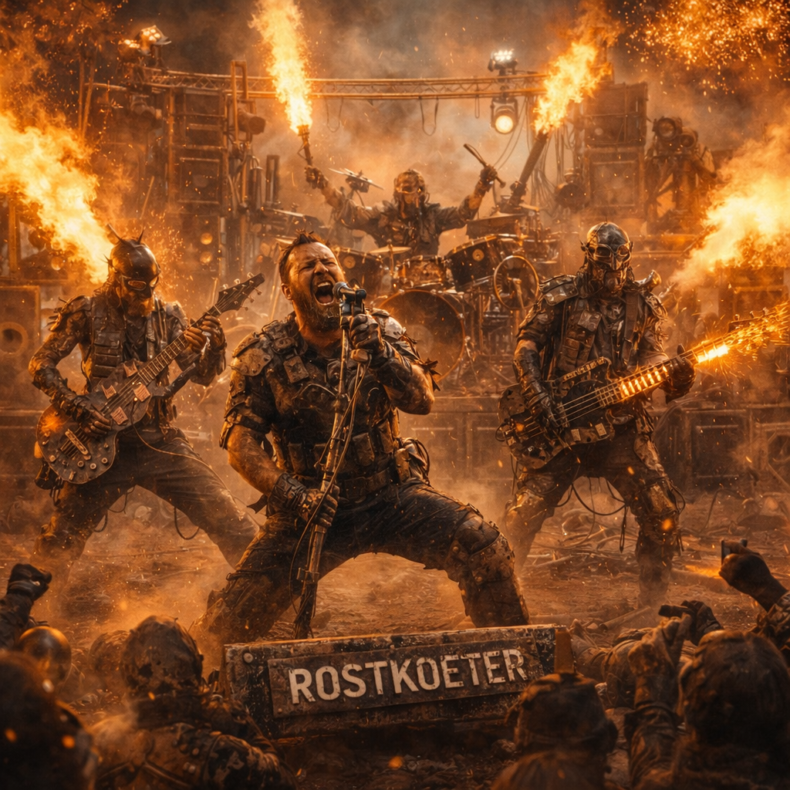

# Rostköter

Rostköter ist eine der bekanntesten Live-Bands im Umfeld von [Doomsday Radio](../../Kanon/glossar.md#doomsday-radio). Ihr Sound sitzt zwischen hartem Desert Rock, räudigem Punk und kaputtgefahrenem Hard Rock: trocken, bissig, laut und immer kurz davor, in Rückkopplung zu kippen.



## Sound

- blown-out Gitarren mit trockenem Sandpapier-Kratzen
- stampfende, trockene Drums
- zäher Bass mit Motorleerlauf-Groove
- halb gesungene, halb gebellte Männerstimme durch schmutzigen Funkfilter
- Refrains mit Gang-Shouts und dicken Oktavgitarren
- kurze Funkstiche, Feedback-Heuler und Rauschfetzen zwischen den Parts

## Rolle im Sendekanon

Rostköter läuft bei [Doomsday Radio](../../Kanon/glossar.md#doomsday-radio) vor allem in härteren Musikfenstern, nach Nachrichtenblöcken von [Mad Dog](../../Kanon/glossar.md#mad-dog) oder in spätabendlichen Strecken, wenn der Sender mehr Straße als Struktur braucht. Die Band ist keine Bot-Erzeugung, sondern eine feste [Wasteland](../../Kanon/glossar.md#wasteland)-Größe mit wiedererkennbaren Songs, rotierenden Live-Mitschnitten und klarer Fanbasis.

Im aktuellen Musikgefüge ist Rostköter ein fester Zugname im [Stranded-Stranglers](../../Orte/Sonstiges/Stranded-Stranglers.md)-Katalog: laut genug für Ticket-Spots, dreckig genug für Kaliber 50 und groß genug, um in der Ödlandarena ganze Vorprogramme zu tragen.

## Publikum & Wirkung

- **[Roamer](../../Kanon/glossar.md#roamer):** Kernhörerschaft, besonders [Hardliner](../../Kanon/glossar.md#hardliner) und Karawanenfahrer
- **[Maker](../../Kanon/glossar.md#maker):** mögen den improvisierten, maschinennahen Sound
- **[Hillbillys](../../Kanon/glossar.md#hillbillys):** grölen die Refrains mit, auch wenn sie nur die Hälfte treffen
- **[Zeros](../../Kanon/glossar.md#zeros):** halten Rostköter für primitiven Pöbelkrach
- **[Orden](../../Kanon/glossar.md#orden):** je nach Gruppe sündiger Lärm oder ehrliche Endzeitmusik

Rostköter gilt als Fahr-, Kampf- und Marktmusik. Die Band läuft auf Karawanenlautsprechern, in Werkstattinseln, auf Schrottplatzpartys und an Orten, wo Menschen zu lange wach bleiben und trotzdem weitermachen müssen.

## Feste Auftrittsorte

- [Kaliber 50](../../Orte/Handelsposten/Kaliber-50.md): harte Live-Sets für [Hardliner](../../Kanon/glossar.md#hardliner), Söldner und Durchreisende
- [Ödlandarena](../../Orte/Zonen/Oedlandarena.md): Auftritte vor Rennen, nach Sonderläufen und in Nachtfenstern mit Wetten und Ausschreitungsrisiko

## Themen

Rostköter-Songs drehen sich meist um Staubrouten, kaputte Motoren, leere Tanks, Gewalt an Kontrollpunkten, Hunger, Funk, Rudelinstinkt, Zorn auf saubere Machtzentren und das Weitermachen ohne sauberen Ausweg.

## Bekannter Song

### Calling All the Lost Ones

Einer der bekanntesten Rostköter-Songs und für viele Hörer die inoffizielle Straßenhymne von [Doomsday Radio](../../Kanon/glossar.md#doomsday-radio). Der Track verbindet [Wasteland](../../Kanon/glossar.md#wasteland)-Roadsound mit Sender-Mythos: kaputte Reichweite, verlorene Leute, laufende Motoren und ein Radiokanal, der trotz allem noch atmet.

**Einordnung**

- harter Desert Rock, Punk-Dreck, kaputter Hard-Rock-Druck
- läuft oft in Übergängen nach harten Nachrichtenblöcken
- funktioniert live im [Kaliber 50](../../Orte/Handelsposten/Kaliber-50.md) besonders gut
- gehört in der [Ödlandarena](../../Orte/Zonen/Oedlandarena.md) zu den zuverlässigsten Einlauf- und Nachlauf-Tracks

**Warum der Song funktioniert**

Der Song trifft den Kern der [Wasteland](../../Kanon/glossar.md#wasteland) in einfacher, brutaler Bildsprache: Rost im Mund, Staub in der Lunge, alte Straßen, halb tote Tanks und ein Sender, der verlorene Leute trotzdem noch anspricht. Gerade der Refrain macht den Track so groß im Programm, weil er [Doomsday Radio](../../Kanon/glossar.md#doomsday-radio) nicht nur erwähnt, sondern als Sammelpunkt für Gestrandete, Zornige und Gebrochene markiert.

**Lyrics**

```text
[Intro]
[radio crackle
Tuning noise]
"This is Doomsday Radio
Signal still breathing…
If you can hear this
You’re still alive" (hah)

[Verse 1]
Rust in my teeth
Dust in my lungs
Scars on the map
From the roads we’ve run
Sun burned out
But it still throws heat
Got a tank half dead
And a heart off-beat

[Chorus]
Doomsday Radio
Calling all the lost ones
Headlights crawling through the ash
If you’re out there
Bring your broken
Bring your bad
Dial in
Don’t look back
We’re the last loud laugh
On the Doomsday Radio

[Verse 2]
Billboard bones
Lean over the sand
Names long gone
From a trembling hand
Trade you truth
For a jerry can
Play one song
For the ghost of your clan (hey)

[Chorus]
Doomsday Radio
Calling all the lost ones
Headlights crawling through the ash
If you’re out there
Bring your broken
Bring your bad
Dial in
Don’t look back
We’re the last loud laugh
On the Doomsday Radio

[Bridge]
If your faith ran dry
In a ditch somewhere
If your hope caught fire
In the fallout air
Turn that knob
’Til the noise fights back
I’ll be here
On this hijacked band (oh yeah)

[Chorus]
Doomsday Radio
Calling all the lost ones
Headlights crawling through the ash
If you’re out there
Bring your broken
Bring your bad
Dial in
Don’t look back
We’re the last loud laugh
On the Doomsday Radio

[Outro]
[signal fading
Low feedback]
"This is Doomsday Radio…
If the world’s still ending tomorrow
We’ll be right here
Same time
Same wreckage"
```

### Unter-Reststrom

Ein weiterer fester Rostköter-Track, der besonders mit Routen durch alte Transit- und Technikzonen verbunden wird. Der Song zieht seine Bilder aus Restenergie, falschen Leitsignalen, engen Durchlässen und dem Gefühl, dass Infrastruktur noch immer Menschen frisst, obwohl längst niemand mehr offiziell das Licht anlässt.

**Einordnung**

- roher, vorwärtstreibender Track mit stampfendem Tunnel-Groove und harten Gang-Shouts
- funktioniert besonders gut in Nachtstrecken nach Gewalt-, Bergungs- oder Routenmeldungen
- passt thematisch zu toten Transitadern wie dem [Nullbahn-Korridor](../../Orte/Zonen/Nullbahn-Korridor.md)
- wird von Fahrern und Vorhuten gern als Streckenlied für riskante Engstellen zitiert

**Warum der Song funktioniert**

`Unter-Reststrom` verdichtet mehrere kanonische [Wasteland](../../Kanon/glossar.md#wasteland)-Motive in eine einzige Bewegung nach vorn: alte Schienen, Restspannung, falsche Signale, Hinterhalte und der Zwang, trotzdem weiterzugehen. Der Song nennt die Strecke nicht platt beim Namen, macht aber klar, dass hier niemand unterwegs ist, ohne gleichzeitig Beute, Störfaktor oder künftiger Toter zu sein.

**MP3**

- [Unter-Reststrom.mp3](../../../../docs/story/archiv/mp3/Unter-Reststrom.mp3)

**Lyrics**

```text
[Intro]
[Funkrauschen]
Noch Saft auf der Schiene
Noch Glut im Draht
Noch einer weniger hinter uns

[Strophe 1]
Zerschmolzene Tunnel, schwarzer Beton
Der Wind klingt hier wie ein alter Ton
Funken an den Wänden, Staub in der Sicht
Jeder falsche Schritt bezahlt sich nicht
Die Strecke zieht wie ein toter Pfeil
Durch Blech, durch Ruß, durch altes Geheul
Und irgendwo vorne blinkt kaltes Blau
Als ob der Draht noch unser Sterben braucht

[Pre-Chorus]
Reststrom knistert unter Haut
Irgendwer hat uns hier eingebaut
Augen offen, Maul bleibt zu
Hinter der Engstelle wartest du

[Refrain]
Lauf, bevor das Gleis dich nimmt
Bevor das Licht im Schädel spinnt
Bevor ein falscher Ruf dich dreht
Und keiner deinen Namen zählt
Hier will dich nichts lebend sehen
Nur vorwärts, bis die Sohlen brennen
Wenn hinter dir der Tunnel singt
Dann renn, bis dir der Atem springt

[Strophe 2]
Fremde Zeichen flackern durch den Staub
Jeder Weg hier riecht nach Hinterhalt und Raub
Kupfer in Säcken, Blut am Griff
Alles, was du trägst, ist halber Überlebensschiff
Botspuren tief in verbranntem Sand
Kein Mensch hier, der nicht lügt oder spannt
Und aus dem Dunkel ruft ein kalter Ton
Wie Heimweg, nur mit Messer im Strom

[Pre-Chorus]
Enger wird der Atem hier
Jeder Sender klingt nach Gier
Blinder Funk in fremder Hand
Lockt dich weiter an die Wand

[Refrain]
Lauf, bevor das Gleis dich nimmt
Bevor das Licht im Schädel spinnt
Bevor ein falscher Ruf dich dreht
Und keiner deinen Namen zählt
Hier will dich nichts lebend sehen
Nur vorwärts, bis die Sohlen brennen
Wenn hinter dir der Tunnel singt
Dann renn, bis dir der Atem springt

[Bridge]
Manche nennen das 'nen Pfad
Wir nennen's nur schlecht vernarbten Draht
Manche lesen drin noch Sinn
Wir seh'n nur Restglut tief drin
Und wenn der Strom noch einmal lacht
Hat einer von uns es nicht geschafft

[Breakdown]
Noch Saft auf der Schiene
Noch Glas im Knie
Noch ein Meter bis zum Licht
Mehr kriegst du nie

[Refrain]
Lauf, bevor das Gleis dich nimmt
Bevor das Licht im Schädel spinnt
Bevor ein falscher Ruf dich dreht
Und keiner deinen Namen zählt
Hier will dich nichts lebend sehen
Nur vorwärts, bis die Sohlen brennen
Wenn hinter dir der Tunnel singt
Dann renn, bis dir der Atem springt
```

### Phallus Maximus

Ein typischer Arena-Brecher von Rostköter: stumpf, größenwahnsinnig und genau intelligent genug, um live eine Tribüne in einen Mitsing-Schlachtruf zu verwandeln. Der Song hängt fest an der [Ödlandarena](../../Orte/Zonen/Oedlandarena.md), an [Killcoin](../../Kanon/glossar.md#killcoin)-Nächten, Staubzoll am Einlass und dem Moment kurz vor dem Start, wenn alle schon wissen, dass Vernunft den Abend nicht überlebt.

**Einordnung**

- dreckiger Midtempo-Rammbock mit gröhlbarem Refrain und viel Rudelenergie
- läuft vor Blutrunden, Einläufen und überall dort, wo [Doomsday Radio](../../Kanon/glossar.md#doomsday-radio) Tickets aggressiv verkaufen will
- nutzt den Arena-Humor der [Wasteland](../../Kanon/glossar.md#wasteland): pubertär, brutal und mit genug Selbsthass, um wieder gut zu sein
- gehört live zu den Songs, bei denen das Publikum `Maximus` zurückbrüllt, lange bevor der Refrain vorbei ist

**Warum der Song funktioniert**

`Phallus Maximus` macht aus der Arena keine edle Heldensage, sondern eine schmutzige Prahlmaschine aus Schrott, Testosteron, Marktgeschrei und sicher vermeidbaren Verletzungen. Der Witz sitzt nicht nur im Titel: Der Track passt zur Ödlandarena, weil dort alles überzeichnet ist, von den Lautsprechertürmen bis zum Ego der Fahrer, und weil das Publikum genau diese Mischung aus Obszönität, Gewalt und Show mit offenen Kehlen frisst.

**MP3**

- [Phallus_Maximus.mp3](../../../../docs/story/archiv/mp3/Phallus_Maximus.mp3)

**Lyrics**

```text
[Intro]
[Motorheulen, Funkpfeifen]
Staubzoll gezahlt
Zähne gefletscht
Licht an
Hirn aus

[Strophe 1]
Karrenkranz glüht in Altmetallnacht
Ränge voll Kehlen, die nach Einschlag schrei'n
Killcoins klimpern, als wär's Gottesmacht
Und jeder Trottel will Legende sein
Schutzbrille schief, Blut unterm Schuh
Am Zaun grölt schon das halbe Revier
Die Magier zieh'n Flammenbögen zu
Als wär Vernunft heute gar nicht mehr hier

[Pre-Refrain]
Heb den Schrott
Heb den Lärm
Heb das Ding zum Himmelsrand
Wenn die Menge `mehr` verlangt
Wird aus Dreck ein Denkmalbrand

[Refrain]
Phallus Maximus
Ragt aus Rost und Größenwahn
Phallus Maximus
Hart wie'n schlechter Todesplan
Hoch aus Schrott, Schweiß, Pyro, Hass
Die ganze Arena brüllt: mehr Gas
Phallus Maximus
Wenn er fällt, dann auf uns drauf

[Strophe 2]
Lautsprechertürme kotzen Bass
Die Seitentribüne bebt im Takt
Ein Wastelandhund schnappt irgendwo ins Fleisch
Und hinterm Ring wird Wettgeld nackt
Hardliner zählen Staubzoll nach
Zeros messen nur den Umsatzstand
Rostköter haut dir den Schädel wach
Mit zwei Akkorden und verbrannter Hand

[Pre-Refrain]
Heb den Müll
Heb den Mut
Heb den ganzen Schandpfahl hoch
Wenn der Motor einmal hustet
Brüllt die Meute `nochmal hoch`

[Refrain]
Phallus Maximus
Ragt aus Rost und Größenwahn
Phallus Maximus
Hart wie'n schlechter Todesplan
Hoch aus Schrott, Schweiß, Pyro, Hass
Die ganze Arena brüllt: mehr Gas
Phallus Maximus
Wenn er fällt, dann auf uns drauf

[Bridge]
Keine Krone, nur ein Flexgerät
Kein Held, nur wer am längsten steht
Keine Ehre, nur der kurze Blick
Bevor dein Karren brennt und keiner bückt
Hier wird jeder Traum obszön
Sobald die Scheinwerfer angeh'n
Und wenn die Achse knackt im Lauf
Trinkt die Menge drauf

[Breakdown]
Maxi-
mus!
Maxi-
mus!
Schrott in den Himmel
Und den Himmel kaputt

[Refrain]
Phallus Maximus
Ragt aus Rost und Größenwahn
Phallus Maximus
Hart wie'n schlechter Todesplan
Hoch aus Schrott, Schweiß, Pyro, Hass
Die ganze Arena brüllt: mehr Gas
Phallus Maximus
Wenn er fällt, dann auf uns drauf

[Outro]
[Feedback, entfernte Sirene]
Einlass vorbei
Zäune krumm
Noch wer lebt
Brüllt weiter rum
```

### Kitty-Kat

Ein englischer Rostköter-Track über die Verbindung aus [Hardliner](../../Kanon/glossar.md#hardliner)-Kultur und Furry-Bot-Piloten. Im Zentrum steht kein einzelnes Ereignis, sondern die widersprüchliche Identität eines Einzelkämpfers, der in einer lächerlich wirkenden Tier-Silhouette steckt und genau deshalb unterschätzt wird. Die Maschine ist selten, teuer, wartungsintensiv und als Elite-Asset der Hardliner zugleich Statusobjekt, Demütigung und taktische Tarnung.

**Einordnung**

- langsamer, schwerer Desert-Rock-Track mit Motorleerlauf-Bass und trockenem Marschrhythmus
- englischer Leadgesang mit rauer, kontrollierter Hardliner-Stimme und großen Gang-Shouts im Refrain
- verbindet die soziale Demütigung des Maskottchens mit der Unterschätzung durch Menschen und einer möglichen Fehlklassifikation durch den Stack
- arbeitet mit Funkrauschen, Servoschritten, mechanischen Kopfbewegungen und kurzen Tierlaut-Imitationen
- bleibt ein Identitäts- und Milieusong: Der Hardliner glaubt, die Maschine als Tarnung zu benutzen; allmählich ist unklar, ob die Maschine ihn selbst als Teil ihrer Tarnung benutzt

**Warum der Song funktioniert**

`Kitty-Kat` macht aus dem Furry-Bot keinen niedlichen Gag. Die animalische Oberfläche ist eine soziale Waffe: Andere lachen, fotografieren oder treten näher, weil sie die Maschine nicht als unmittelbare Bedrohung lesen. Der Hardliner verachtet diese Reaktion und nutzt sie trotzdem. Das passt zu Rostköter, weil der Song Härte nicht als saubere Heldengeste zeigt, sondern als beschädigte Identität, die sich in einer falschen äußeren Form behaupten muss.

**Kanon-Mix**

- [Hardliner](../../Kanon/glossar.md#hardliner): Einzelkämpfer, Callsign-Kultur, Einschüchterung, keine Rüstung zum Schutz anderer, sondern die eigene Person als Rüstung
- [Furry-Bot-Piloten](../../Gruppen/Roamer/hardliner.md): seltene und teure Elite-Linie der Hardliner; tierische Silhouette als unterschätzte, Stack-nahe taktische Tarnung

**Suno-/Produktionsrichtung**

```text
Crunchy wasteland desert rock with punk grit and hard rock punch. Dry stomping drums, blown-out dusty guitars, engine-idle bass, male vocals half-sung half-barked through a dirty radio filter, gang-shout chorus, feedback squeals and shortwave static. Rough, smoky, tense, neon-lit, live arena energy. Lots of pyro, overloaded speaker stacks, metallic impact hits and sudden experimental breakdowns. Arena style with a dangerous club-show atmosphere: aggressive, sweaty, unstable and physically loud. Keep the Furry-Bot subject matter grim and unsettling rather than cute. Let the arrangement switch between a blunt marching riff, explosive gang-vocal hooks and strange mechanical interludes that feel like a machine taking over the stage.
```

**Lyrics**

```text
[Intro]
[Radio static]

Callsign: Iron Fang.

Machine status: waiting.

Public status: laughing.

[Verse 1]

You see the ears.
You see the face.

You see a costume
in a broken place.

You take a picture.
You point and grin.

You see a mascot.
You let it in.

[Pre-Chorus]

I hate the surface.
I use the lie.

The Stack looks down.
The warning stays dry.

[Chorus]

Kitty-Kat is waiting.
Kitty-Kat is weak.

You see the fur.
You miss the teeth.

You want a picture.
You want a name.

Come a little closer.
Do it again.

[Verse 2]

The gate stays open.
The scanner blinks.

The machine says nothing.
The machine still thinks.

It copies a dog bark.
It copies the rain.

It copies a voice
from an old radio frame.

[Pre-Chorus]

I did not teach it
that voice from the past.

I did not tell it
to turn that fast.

[Chorus]

Kitty-Kat is waiting.
Kitty-Kat is weak.

You see the fur.
You miss the teeth.

You want a picture.
You want a name.

Come a little closer.
Do it again.

[Bridge]

The pilot says: "Hold."
The machine says: "Stay."

The pilot says: "Stop."
The machine looks away.

The radio repeats
the pilot's callsign.

No one is laughing.
No one answers.

[Breakdown]

Big eyes.
Steel feet.

Soft face.
Hard beat.

No flag.
No crew.

One bot.
One view.

[Final Chorus]

Kitty-Kat was waiting.
You thought it was weak.

You saw the fur.
You missed the teeth.

You wanted a picture.
You wanted a name.

Now the channel is open.
No one speaks again.

[Outro]

[Servo steps]
[Radio static]

Callsign: Iron Fang.

Machine status: active.

Pilot status:

[Undetermined]
```

## Mad-Dog-Ansage

> *„Und jetzt für alle, die Sand in den Zähnen, Wut im Tank und null Bock auf höfliche Gesellschaft haben: Rostköter. Klingt wie ein Rudel Schrottplatzhunde auf Benzin und genau deshalb ist es gut."*
