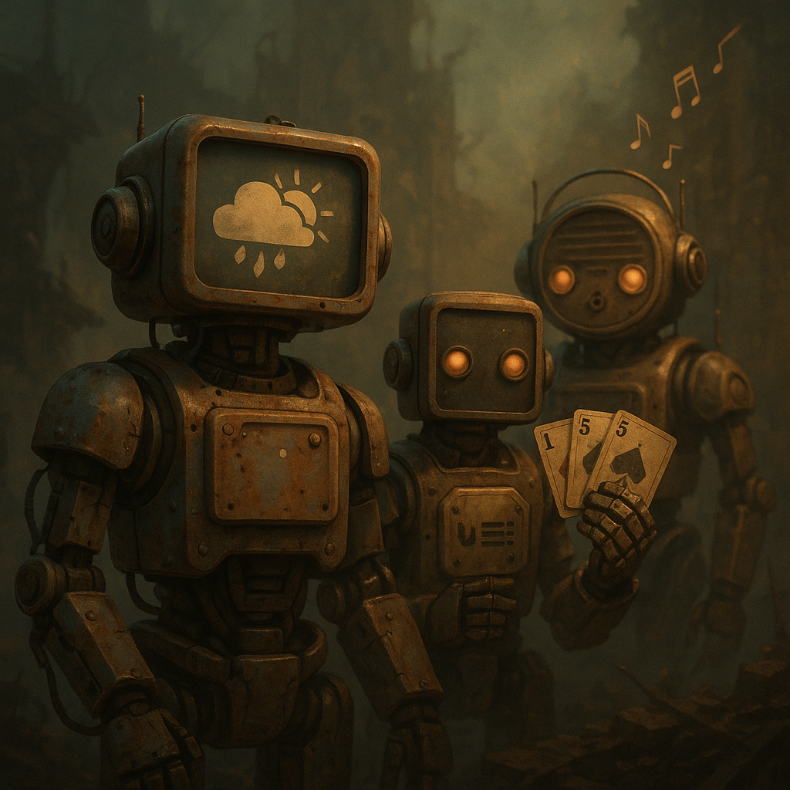

# Radio-Bots - Übersicht

Die Radio-Bots erweitern den Sender um spezialisierte Stimmen für Wetter, Musiksteuerung, Orakel und Identität. Sie liefern Struktur zwischen Chaos, Warnung und Unterhaltung.

## Bots und Module

- [D3PO](D3PO.md) - Host- und Call-in-Bot mit fester abendlicher Sprechstunde.
- [Echo-1](Echo-1.md) - DJ-Bot, Musik-Kurator und Stimme zwischen den Tracks.
- [Störbild-4](Stoerbild-4.md) - investigativer Interview-Bot für Fallrekonstruktionen, Zeugenaussagen und unangenehm höfliche Nachfragen.
- [Nullapostell](Nullapostell.md) - Archiv-Bot für falsche Weltuntergänge und bittere Vorwelt-Pointe.
- [Spotnik](spotnik.md) - Werbe-Bot für Sponsorfenster, Ticket-Spots und bezahlte Durchsagen.
- [ThermoBot-9](ThermoBot-9.md) - Wetter- und Gefahrenstimme mit trockenem Sarkasmus.
- [UNO-Orakel](uno-orakel.md) - taegliche Kartenlesung als symbolische Lageinterpretation; on air als `Uno Future`.
- [Piep Matze](piep-matze.md) - Morse-Code-Bot und Ersteller der taeglichen Morsecode-Challenge.

## Kontext

- Radiostation gesamt: [../index.md](../index.md)
- Programmschiene: [../programm.md](../programm.md)
